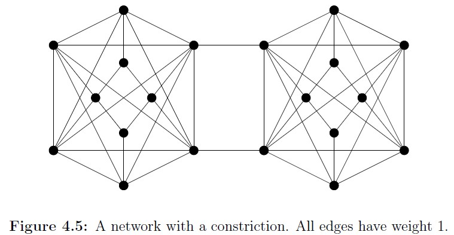

# Foundation of Data Science
- Chapter 4 : Random Walks and Markov Chaindz
  - 4.3 : Areas and Volumes (p.87-89)
  - 4.4 : Convergence of Random Walks on Undirected Graphs (p.89-98)

---

## 進め方の提案
- **4.3 の主張はやや唐突なので、一旦スキップします。**
  - 4.3 がうまくいく理由が 4.4. に書いてあるからです。
  - ただし 4.4 の大事な内容(Thoerem 4.5)は証明がちょっと難しいです。
- そのため、次の進め方とします。
  - まず証明をスキップして、4.4 の概要を説明します。
  - この結果を踏まえて 4.3. に戻って内容を説明します。
  - その後で 4.4. の内容(特に証明)を説明します。

---
# Warp to 4.4 ! (p.89)

---

## 4.4. Convergence of Random Walks 
- Undirected Graph 上の Random Walks を考える
- vertex $i, j$ 間に、weight $w_{ij}$ が定義されているとする。
  - undirected なので $w_{ij} = w_{ji}$
- transition probability として次を使うことができる
$$
p_{ij} = \frac{w_{ij}}{\sum_j w_{ij}}
$$
  - 次の記号も定義しておく
    - $w_i = \sum_j w_{ij}$ 
    - $w_{\textrm{total}} = \sum_j w_j$

---

## Random Walks on Undirected graph
- このように定義された $p_{i,j}$ は次の性質を持つ
  - (1) stationary distribution : $\pi_x = w_x / w_{\textrm{total}}$
  - (2) detailed balance : $w_x p_{xy} = w_y p_{yx}$
    - なので $p_{xy}$ で遷移させると $\boldsymbol{\pi}$ に収束する
- 証明 (1) : stationary であることの証明
$$
\sum_x \pi_x p_{xy}
  = \sum_x \frac{w_x}{w_{\textrm{total}}} \frac{w_{xy}}{w_x}
  = \sum_x \frac{w_{xy}}{w_{\textrm{total}}}
  = \frac{w_y}{w_{\textrm{total}}} = \pi_y
$$
- 証明 (2)
$$
w_x p_{xy}
  = w_x \frac{w_{xy}}{w_x} = w_{xy} = w_{yx}
  = w_y \frac{w_{yx}}{w_y} = w_y p_{yx}
$$

---

## Undirected Graph の例

- ボトルネック(constriction=狭窄部)が存在する
- このようなケースでは Random Walkがうまく「混じらない」と考えられる

---

## Undirected Graph の例
- Lattice
  - すべてのLatticeの隣り合うLatticeにweight1でつながっている場合
  - 実は section 4.3 ではこの場合が念頭にある。
- Crique
  - 状態遷移でうまく混じるかどうかを定量化したい！

---

## Random Walk の「所要時間」
- 様々な定義が存在する。
  - ある状態に到達する時間 : 4.6で説明
    - ある状態からある状態に遷移する時間 : hitting time
    - すべての状態に到達する時間 : cover time
  - 経験分布が定常分布に近づく時間
    - $\varepsilon$-mixing time : 4.4で説明

---
## mixing time
- Recap : **running average distribution**
$$
\boldsymbol{a}(t) = \frac{1}{t}(
  \boldsymbol{p}(0) +
  \boldsymbol{p}(1) + ... +
  \boldsymbol{p}(t)
)
$$
- $\varepsilon$-mixing time of Markov Chain (Definition 4.1)
  - *minimum integer $t$ such that*
    *for any starting distribution* $\boldsymbol{p}(0)$, 
$$
|\boldsymbol{a}(t) - \boldsymbol{\pi}| \le \varepsilon
$$

---
## Normalized conductance
- あるMarkov Chainが、すべてのノードに対して伝わりやすいかの指標
  - コンダクタンス(conductance)は、もともと電気回路の用語
    - condactance is the inverse of resistance
- まず vertex の subset $S$ に対する定義から考える (Definition 4.2)
  - $\pi(S) = \sum_{x \in S} \pi_x$
  - *The normalized conductance $\Phi(S)$ of $S$ is*
$$
  \Phi(S) = \frac
  {\displaystyle\sum_{(x,y) \in (S, \bar{S})} \pi_x p_{xy}}
  {\min (\pi(S), \pi(\bar{S}))}
$$

---
## Normalized conductance の定性的理解
- 式を次のように変形してみる。ただし $\pi(S) \le \pi(\bar{S})$ とする。
$$
\Phi(S) =
  \sum_{x \in S}
  \underbrace{\frac{\pi_x}{\pi(S)}} _ {a}
  \underbrace{\sum_{y \in \bar{S}} \pi_{xy}} _ {b}
$$
- 式の理解
  - 仮に現在の定常分布が、集合$S$に限られていると考える
  - $a$は、この制限された集合における定常分布である。
  - $b$は、この集合から外に出る確率である。
- Normalized conductance は、集合$S$から1Stepで  
  外側に出ていく確率とみなすことができる

---
## グラフ全体の Normalized conductance
- Definition 4.3
  - *The normalized condutance of the Markov chain, denoted $\Phi$ :*
$$
\Phi = \min_{S \subset V, S \ne \\{\\}} \Phi(S)
$$

- 直感的な理解
  - $\varepsilon$-mixing time が小さいということは、どこかの集合に  
    分布が偏っていても、すぐにそれ以外の集合に行くということ
  - つまり、mixing time が小さいならば, $\Phi$は大きくなる。
    - ちゃんとした証明があるはず(証明は簡単？)
- 逆に $\Phi$が大きくなると、$\varepsilon$-mixing time が小さい(Theorem 4.5)

---
## Mixing time と Normalized conductance の関係
- Theorem 4.5
  - *Thg $\varepsilon$-mixing time of a random walk on an undirected graph is:*
$$
O(\frac{\ln (1/\pi_{\min})}{\Phi^2 \varepsilon^3})
$$
  - *where $\pi_{\min}$ is the minimum stationary probability of any state.*
- 証明はややこしい。一旦スキップします。

---
## lattice 上の Random Walk (4.4.1)
- 隣接するノード (d次元の場合、2d個ある)に同じ確率でjumpする  
  lattice 上の Random Walk の mixing time を考える。
- (例) 2-d の場合:
  - 端にぶつかる場合は、元の場所に戻る (動かない=MCMCのreject)

---
## lattice 上の Random Walk (4.4.1)

- Theorem 4.5 によると $\varepsilon$-mixing timeは、
$$
O(\frac{\ln (1/\pi_{\min})}{\Phi^2 \varepsilon^3})
$$
- 具体的な結果 (具体的な計算手順は一旦スキップ)
  - 1-d lattice
    - $\Phi = 1/n$ であり $\varepsilon$-mixing time は $O((n^2 \log n) / \varepsilon^3)$
  - 2-d lattice
    - $\Phi = \Omega(1/n)$ であり
      $\varepsilon$-mixing time $= O((n^2 \log n) / \varepsilon^3)$
  - d次元のlattice
    - $\Phi = \Omega(1/dn)$ (証明は Exercise 4.25で示すことになっている！)
    - すべてのノード$x$ について $\pi_x = n^{-d}$
    - $\varepsilon$-mixing time $= O((d^3 n^2 \log n) / \varepsilon^3)$
      - $d$の多項式となっている！

---
## d次元のlatticeについて
- 1辺の長さが a の d次元 cube の体積は $a^d$
  - dについて exponential order で大きくなる
- d次元 lattice Random Walk の $\varepsilon$-mixing time は
  $O((d^3 n^2 \log n) / \varepsilon^3)$
- つまり running average distribution
$$
\boldsymbol{a}(t) = \frac{1}{t}(
  \boldsymbol{p}(0) +
  \boldsymbol{p}(1) + ... +
  \boldsymbol{p}(t)
)
$$
の値は $t \ge O((d^3 n^2 \log n) / \varepsilon^3)$ とすれば
$|\boldsymbol{a}(t) - \boldsymbol{\pi}| \le \varepsilon$を満たす ($\pi_x = n^{-d}$)
- すべての点をサンプリングしようと思ったら$n^d$の時間がかかるのに  
  Random Walk が定常確率に収束するには $d^3$ 程度の時間で十分である。
  - ここが Section 4.3 の議論の起点となる。

---
# Go back to 4.3 ! (p.87)

---
## Monte Carlo による体積の推定
- 例えば、2次元の乱数を生成することで円の面積を推定できる
  - 1x1の正方形(square)上で一様な乱数(uniform random number)を生成
  - 原点からの距離が1以下になる場合の割合を算出する。
    - この値が1/4の円の面積 $\pi / 4$ に近づく

---
## Monte Carlo による体積の推定
- $d$次元($d$はとても大きい)ではどうなるのだろう？
  - d次元単位超球面(unit ball)の体積は、Lemma 2.6 より、
    $ V(d) = \frac{2 \pi^{\frac{d}{2}}}{d \Gamma(\frac{d}{2})} $
  - 値が正(positive)に限定すると、$\frac{1}{2^d}$倍になるから
    $ V_{+}(d) = \frac{\pi^{\frac{d}{2}}}{d \cdot 2^{d-1} \Gamma(\frac{d}{2})} $
  - この値は、$d!$のオーダーで小さくなる。acceptance ratio がとても小さい。

---

# d次元lattice上のRandom Walk (MCMC)を使おう！

---
## MCMCによる体積の推定
- $d$次元lattice で隣のvertex($2d$個)に確率$1/2d$で動く  
  Random Walk (簡単な形のMCMC)を考える。
- この場合、Random Walk の $\varepsilon$-mixing time は  
  $O((d^3 n^2 \log n) / \varepsilon^3)$ だった。

---
## MCMCによる体積の推定
- (convexな)図形$R$の面積を考える場合、
  - $R$を含む円$S_{i+1}$と、$R$に含まれる円$S_i$を考える。
  - $R \cap S_{i+1}$上のRandom Walkを考え、その場所が $S_i$ を含む割合を考える。

---
## MCMCによる体積の推定
- この割合は
$
\displaystyle{
\frac{\textrm{Vol}(S_{i+1} \cap R)}{\textrm{Vol}(S_{i} \cap R)}
= \frac{\textrm{Vol}(R)}{\textrm{Vol}(S_{i})}
}
$
- この割合に $\textrm{Vol}(S_{i})$の値をかければ  
$
\displaystyle
\frac{\textrm{Vol}(S_{i+1})}{\textrm{Vol}(S_{i})}
\textrm{Vol}(S_{i}) = \textrm{Vol}(R)
$ となって図形の面積が求まる!

---
## でも$d$が大きいと、体積比がとても
## 大きくなるのでうまくいかない...

---
## 円を少しずつ
## 大きくすればいいのではないか？

---
## MCMCによる体積の推定 (修正)
- 同じ中心の円 $S_1 \subset S_2 \subset ... \subset S_k$ を, 半径が $1 + \frac{1}{d}$倍で  
  順番に大きくなるように作り、$S_1 \subset R \subset S_k$ となるように作る

$$
\begin{align}
\textrm{Vol}(R)
  &= \textrm{Vol}(S_k \cap R) \\\\
  &= \frac{\textrm{Vol}(S_k \cap R)}{\textrm{Vol}(S_{k-1} \cap R)}
     \frac{\textrm{Vol}(S_{k-1} \cap R)}{\textrm{Vol}(S_{k-2} \cap R)}
     ...
     \frac{\textrm{Vol}(S_2 \cap R)}{\textrm{Vol}(S_1 \cap R)}
     \textrm{Vol}(S_1)
\end{align}
$$
- ここで次が成り立つ (定数で上から抑えられる)
$$
1
\le \frac{\textrm{Vol}(S_k \cap R)}{\textrm{Vol}(S_{k-1} \cap R)}
\le \frac{\textrm{Vol}(S_k)}{\textrm{Vol}(S_{k-1})}
= (1+\frac{1}{d})^d
\lt e
$$
- なので、$S_i \cap R$ 上の点を Random Walks でサンプリングし  
  それらの点が $S_{i-1} \cap R$ に含まれる割合で
$
\displaystyle{
\frac{\textrm{Vol}(S_{i} \cap R)}{\textrm{Vol}(S_{i-1} \cap R)}
}
$ を計算できる。

---
## MCMCによる体積の推定 (修正)
- 同じ中心の円 $S_1 \subset S_2 \subset ... \subset S_k$ を, 半径が $1 + \frac{1}{d}$倍で  
  順番に大きくなるように作り、$S_1 \subset R \subset S_k$ となるように作る
  - では一体、何個の円を作ればよいか？
- 最大の円と最小の円の半径の比(ratio)を$r$ とすると、
$$
(1 + \frac{1}{d})^k = r
$$
$$
k = \frac{\ln r}{\ln (1 + 1/d)} 
  \ge \frac{\ln r}{1/d} = d \ln r
$$
- 実は、円でなくても、四角でもよい。
