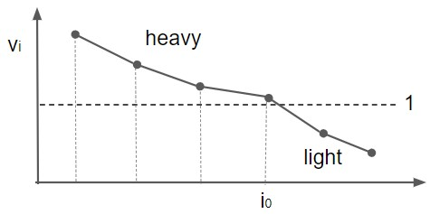
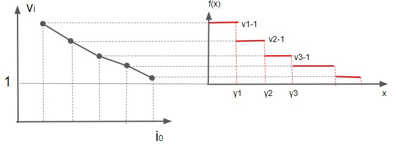
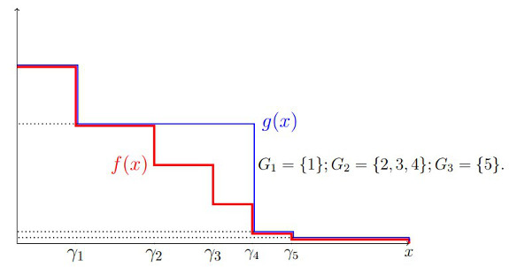

# Foundation of Data Science
- Chapter 4 : Random Walks and Markov Chains
  - 4.4 : Convergence of Random Walks on Undirected Graphs (p.89-98)
    - Theorem 4.5 の証明
    - 4.4.1 の $\Phi$ の導出 (p.95-98)
  - 4.5 : Electrical Network and Random Walks (p.98-103)

---
## mixing time
- Recap : **running average distribution**
$$
\boldsymbol{a}(t) = \frac{1}{t}(
  \boldsymbol{p}(0) +
  \boldsymbol{p}(1) + ... +
  \boldsymbol{p}(t-1)
)
$$
- $\varepsilon$-mixing time of Markov Chain (Definition 4.1)
  - *minimum integer $t$ such that*
    *for any starting distribution* $\boldsymbol{p}(0)$, 
$$
\Vert \boldsymbol{a}(t) - \boldsymbol{\pi} \Vert _ 1 \le \varepsilon
$$

---
## Normalized conductance
- あるMarkov Chainが、すべてのノードに対して伝わりやすいかの指標
  - conductance : もともと電気回路の用語で、電流の流れやすさの指標。
    - condactance is the inverse of resistance
- まず vertex の subset $S$ に対する定義から考える (Definition 4.2)
  - $\displaystyle \pi(S) = \sum_{x \in S} \pi_x$
  - *The normalized conductance $\Phi(S)$ of $S$ is*
$$
  \Phi(S) = \frac
  {\displaystyle\sum_{(x,y) \in (S, \bar{S})} \pi_x p_{xy}}
  {\min (\pi(S), \pi(\bar{S}))}
$$

---
## Mixing time と Normalized conductance の関係
- Theorem 4.5
  - *Thg $\varepsilon$-mixing time of a random walk on an undirected graph is:*
$$
O(\frac{\ln (1/\pi_{\min})}{\Phi^2 \varepsilon^3})
$$
  - *where $\pi_{\min}$ is the minimum stationary probability of any state.*
- 証明はただひたすらややこしい (あまり面白くない...)

---
## Theorem 4.5 の準備
- しつこいですが、running average distribution とは
$$
\boldsymbol{a} = \boldsymbol{a}(t) = \frac{1}{t}(
  \boldsymbol{p}(0) +
  \boldsymbol{p}(1) + ... +
  \boldsymbol{p}(t-1)
)
$$
- これから示すのは、大きい $t$ で
  $\Vert \boldsymbol{a} - \boldsymbol{\pi} \Vert _ 1 \le \varepsilon$ となること。

- $\displaystyle v_i = \frac{a_i}{\pi_i}$ を定義し, $v_1 \ge v_2 \ge ...$
  のように降順に並べ替えておく。

---
- $\Vert \boldsymbol{a} - \boldsymbol{\pi} \Vert _ 1 \le \varepsilon$ となってほしい
- そのため $v_i = a_i / \pi_i$ は $1$ に近づいてほしい。
  - $v_i$ のグラフは傾きが緩やかになっていくことが望ましい。
- $v_i > 1$ となる $i$ を **heavy state** と呼び、ここから別の状態への  
  確率の流れ *probability flows* を確認する。
  - $v_i > 1$ となる最大の $i$ を $i_0$ とする。

---
- 次の Proposition 4.4 を思い出す ($x^{+}$ とは ReLUと同じ意味)
$$
\Vert \boldsymbol{p} - \boldsymbol{q} \Vert _ 1
= 2 \sum_i (p_i - q_i)^{+}
= 2 \sum_i (q_i - p_i)^{+}
$$
- これを使って, $v_i = a_i / \pi_i$ に注意して
$$
\begin{align}
\Vert \boldsymbol{a} - \boldsymbol{\pi} \Vert _ 1
 &= 2 \sum_i (a_i - \pi_i)^{+} = 2 \sum_i^{i_0} (v_i - 1) \pi_i \\\\
 &= 2 \sum_i (\pi_i - a_i)^{+} = 2 \sum_{i > i_0} (1 - v_i) \pi_i
\end{align}
$$

---

$$
\begin{align}
\Vert \boldsymbol{a} - \boldsymbol{\pi} \Vert _ 1
 &= 2 \sum_{i=0}^{i_0} (v_i - 1) \pi_i & ... (1) \\\\
 &= 2 \sum_{i > i_0} (1 - v_i) \pi_i & ... (2)
\end{align}
$$

- $(1)$は heavy state、$(2)$は light state の和になっている。  
- 以下では heavy state を中心に考える。

---
- 次の $\gamma_i$ を定義する。つまり $i$ 番目までのstateの定常確率の和
  - 書いていないが $\gamma_0 = 0$ と定義することに注意
$$
\gamma_i = \pi_1 + \pi_2 + ... + \pi_i
$$
- ここで関数 $f(x)$ を $x \in [0, \gamma_{i_0}]$ の範囲で定義する
$$
f(x) = v_i - 1
\quad \textrm{ for } \quad
x \in [\gamma_{i-1}, \gamma_i)
$$

---
- 次が成立する
$$
\sum_{i=1}^{i_0} (v_i - 1) \pi_i
= \int_0^{\gamma_{i_0}} f(x) dx
$$

---

- やや天下り式ではあるが、$\{ 1, 2, ... , i_0 \}$ をこの順序で、  
  $G_1, G_2, G_3, ... , G_r$ のグループに分割する (分け方は後で考える)
- 分割したグループごとに $u_s = \textrm{Max}_{i \in G_s} v_i$ を定義
- 関数 $g(x)$ を次のように定義
$$
g(x) = u_s - 1
\quad \textrm{ for } \quad 
x \in \bigcup _ {i \in G_s} [\gamma_{i_1}, \gamma_i)
$$

---

- 次が成立する
$$
\int_0^{\gamma_{i_0}} f(x) dx
\le \int_0^{\gamma_{i_0}} g(x) dx
$$

---

- 積分する代わりに、横の長方形を順番に足すことを考えると、次が成立
$$
\int_0^{\gamma_{i_0}} g(x) dx
= \sum_{t=1}^r \pi(G_1 \cup G_2 \cup ... \cup G_t) (u_t - u_{t+1})
$$
  - 書かれていないが $u_{t+1} = 0$としている。
  - $\pi(G_1 \cup ... \cup G_t)$ とは対象となるグループに含まれる  
    状態の定常確率のすべての和の意味

---
- ここまでの式をまとめると
$$
\begin{align}
\Vert \boldsymbol{a} - \boldsymbol{\pi} \Vert _ 1
 &= 2 \sum_{i=0}^{i_0} (v_i - 1) \pi_i \quad ... (4.3) \\\\
 &= 2 \int_0^{\gamma_{i_0}} f(x) dx  \quad ... (4.4) \\\\
 &\le 2 \int_0^{\gamma_{i_0}} g(x) dx \quad  ... (4.5) \\\\
 &= 2 \sum_{t=1}^r \pi(G_1 \cup G_2 \cup ... \cup G_t) (u_t - u_{t+1}) \quad  ... (4.6) \\\\
\end{align}
$$
- 実は、適切にグループを分割し、かつ $t$ がmixing time 以上であれば  
  最後の式が $\varepsilon$ 以下になるということを示そう。  
  (まだグループの分割方法は言わない...)

---

- もう一度 Proposition 4.4 から導いた次の式に戻る
$$
\begin{align}
\Vert \boldsymbol{a} - \boldsymbol{\pi} \Vert _ 1
 &= 2 \sum_{i=0}^{i_0} (v_i - 1) \pi_i & ... (1) \\\\
 &= 2 \sum_{i \ge i_0 + 1} (1 - v_i) \pi_i & ... (2)
\end{align}
$$
- light state の式 $(2)$ を考えると
  - これが $\varepsilon$ 以下だったら、証明が終わってしまう。
  - なので、ここではそうではないと考える。つまり次を仮定する  
    （この後、矛盾する $(1) \le \varepsilon$ を導き、この仮定を棄却する予定）
$$
\sum_{i \ge i_0 + 1} (1 - v_i) \pi_i > \frac{\varepsilon}{2}
$$

---

- 仮定した不等式を変形して、
$$
\begin{align}
\frac{\varepsilon}{2}
 &< \sum_{i \ge i_0 + 1} (1 - v_i) \pi_i \\\\
 &= \sum_{i \ge i_0 + 1} \pi_i - \sum_{i \ge i_0 + 1} \pi_i v_i
 \le \sum_{i \ge i_0 + 1} \pi_i \\\\
& \therefore \quad 
\sum_{i \ge i_0 + 1} \pi_i > \frac{\varepsilon}{2}
\end{align}
$$
- なんか奇妙な式変形だが、heavy state の任意の subset $A$ に対して
$$
\begin{align}
\pi(A) &\ge \frac{\varepsilon}{2} \pi(A)  \\\\
\pi(\bar{A}) &\ge \sum_{i \ge i_0 + 1} \pi_i > \frac{\varepsilon}{2}
\ge \frac{\varepsilon}{2} \pi(A) \\\\
& \therefore \quad 
\textrm{Min} (\pi(A), \pi(\bar{A})) \ge  \frac{\varepsilon}{2} \pi(A)
\end{align}
$$
  - この辺の導出は、テキストの記載がかなり雑で分かりにくい。

---
- ようやくグループ $G_1, G_2, ... , G_r$ を作ろう！ 
  - $G_1 = \\{ 1 \\}$
  - $G_{s-1}$ を作った後で $G_s$ を作ることを考える
    - 最初の要素 $i_s$ は $G_s$ の最後の要素 $+1$ $ \quad ...$ $i_s = k$ と定義
    - 最後の要素 $l$ は $k \le l \le i_0$ の範囲で、次を満たす最大の $l$
$$
\sum_{j = k + 1}^{l} \pi_j \le \frac{\varepsilon \Phi \gamma_k}{2}
$$