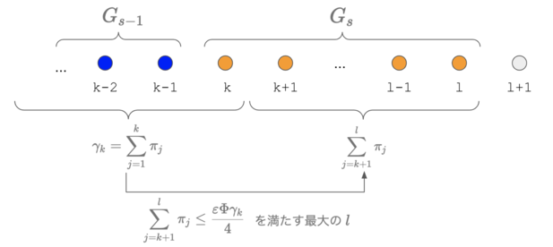

# Foundation of Data Science
- Chapter 4 : Random Walks and Markov Chains
  - 4.4 : Convergence of Random Walks on Undirected Graphs (p.89-98)
    - Theorem 4.5 の証明を追っていて力尽きてしまいました...

---
## mixing time
- Recap : **running average distribution**
$$
\boldsymbol{a}(t) = \frac{1}{t}(
  \boldsymbol{p}(0) +
  \boldsymbol{p}(1) + ... +
  \boldsymbol{p}(t-1)
)
$$
- $\varepsilon$-mixing time of Markov Chain (Definition 4.1)
  - *minimum integer $t$ such that*
    *for any starting distribution* $\boldsymbol{p}(0)$, 
$$
\Vert \boldsymbol{a}(t) - \boldsymbol{\pi} \Vert _ 1 \le \varepsilon
$$

---
## Normalized conductance
- あるMarkov Chainが、すべてのノードに対して伝わりやすいかの指標
  - conductance : もともと電気回路の用語で、電流の流れやすさの指標。
    - condactance is the inverse of resistance
- まず vertex の subset $S$ に対する定義から考える (Definition 4.2)
  - $\displaystyle \pi(S) = \sum_{x \in S} \pi_x$
  - *The normalized conductance $\Phi(S)$ of $S$ is*
$$
  \Phi(S) = \frac
  {\displaystyle\sum_{(x,y) \in (S, \bar{S})} \pi_x p_{xy}}
  {\min (\pi(S), \pi(\bar{S}))}
$$

---
## Mixing time と Normalized conductance の関係
- Theorem 4.5
  - *Thg $\varepsilon$-mixing time of a random walk on an undirected graph is:*
$$
O(\frac{\ln (1/\pi_{\min})}{\Phi^2 \varepsilon^3})
$$
  - *where $\pi_{\min}$ is the minimum stationary probability of any state.*
- 証明はかなりややこしい

---
## Theorem 4.5 の準備
- running average distribution とは（もう一度）
$$
\boldsymbol{a} = \boldsymbol{a}(t) = \frac{1}{t}(
  \boldsymbol{p}(0) +
  \boldsymbol{p}(1) + ... +
  \boldsymbol{p}(t-1)
)
$$
- これから示すのは、大きい $t$ で
  $\Vert \boldsymbol{a} - \boldsymbol{\pi} \Vert _ 1 \le \varepsilon$ となること。

- $\displaystyle v_i = \frac{a_i}{\pi_i}$ を定義し, $v_1 \ge v_2 \ge ...$
  のように降順に並べ替えておく。

---
- $\Vert \boldsymbol{a} - \boldsymbol{\pi} \Vert _ 1 \le \varepsilon$ となってほしい
- そのため $v_i = a_i / \pi_i$ は $1$ に近づいてほしい。
  - $v_i$ のグラフは傾きが緩やかになっていくことが望ましい。
- $v_i > 1$ となる $i$ を **heavy state** と呼び、ここから別の状態への  
  確率の流れ *probability flows* を確認する。
  - heavy state から確率が流れ出せば light state の確率が増加するから、  
    $v_i$のグラフは flat になり条件を満たす（証明の基本的なアイデア）
  - $v_i > 1$ となる最大の $i$ を $i_0$ とする。

---
- 次の Proposition 4.4 を思い出す ($x^{+}$ とは ReLUと同じ意味)
$$
\Vert \boldsymbol{p} - \boldsymbol{q} \Vert _ 1
= 2 \sum_i (p_i - q_i)^{+}
= 2 \sum_i (q_i - p_i)^{+}
$$
- これを使って, $v_i = a_i / \pi_i$ に注意して
$$
\begin{align}
\Vert \boldsymbol{a} - \boldsymbol{\pi} \Vert _ 1
 &= 2 \sum_i (a_i - \pi_i)^{+} = 2 \sum_i^{i_0} (v_i - 1) \pi_i \\\\
 &= 2 \sum_i (\pi_i - a_i)^{+} = 2 \sum_{i > i_0} (1 - v_i) \pi_i
\end{align}
$$

---

$$
\begin{align}
\Vert \boldsymbol{a} - \boldsymbol{\pi} \Vert _ 1
 &= 2 \sum_{i=0}^{i_0} (v_i - 1) \pi_i & ... (1) \\\\
 &= 2 \sum_{i > i_0} (1 - v_i) \pi_i & ... (2)
\end{align}
$$

- $(1)$は heavy state、$(2)$は light state の和になっている。  
- だから、$(1)$ が減ることと、$(2)$ が減ることは同じ話。
- 以下では heavy state を中心に考える。

---
- 次の $\gamma_i$ を定義する。つまり $i$ 番目までのstateの定常確率の和  
  (書いていないが $\gamma_0 = 0$ と定義することに注意)
$$
\gamma_i = \pi_1 + \pi_2 + ... + \pi_i
$$
- ここで関数 $f(x)$ を $x \in [0, \gamma_{i_0}]$ の範囲で定義する  
  ($i$の関数だった $v_i$ を、累積確率 $\gamma_i$ の関数として作った感じ)
$$
f(x) = v_i - 1
\quad \textrm{ for } \quad
x \in [\gamma_{i-1}, \gamma_i)
$$

- もう一度説明しておくと $v_i = a_i / \pi_i$

---
- 次が成立する
$$
\sum_{i=1}^{i_0} (v_i - 1) \pi_i
= \int_0^{\gamma_{i_0}} f(x) dx
$$
- 難しい話ではない。  
  $f(x)$(階段の形の関数)の下の面積を計算するのに、  
  和を使うか積分を使うか、書き方を変えただけの話。

---

- やや天下り式ではあるが、$\{ 1, 2, ... , i_0 \}$ をこの順序で、  
  $G_1, G_2, G_3, ... , G_r$ のグループに分割する (分け方は後で考える)
- 分割したグループごとに $u_s = \textrm{Max}_{i \in G_s} v_i$ を定義
- 関数 $g(x)$ を次のように定義
$$
g(x) = u_s - 1
\quad \textrm{ for } \quad 
x \in \bigcup _ {i \in G_s} [\gamma_{i-1}, \gamma_i)
$$

---

- 次が成立する
$$
\int_0^{\gamma_{i_0}} f(x) dx
\le \int_0^{\gamma_{i_0}} g(x) dx
$$
- 難しい話ではない。  
  $f(x)$の下の面積より
  $g(x)$の下の面積の方が大きいよねという話。

---

- 積分する代わりに、横の長方形を順番に足すことを考えると、次が成立
$$
\int_0^{\gamma_{i_0}} g(x) dx
= \sum_{t=1}^r \pi(G_1 \cup G_2 \cup ... \cup G_t) (u_t - u_{t+1})
$$
  - 書かれていないが $u_{t+1} = 0$としている。
  - $\pi(G_1 \cup ... \cup G_t)$ とは対象となるグループに含まれる  
    状態の定常確率のすべての和の意味

---
- ここまでの式をまとめると
$$
\begin{align}
\Vert \boldsymbol{a} - \boldsymbol{\pi} \Vert _ 1
 &= 2 \sum_{i=0}^{i_0} (v_i - 1) \pi_i \quad ... (4.3) \\\\
 &= 2 \int_0^{\gamma_{i_0}} f(x) dx  \quad ... (4.4) \\\\
 &\le 2 \int_0^{\gamma_{i_0}} g(x) dx \quad  ... (4.5) \\\\
 &= 2 \sum_{t=1}^r \pi(G_1 \cup G_2 \cup ... \cup G_t) (u_t - u_{t+1}) \quad  ... (4.6) \\\\
\end{align}
$$
- 実は、適切にグループを分割し、かつ $t$ がmixing time 以上であれば  
  最後の式が $\varepsilon$ 以下になるということを示そう。  
  (まだグループの分割方法は言わない...)

---

- もう一度 Proposition 4.4 から導いた次の式に戻る
$$
\begin{align}
\Vert \boldsymbol{a} - \boldsymbol{\pi} \Vert _ 1
 &= 2 \sum_{i=0}^{i_0} (v_i - 1) \pi_i & ... (1) \\\\
 &= 2 \sum_{i \ge i_0 + 1} (1 - v_i) \pi_i & ... (2)
\end{align}
$$
- light state の式 $(2)$ を考えると
  - これが $(2) \le \varepsilon$ 以下だったら、証明が終わってしまう。
  - なので、ここでは $(2) \gt \varepsilon$ を仮定する。次が成り立つ。   
    （この後、矛盾する $(1) \le \varepsilon$ を導き、この仮定を棄却する予定）
$$
\sum_{i \ge i_0 + 1} (1 - v_i) \pi_i > \frac{\varepsilon}{2}
$$

---

- 仮定した不等式を変形して、
$$
\begin{align}
\frac{\varepsilon}{2}
 &< \sum_{i \ge i_0 + 1} (1 - v_i) \pi_i \\\\
 &= \sum_{i \ge i_0 + 1} \pi_i - \sum_{i \ge i_0 + 1} \pi_i v_i
 \le \sum_{i \ge i_0 + 1} \pi_i \\\\
& \therefore \quad 
\sum_{i \ge i_0 + 1} \pi_i > \frac{\varepsilon}{2}
\end{align}
$$
- なんか奇妙な式変形だが、heavy state の任意の subset $A$ に対して
$$
\begin{align}
\pi(A) &\ge \frac{\varepsilon}{2} \pi(A)  \\\\
\pi(\bar{A}) &\ge \sum_{i \ge i_0 + 1} \pi_i > \frac{\varepsilon}{2}
\ge \frac{\varepsilon}{2} \pi(A) \\\\
& \therefore \quad 
\textrm{Min} (\pi(A), \pi(\bar{A})) \ge  \frac{\varepsilon}{2} \pi(A)
\end{align}
$$
  - この辺の導出は、テキストの記載がかなり雑で分かりにくい。

---
- ようやくグループ $G_1, G_2, ... , G_r$ を作ろう！ 
  - $G_1 = \\{ 1 \\}$
  - $G_{s-1}$ を作った後で $G_s$ を作ることを考える
    - 最初の要素 $k$ は $G_s$ の最後の要素の番号 $+1$
    - 最後の要素 $l$ は $k \le l \le i_0$ の範囲で、次を満たす最大の $l$
$$
\sum_{j = k + 1}^{l} \pi_j \le \frac{\varepsilon \Phi \gamma_k}{4}
$$

---
- ここで次の Lemma を使う (あとで証明する)
  - Lemma 4.6:
    - *Suppose groups $G_1, .., G_r, u_1, ..., u_r, u_{r+1}$ are as above. Then,*
$$
\pi(G_1 \cup G_2 \cup ... \cup G_s)(u_s - u_{s+1}) \le \frac{8}{t \Phi \varepsilon}
$$
- ええと、証明しなきゃいけないのはなんだっけ..
$$
\Vert \boldsymbol{a} - \boldsymbol{\pi} \Vert _ 1
 = 2 \sum_{t=1}^r \pi(G_1 \cup G_2 \cup ... \cup G_t) (u_t - u_{t+1}) \le \varepsilon
$$
- Lemma を使えば次がわかる。ん？ $r$ っていくつなんだ...
$$
\sum_{t=1}^r \pi(G_1 \cup G_2 \cup ... \cup G_t) (u_t - u_{t+1}) \le \frac{8r}{t \Phi \varepsilon}
$$

---
- $r$ の upper bound を算出しよう。グループの作り方を思い出す。  
  - $l$ は次の式を満たす最大の $l$ だった。 $\displaystyle
\sum_{j = k + 1}^{l} \pi_j \le \frac{\varepsilon \Phi \gamma_k}{4}$
  - つまり $l+1$ になるとこの条件が破れる。$\displaystyle
\sum_{j = k + 1}^{l+1} \pi_j \gt \frac{\varepsilon \Phi \gamma_k}{4}
$
- これは $\gamma_{l+1}$ を出発点として考えると、
$$
\gamma_{l+1}
 = \sum_{j = 1}^{k} \pi_j + \sum_{j = k+1}^{l+1} \pi_j
 \gt \gamma_k + \frac{\varepsilon \Phi \gamma_k}{4}
 = \left(1 + \frac{\varepsilon \Phi}{4} \right) \gamma_k
$$

---
- これを $G_{r-1}$ のグループから順にたどってみる
- $G_s$ の開始番号を $k_s$ とかけば、
$$
\begin{align}
\gamma_{k_r}
  &\gt \left(1 + \frac{\varepsilon \Phi}{4} \right) \gamma_{k_{r-1}}
  \gt \left(1 + \frac{\varepsilon \Phi}{4} \right)^2 \gamma_{k_{r-2}}
  \gt ... \\\\
  &\gt \left(1 + \frac{\varepsilon \Phi}{4} \right)^{r-2} \gamma_{k_2}
  \gt \left(1 + \frac{\varepsilon \Phi}{4} \right)^{r-2} \pi_1
\end{align}
$$
- $1 \ge \gamma_{k_r}$ なので、
$\displaystyle
\left(1 + \frac{\varepsilon \Phi}{4} \right)^{r-2} \pi_1 \lt 1
$
- 両辺logとって整理すれば、
$$
r < \frac{\log(\frac1{\pi_1})}{\log \left(1 + \frac{\varepsilon \Phi}{4} \right)} + 2
\le \frac{\log(\frac1{\pi_1})}{\frac{\varepsilon \Phi}{4}} + 2
\le \frac{4 \log(\frac1{\pi_{min}})}{\varepsilon \Phi} + 2
$$
  - これで *completes the proof* とか言っているのだが、まてまて...

---
- Lemma 4.6 を使って途中になっていた式を出すと、
$$
\sum_{t=1}^r \pi(G_1 \cup G_2 \cup ... \cup G_t) (u_t - u_{t+1}) \le \frac{8r}{t \Phi \varepsilon}
  \quad ... (★)
$$
- ここで $\displaystyle r \le \frac{4 \log(\frac1{\pi_{min}})}{\varepsilon \Phi} + 2$ を使うと、
$$
(★)
 \le \frac{8}{t \Phi \varepsilon}
 \left[
 \frac{4 \log(\frac1{\pi_{min}})}{\varepsilon \Phi} + 2
 \right]
= \frac{32 \log(\frac1{\pi_{min}})}{t \Phi^2 \varepsilon^2}
 \left[ 1 + O(\varepsilon) \right] \quad ... (*)
$$
- $t = \frac{32 \log(\frac1{\pi_{min}})}{t \Phi^2 \varepsilon^3}$ とおけば
$(*) = \varepsilon[ 1 + O(\varepsilon)] = O(\varepsilon)$
  - これでようやく証明終わり

---
- 宿題になっていた Lemma 4.6
  - 図のような感じで、$G_1, G_2, ...$ を作っていけば、次が成立する
$$
\pi(G_1 \cup G_2 \cup ... \cup G_s)(u_s - u_{s+1}) \le \frac{8}{t \Phi \varepsilon}
$$

---
- Lemma 4.6 の証明の方針
  - あるグループ $G_s = \\{ k, k+1, ..., l - 1, l \\}$ をとる (図を参照)
  - このグループの最初の要素 $k$ までの集合 $A = \\{ 1, 2, ..., k \\}$ を考える。
  - $A$ から確率の流れの関係式を2つ立てて証明する。
    - 流れを追ってみますが、多分この書籍の証明のどこかが間違っています。

---
- Part1 : running average probability の収束定理 Theorem 4.2 の途中の導出を使う
$$
\begin{align}
\boldsymbol{a}(t)P - \boldsymbol{a}(t)
  &= \frac{1}{t}(\boldsymbol{p}(0)P + ... + \boldsymbol{p}(t-1)P) -
    \frac{1}{t}(\boldsymbol{p}(0) + ... + \boldsymbol{p}(t-1)) \\\\
  &= \frac{1}{t}(\boldsymbol{p}(1) + ... + \boldsymbol{p}(t)) -
    \frac{1}{t}(\boldsymbol{p}(0) + ... + \boldsymbol{p}(t-1)) \\\\
  &= \frac{1}{t}(\boldsymbol{p}(t) - \boldsymbol{p}(0))
\end{align}
$$
- この式を用いると、初期分布をこの \boldsymbol{a}(t) とした時に \\\\
  1step 進んだ時の $A$ からの確率減少分について、
$$
\sum_{i=1}^k (a_i - (\boldsymbol{a}P)_i) \le \frac2{t}
$$
  - つまり $A$ からの確率の流れは、$2/t$以下となっている。

---
- Part2 : $A$ からそれ以外 $\bar{A}$ への確率流れ
  - Part1 と同じく、初期分布を $\boldsymbol{a}(t)$ とした時、  
    $i \in A, j \notin A$ に対して
$$
\begin{align}
\textrm{net-flow}(i,j)
 &= \textrm{flow}(i,j) - \textrm{flow}(j, i) \\\\
 &= a_i p_{ij} - a_j p_{ji} \\\\
 &= \pi_i p_{ij} v_i - \pi_j p_{ji} v_j \\\\
 &= \pi_j p_{ji} (v_i - v_j) \ge 0
\end{align}
$$
  - つまり、$i \in A$ から $j \notin A$ への確率の流れはプラス

---
- ここで、$i \le k$ から $l < j$ への確率の流れを考える。
  - この場合も任意の $i,j$ で $\textrm{net-flow}(i,j) = \pi_j p_{ji} (v_i - v_j) \ge 0$
  - 和をとって、$v_i \ge v_k, v_j \le v_{l+1}$ を使って整理すると
$$
\sum_{i \le k, l < j} \pi_j p_{ji} (v_i - v_j)
\le (v_k - v_{l+1}) \sum_{i \le k, l < j} \pi_j p_{ji}
$$
- Part1, Part2 の知見を合体すると、 $\displaystyle
(v_k - v_{l+1}) \sum_{i \le k, l < j} \pi_j p_{ji} < \frac2{t}
$

---
- sumの部分を考えると出発点 $j$ の異なる和について差をとって
$$
\sum_{i \le k, l < j} \pi_j p_{ji}
 = \sum_{i \le k < j} \pi_j p_{ji} - \sum_{i \le k < j \le l} \pi_j p_{ji}
$$
  - 1つめの和は、任意の heavy 集合 $A$ について  
    $\textrm{Min} (\pi(A), \pi(\bar{A})) \ge  \frac{\varepsilon}{2} \pi(A)$ としたので、
$$
\begin{align}
\sum_{i \le k < j} \pi_j p_{ji}
 &= \frac{\sum_{i \le k < j} \pi_j p_{ji}}{\textrm{Min} (\pi(A), \pi(\bar{A}))}
   \textrm{Min} (\pi(A), \pi(\bar{A})) \\\\
 &\ge \Phi \textrm{Min} (\pi(A), \pi(\bar{A})) \ge \frac{\varepsilon \Phi \gamma_k}{2}
\end{align}
$$
  - 2つめの和は、グループの作り方から
    $\displaystyle \sum_{j = k+1}^l \pi_j \le \frac{\varepsilon \Phi \gamma_k}{4}$ なので、
$$
\sum_{i \le k < j \le l} \pi_j p_{ji}
\le \sum_{j = k+1}^l \pi_j \le \frac{\varepsilon \Phi \gamma_k}{4}
$$

---
- 以上をまとめると
$$
\begin{align}
\frac2{t}
&\le (v_k - v_{l+1}) \sum_{i \le k, l < j} \pi_j p_{ji} \\\\
&\le (v_k - v_{l+1})
 (\frac{\varepsilon \Phi \gamma_k}{2} - \frac{\varepsilon \Phi \gamma_k}{4})
= (v_k - v_{l+1}) \frac{\varepsilon \Phi \gamma_k}{4}
\end{align}
$$
- 整理すると
$$
\gamma_k (v_k - v_{l+1}) \le \frac{8}{t \varepsilon \Phi \gamma_k}
$$
- これで Lemma が証明できた！といっているが、本当に証明したいのは、  
  $\gamma_k$ のところが $\pi(G_1 \cup G_2 \cup ... \cup G_t)$ なので証明がまちがっているのではないかと..
