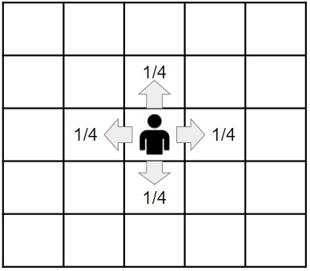
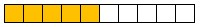
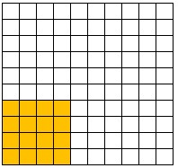

# Foundation of Data Science
- Chapter 4 : Random Walks and Markov Chains
  - 4.4.1 : Using Normalized Conductance to Prove Convergence
    - いくつかのケースで$\Phi$を算出する手順を考える

---
## Normalized conductance
- あるMarkov Chainが、すべてのノードに対して伝わりやすいかの指標
  - conductance : もともと電気回路の用語で、電流の流れやすさの指標。
    - condactance is the inverse of resistance
- まず vertex の subset $S$ に対する定義から考える (Definition 4.2)
  - $\displaystyle \pi(S) = \sum_{x \in S} \pi_x$
  - *The normalized conductance $\Phi(S)$ of $S$ is*
$$
  \Phi(S) = \frac
  {\displaystyle\sum_{(x,y) \in (S, \bar{S})} \pi_x p_{xy}}
  {\min (\pi(S), \pi(\bar{S}))}
$$

---
## Mixing time と Normalized conductance の関係
- Theorem 4.5
  - *Thg $\varepsilon$-mixing time of a random walk on an undirected graph is:*
$$
O(\frac{\ln (1/\pi_{\min})}{\Phi^2 \varepsilon^3})
$$
  - *where $\pi_{\min}$ is the minimum stationary probability of any state.*
- **私はもう今後 $t_{\varepsilon}$ と書きますね。**

---
## Normalized condactance の算出例
- いくつかの特殊なケースでは、$\Phi$を簡易に算出できる
  - 1-dim lattice
  - 2-dim lattice
  - $d$-dim lattice
  - clique
  - connected undirected graph
  - gaussian distribution on the interval [-1, 1]
- 順番に説明しますが、先に復習...

---

## Recap : Random Walks on Undirected graph
- vertex $i, j$ 間に、weight $w_{ij}$ が定義されているとする。
  - undirected なので $w_{ij} = w_{ji}$
- transition probability として次を使うことができる
$$
p_{ij} = \frac{w_{ij}}{\sum_j w_{ij}}
$$
  - 次の記号も定義しておく
    - $w_i = \sum_j w_{ij}$ 
    - $w_{\textrm{total}} = \sum_j w_j$

---

## Recap : Random Walks on Undirected graph
- このように定義された $p_{ij}$ は次の性質を持つ
  - (1) stationary distribution : $\pi_x = w_x / w_{\textrm{total}}$
  - (2) detailed balance : $w_x p_{xy} = w_y p_{yx}$
    - なので $p_{xy}$ で遷移させると $\boldsymbol{\pi}$ に収束する

---

## lattice 上の Random Walk
- 隣接するノード (d次元の場合、2d個ある)に同じ確率でjumpする  
  lattice 上の Random Walk の mixing time を考える。
- (例) 2-d の場合:
  - 端にぶつかる場合は、元の場所に戻る (動かない=MCMCのreject)
- 一般に $d$ 次元の場合 : $p_{ij} = 1 / 2^d, {} \pi_x = 1 / n^d$

---

## 1-dim lattice
- $p_{xy} = 1/2, \pi_x = 1/n$
- 最小の $\Phi$ となるのは、latticeのちょうど半分が$S$の場合
  - $\Phi$ の計算では、端の要素($\pi_x = 1/n$)だけが計算に寄与し、  
    その隣への遷移 $p_{xy} = 1/2$ だけが関係するから、
$$
\begin{align}
\Phi(S)
  &= \frac{\sum_{(x,y)\in(S, \bar{S})}\pi_x p_{xy}}
    {\min(\pi(S), \pi(\bar{S}))}
  = \frac{(1/n) \times (1/2)}{1/2}
  = \frac1{n} \\\\
t_{\varepsilon}
  &= O(\frac{\log (1/\pi_{\min})}{\Phi^2 \varepsilon^3})
  = O(\frac{\log n}{(1/n)^2 \varepsilon^3})
  = O(n^2 \log n / \varepsilon^3)
\end{align}
$$

---

## 2-dim lattice
- $p_{xy} = 1/4, \pi_x = 1/n^2$
- $|S| < n^2/2$ のケースだけを考えればOK. これを次の2つに分ける
  - (Case1) : $|S| \ge n^2  / 4$の場合(全体の25%以上)
  - (Case2) : $|S| < n^2  / 4$の場合(全体の25%未満) 

---

### Case1
- $|S| \ge n^2  / 4$の場合(全体の25%以上)
  - 端から縦1列ずつ順に埋めていけばいい(1列だけ半端になることは許す)
  - この場合、$S$ から $\bar{S}$ への edge の本数 $>n$

$$
\begin{align}
\therefore
\Phi(S)
  &= \frac{\sum_{i \in S} \sum_{j \in \bar{S}}\pi_i p_{ij}}
    {\min(\pi(S), \pi(\bar{S}))}
  \ge \Omega \left(
      \frac{n \frac1{n^2}}
        {\min(\frac{S}{n^2}, \frac{\bar{S}}{n^2})} \right) \\\\
  &\ge \Omega \left(
      \frac{\frac1{n}}{\frac{n^2}{4 n^2}} \right)
  = \Omega \left(\frac1{n} \right)
\end{align}
$$

---

### Case2

- $|S| < n^2  / 4$の場合(全体の25%未満)
  - 左下の角に正方形(square)で配置するのが最も edge が少ない  
    (Exercise 4.24で示すことになっている)
  - この場合、$S$ から $\bar{S}$ への edge の本数 $>2 \sqrt{|S|}$

$$
\begin{align}
\therefore
\Phi(S)
  &= \frac{\sum_{i \in S} \sum_{j \in \bar{S}}\pi_i p_{ij}}
    {\min(\pi(S), \pi(\bar{S}))}
  \ge \Omega \left(
      \frac{\frac1{n^2} \times 2 \sqrt{|S|}}
        {\frac1{n^2} |S|} \right) \\\\
  &= \Omega \left(
      \frac2{\sqrt{|S|}} \right)
  = \Omega \left(\frac1{n} \right)
\end{align}
$$

---

## 2-dim lattice まとめ
- 結局1-dim, 2-dimで話は同じで、
$$
\begin{align}
\Phi(S) &= \Omega \left(\frac1{n} \right) \\\\
t_{\varepsilon} &= O(n^2 \log n / \varepsilon^3)
\end{align}
$$

---

## d-dim lattice
- $p_{xy} = 1/2^d, \pi_x = 1/n^d$
- すべての状態に到達する時間 (cover time)は少なくとも $n^d$
- でも、$\Phi=\Omega(1/dn)$ が示せるので (Exercise 4.25の宿題！)
$$
t_{\varepsilon}
  = O(\frac{\log (1/\pi_{\min})}{\Phi^2 \varepsilon^3})
  = O(\frac{\log n^d}{(\frac1{dn})^2 \varepsilon^3})
  = O(d^3 n^2 \log n / \varepsilon^3)
$$
- これは Metropolis-Hastings や Gibbs Sampling がなぜ速く収束  
  するかということに対するざっくりした説明になっている。

---

## Clique
- これは簡単 : ${} p_{xy} = 1/n, \pi_x = 1/n$  
  $ \therefore \quad p_{xy} \pi_x = 1/n^2$
$$
\begin{align}
\Phi(S)
  &= \frac{\sum_{(x,y)\in(S, \bar{S})}\pi_x p_{xy}}
    {\min(\pi(S), \pi(\bar{S}))}
  = \frac{\frac1{n^2} |S||\bar{S}|}{\frac1{n} \min(|S|, |\bar{S}|)} \\\\
  &= \frac1{n} \max(|S|, |\bar{S}|)
  = 1 \\\\
t_{\varepsilon}
  &= O(\frac{\log (1/\pi_{\min})}{\Phi^2 \varepsilon^3})
  = O(\frac{\log n}{\varepsilon^3})
\end{align}
$$