## Are we really making much progress?: Revisiting, benchmarking and refining heterogeneous graph neural networks
- [論文](https://dl.acm.org/doi/10.1145/3447548.3467350)
- [実装およびデータセット](https://github.com/THUDM/HGB)

### 概要
Heterogeneous Graph Neural Network (HGNN) のベンチマークデータセットである
[Heterogeneous Graph Benchmark (HGB)](https://github.com/THUDM/HGB) を整備した。

このレポジトリで、3つのタスクの、全部で11のデータセットを使い、
これまで公開された複数の手法を使って精度比較をした報告である。

Are we really making much progress? はいわずもがな
MaurizioFD氏による Are We Really Making Much Progress?
A Worrying Analysis of Recent Neural Recommendation Approaches
が念頭にあり、Graph Neural Network の最近の進展を批判的に
取り上げた論文である。

様々な手法が最近提案されているが、これまでの手法の中で
最も精度が高かったのは、ほとんどのデータセット/タスクに対して
GAT(Graph Attention Network)という、比較的初期に提案された手法を使う場合である
と指摘したうえで、著者らはGATを若干拡張した手法である、Simple-HGNという
（単純な）手法を考え、結局この手法が、すべてのデータセット/タスクにおいて
最も精度が高かった、という結果を出しており、結局これまでの研究で
進歩はあったのだろうか？ を問う報告となっている。

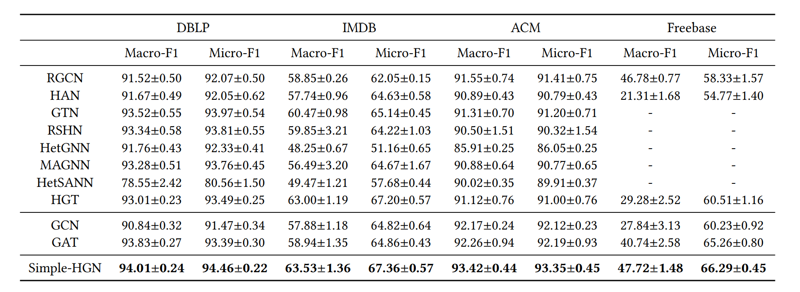

以後、HGNN系の研究は、彼らのベンチマークデータセットでの
検証結果が基準になっていくのだろう、という気概を感じる報告である。

## Learning Based Proximity Matrix Factorization for Node Embedding
- [論文](https://dl.acm.org/doi/10.1145/3447548.3467296)
- 実装がない。

### 概要
Node Embedding の算出手法として、

1. まず、Network上のRandom Walkをして、到達確率から
   Node間の similarity matrix を算出
2. 算出された similarity 行列を分解し、ノードのembeddingを算出

というステップを踏む手法が多数ある。

これらのステップで、similarity の計算では Personalized PageRank(PPR;
起点のノードから出発して、ある確率$\alpha$で起点に戻る場合の
他のノードの滞在率を起点ノードとのsimilarityと考える PageRank の変種)
を使うケースが多く、行列分解では SVD が使われることが多い。

この場合 PPR のパラメータ $\alpha$ は Node Embedding を適用する
タスク(Link Prediction / Node Classification など)によって最適な
パラメータが異なるので、現在のタスクのloss関数が最小となるように
similarityのパラメータ$\alpha$を最適化できるようにする手法を
考えたという報告。この手法を Lemane と呼んでいる。

この手法では PPR $\to$ SVD $\to$ embedding $\to$ loss function
という流れにおいて、SVDで微分可能なもの(differential SVD)
を使うのが特徴的。PyTorchで筆者らは実装。Training の流れを以下に示す。

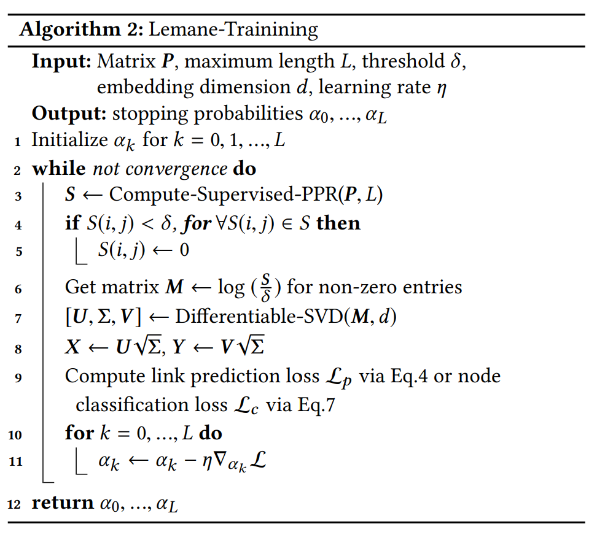

ただし計算コストが高く、コストがかからないような工夫があるため、
ノードをsub-samplingするなど、ロジックが若干ややこしい。
(上のTrainingとは別に記載がある)

計算した結果得られる Node Embedding による各タスクの精度は
他の手法よりも高いと報告している。既存の手法で最も高いものとして
同じく PPR(の改良版)+SVD という構成の [STRAP](https://arxiv.org/abs/1905.07245)
という手法が取り上げられている。

## Signed Graph Neural Network with Latent Groups
- [論文](https://dl.acm.org/doi/10.1145/3447548.3467355)
- [実装](https://github.com/haoxin1998/GS-GNN)  ... まだ公開されていない感じ。

### 概要
敵・味方のネットワークで、node representation を得ようという話。
「味方の味方は味方」「敵の敵は味方」となっているように友達関係が
構成されるという "balance theory" (バランス理論) に基づいて愚直に
representation を構成しようとすると破綻するので、ある程度グループ
にまとめてしまい、グループ内で representation が似ていて、
そこから敵・味方関係の矛盾が少なくなるように representation を
算出するアルゴリズム GS-GNN を構成した。

## Approximate Graph Propagation
- [論文](https://dl.acm.org/doi/pdf/10.1145/3447548.3467243)
- [著者github](https://github.com/wanghzccls/) ... ただし実装がない

### 概要
Graph Propagation に基づく Node Representation の手法として、
Personalized PageRank (PPR), heat kernel, Katz などの手法があるが
これらを統合したうえで、さらに近似計算で高速化した改良手法の提案

それぞれの手法は、整理すると、

1. $i-$Step後の確率に適用する重み
2. 伝播させる情報
3. 伝播の式

の違いですべて説明でき、これらの違いを1つのモデルに集約して
パラメータの値の違いで、任意のモデルになるようにできるような
手法(のはず、ちゃんと理解できていない...)としてまとめることが
できるが、そのモデルをまじめに解くことは困難なので、これを
近似することで現実的な計算時間内に収まるようにした手法である
Approximate Graph Propagation (AGP) を提案している。

各種手法との精度・計算時間の比較グラフを見ると、
どのようなタスクにおいても、既存手法より10倍前後程度速くて、
かつ既存手法より若干精度が劣る程度にとどめられるとのこと。

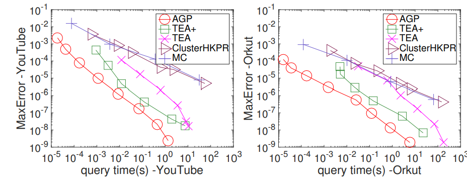

## Maximizing Influence of Leaders in Social Networks
- [論文](https://dl.acm.org/doi/10.1145/3447548.3467229)
- [実装](https://github.com/kedges/kedges)

### 概要
二極化した世論(0/1)で、人々の意見は身近な知り合いの意見の平均で
決まる、とするネットワーク上のダイナミクスモデル（これを一般的に
Leader-Follower DeGroot Modelというらしい）が与えられたときに、
初期条件として1の意見をもつ人達(leaders)から、0の意見を持つ人たち
(follower)に対して、任意にedgeをつないでいい時に、その本数が固定の
場合に、最もダイナミクスを無限回回した時の1の意見を持つ人の割合
が最大になるようなedgeの結び方の提案。

このようなedgeの選び方は submodular 性をもつので、greedy に選択
しても、ある程度精度が担保でき、かつ、1本追加で選んだ時の
1の割合は、逆行列を使った更新式 (Sherman-Morrison formula) で
更新できる。

Julia を使った実装が存在する。

## MiniRocket: A Very Fast (Almost) Deterministic Transform for Time Series Classification
- [論文](https://dl.acm.org/doi/10.1145/3447548.3467231)
- [実装](https://github.com/angus924/minirocket)

### 概要
時系列に対する判別モデル。

論文はわかりにくいのだが、講演で示したスライドがわかりやすく、
図のように非常にたくさんの Convolution Kernel を作っておき、
これらのパターンのKernelの長さを引き延ばしたり、様々に変換した
Kernelを使って、Convolutionしてfeatureを多数作り、
このfeature で別のモデルで判別するという趣旨のもの。

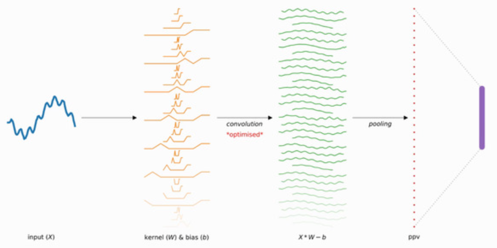

先行する手法の Rocket と似ているが、乱数を使わない決定的手法。
Rocketと比較して精度を維持しつつ75倍速くなったといっている。

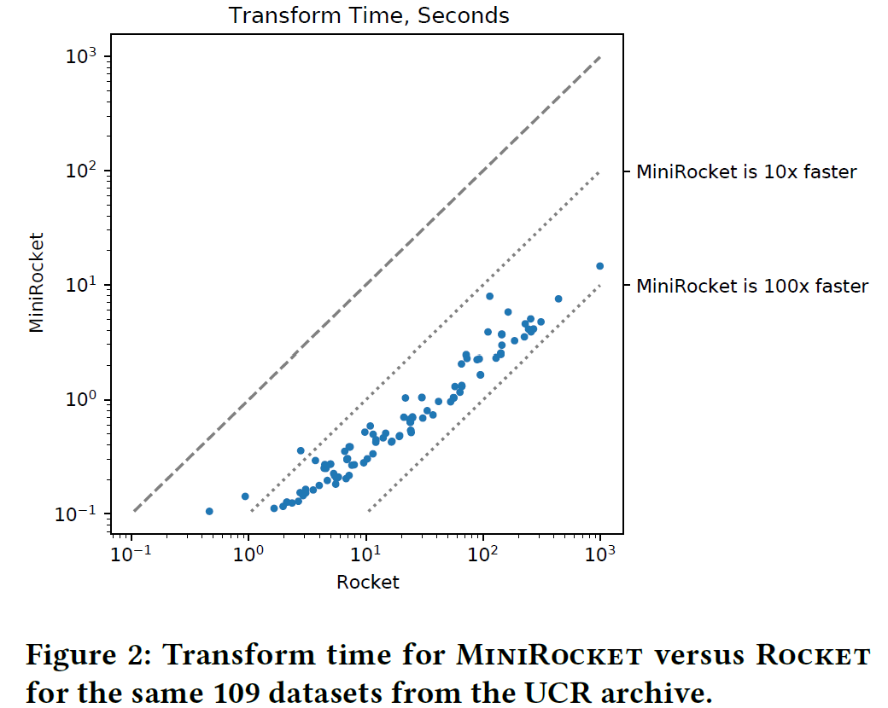

KDDに先行してすでに実装があったらしい。
sklearnと親和性が高そうであり、使い勝手がよさそう。
時系列データに対する判別モデルなどのタスクが出たら
ぜひ試してみたい。

## A Broader Picture of Random-walk Based Graph Embedding
- [論文](https://dl.acm.org/doi/abs/10.1145/3447548.3467300)
- [実装](https://github.com/zexihuang/random-walk-embedding)

### 概要
これまでに提案されてきた Random-walk を用いる Graph Embedding 手法には
非常にたくさんの手法があるが、非常に似ているものもあれば、かなり異なる
ものもあり、これらのどこが違うのかをまず次の3つの要素で特徴づけて分類:

1. 遷移確率の取り方(連結要素だけに行くか, PageRankのようにジャンプがあるか)
2. ノード間の類似度の計算の仕方(PMI or Autocovariance)
3. ノードembeddingの算出方法(Matrix Factorization or Sampling)

これらの要素で分類してみると、要素の組み合わせには様々考えられて、
まだ提案されていない組み合わせも多々あるよね、と指摘したうえで、
これらの組み合わせを含めて複数のデータセット・タスクで検証を改めて
実施した結果が報告されている。

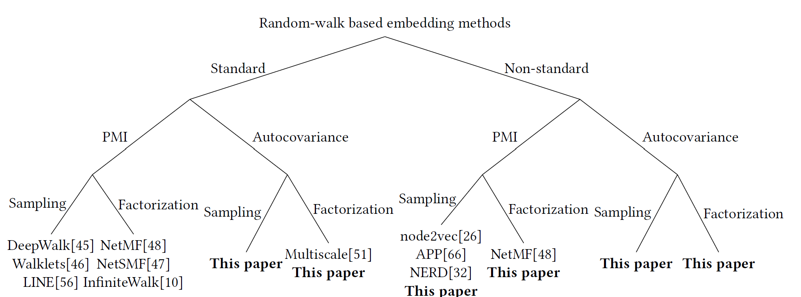

実際には、タスクごとに適した組み合わせがあり、例えば、

- PMI vs Autocovariance では、
  - Node Classification では、PMIが性能高い
  - Link Prediction では、AutoCovarianceが性能高い

その他、3つの要素いずれについても、タスクごとにどちらが優れて
いるかはタスクによって変わるので、タスクによってそれぞれの要素
のどれがいいか選択するべきである、という趣旨である。

Graph Embedding については、上の "Approximate Graph Propagation"
と同じく、手法がかなり発散していて、このような整理学が求められて
いるという雰囲気がある。

## Where are we in embedding spaces? A Comprehensive Analysis on Network Embedding Approaches for Recommender Systems
- [論文](https://dl.acm.org/doi/10.1145/3447548.3467421), [arxiv](https://arxiv.org/abs/2105.08908)
- [実装](https://github.com/RinneSz/Social-Collaborative-Metric-Learning)

### 概要
レコメンドタスクでHyperbolic embeddingがどれだけ有効かを
ちゃんと調べてみようという研究。practitionerは、なんでも
hyperbolic化したがるけど、そうなんでもhyperbolicにしたからと
いってよくなるわけではないよという前置きから始まる。

3つの仮定を置き、実際のデータで仮説が正しいことを確認している。

1. inner product based の手法より distance based の手法に対して
   hyperbolic化する方が改善が大きい。
2. データの密度が低い場合に hyperbolic 化での改善が大きい。
3. hyperbolic の場合は、しない場合と比較して次元が低いほうが改善が大きい。

「データの密度が低い」は、行列密度が、0.01%-0.1%程度のスケールを指している。
MovieLensは100k-1Mは、4-6%程度であり、密度が高いケースになる。

実際にSocial Network で、これらの仮定が当てはまるような
CMLの拡張手法 SCML と hyperbolic 化した HSCMF を提案し
確かに従来法よりも精度が改善することを確認。
ただし計算コストが高いので、注意したほうがいいというコメント。

レコメンドタスクでは、hyperbolic化により精度改善ができるケースが
比較的限られているので注意したほうがいいという指摘に見えた。

## NewsEmbed: Modeling News through Pre-trained Document Representations
- [論文](https://dl.acm.org/doi/10.1145/3447548.3467392)
- 実装はない。
  - first author である Jialu Liu の [github](https://github.com/remenberl)にも実装は見当たらない。 

### 概要
News記事のembeddingを算出する話である。
基本的には、学習済み transformer モデルを使うのだが、
単に適用するだけではなくて様々な工夫がある。

- news記事1つに対してまったく同じだが表現が違うもの(positive)と
  よく似ているが、まったく別の記事(negative)でtripletを構成し、
  InfoNCE loss を使って [contrastive learning](https://arxiv.org/abs/1807.03748)
  で embedding を学習する。

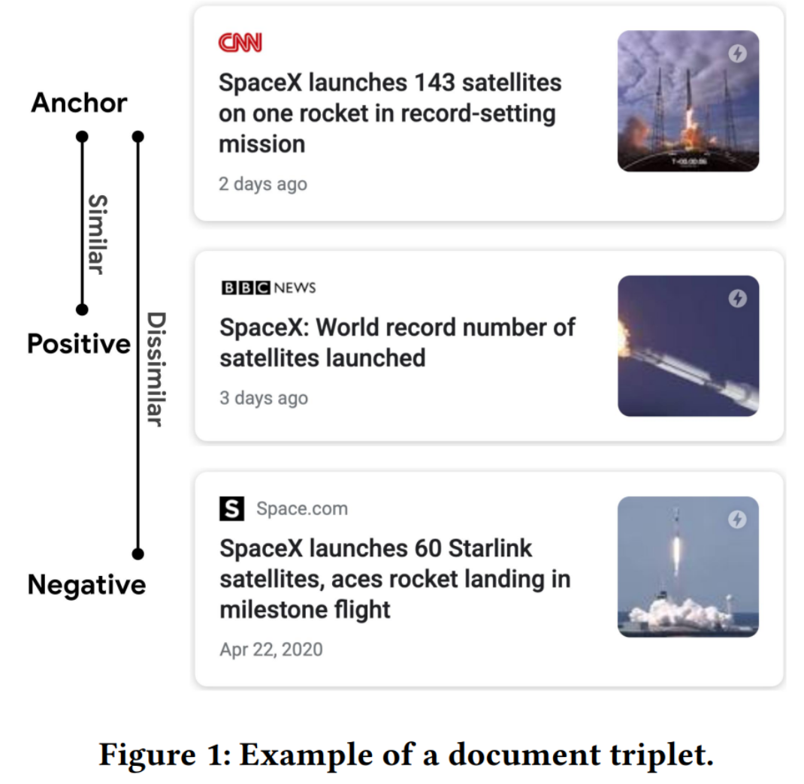

- この学習において、news記事に対して付与されている
  記事カテゴリの判別タスクも含めて学習を実施し、
  multitask learning をして精度を高めている。

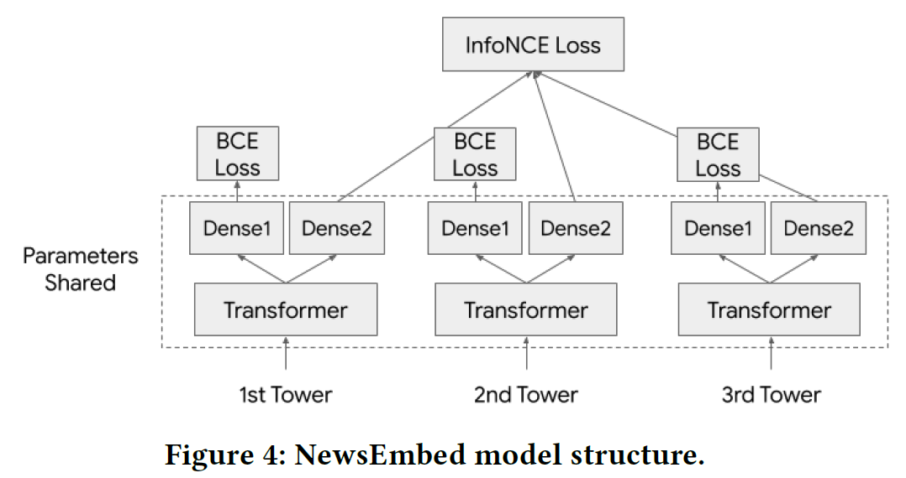

単にcontrastive learning するだけではなく、
multitaskにして精度を高めたりするあたりの工夫が光る。

またデータをクロールする際に、記事の時刻と、
記事についた画像のembeddingsにより、記事の同一性を担保するなど、
データの集め方やラベルのつけ方が素晴らしい。パイプラインの構成など、
学習システムの構築など非常に鮮やかな感じがする。

## Triplet Attention: Rethinking the similarity in Transformers
- [論文](https://dl.acm.org/doi/abs/10.1145/3447548.3467241)
- [実装](https://github.com/zhouhaoyi/TripletAttention) ... これを書いた時点では *We will release the code soon.* となっている

### 概要
Transformers モデルの Self-Attention の部分で、
Query,Key,Value のKeyの部分にKey1,Key2と拡張する。
この際に、Key1,Key2のOuter-productとQueryとのinner productが
大きい場合に値が大きいとする考え方。このようにすると文脈ごとに
意味が異なる表現を取り込めるという話らしい。

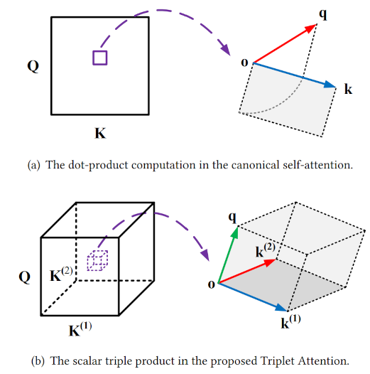

ただしこの機構を取り入れて改善できた差分はあまりそこまで
大きくないし、定性的に何か新しいことが抽出できるという
わけでもなさそうなので、あまりインパクトがないのではという印象。

## Efficient Data-specific Model Search for Collaborative Filtering
- [論文](https://dl.acm.org/doi/10.1145/3447548.3467399)
- 実装はみあたらない。

### 概要
Collaborative Filteringを改良した手法は、Embeddingの算出や
inner productの算出部分に改良が加わっているという違いがあるだけ
なので、これらを適用する/しないをデータごとにパラメータチューニング
することで、データごとに特化した最適手法を抽出できるという前提で
組まれたレコメンド向け自動モデルチューニング機構についての報告。

心躍るタイトルで読み始めたのだが、前提として、Xiangnan He の
[Neural Collaborative Filtering](https://arxiv.org/abs/1708.05031)
の精度が高いことを期待しているのだが、残念ながら NCF は Steffen Rendle
さんが[RecSys2020で、シンプルなMatrix Factorizationより精度が低い](https://dl.acm.org/doi/10.1145/3383313.3412488)
というかなり辛らつだが確からしい実験報告が存在するあるので、この手の論文も
Matrix Factorization 系のモデルについてチューニングが正しくされているか
怪しい感じがある。コンセプトは理解するが結果については信憑性に欠くのでは
というのが素朴な印象。

## Deconfounded Recommendation for Alleviating Bias Amplification
- [論文](https://dl.acm.org/doi/10.1145/3447548.3467249)
- [実装](https://github.com/WenjieWWJ/DecRS)

### 概要
レコメンドにおけるPopularity Biasの除外を因果推論の立場から考えた研究。
手法として、Factorization Machineとその亜種の改善が念頭にある。

User Embedding $U$ とUser Response $Y$ の両方に対して、
Item Groupへの直近の接触の多さという交絡因子が存在するため、
Popularity Biasが発生するという因果を仮定するところが出発点。

ここから、User Embedding $U$ や、Item Embedding $I$ とは独立に
「Item Group滞在分布」という変数 $D$ を FM モデルに入れて、
交絡因子の無効化(Deconfounding)を実施する DecRS を提案。
実際には、Item GroupごとのEmbedding $M$ を作って、$U,I,M$の
3つ組でモデルの中に組み込むという形をとる。

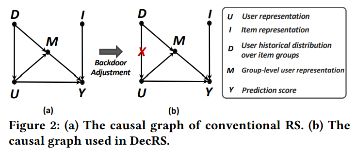

交絡因子の仮定までは理解だが、その後の取り扱い方が因果推論系では
あまり一般的なやり方でないように見えるので、これで交絡因子を考慮した
因果推論として成立しているのかがよくわからない。手法を適用した後の
効果推定が通常のnDCGになっているのも、これで妥当なのかが疑問。
ただしシンプルなので、実運用には使いやすそう。

効果が表れやすいuserとして、Item Groupの季節変動が著しいuserへの
効果が表れやすいという話が面白い指摘に思った。
(レコメンド結果で行動に対してバイアスがかかりやすい人ほど
popularity bias補正の効果が出やすいという指摘)

Xiangnan He さんはこの方向性に舵を切ってきたらしい。。

## TimeSHAP: Explaining Recurrent Models through Sequence Perturbations
- [論文](https://dl.acm.org/doi/10.1145/3447548.3467166)
- 実装は見当たらない

### 概要
SHAPは、回帰/判別モデルでの説明変数の重要度の算出に用いる手法で、
LIMEと並んでよくつかわれるが、計算オーダーが変数の数の指数オーダーに
なる点が懸念点であるため、時系列イベントデータに使うにはコストが高い。

そこで、TimeSHAPと呼ばれる次の工夫を入れた。
(SHAPはそのままに、SHAPに入力するデータの入れ方の工夫だけにみえる)

1. 時系列データを現在から一定時刻前と後で2分割して扱ってSHAPで
   shapley値を計算し、最も効果の高い分割を見つける。
   (過去時刻の探索を効率化するpruning)
2. 決定した時刻より前の変数について、時刻ごと/変数ごとにグループ分けし
   最も効果のある組み合わせを見つける（時刻x変数の全組み合わせを
   探すと破綻するので。図）

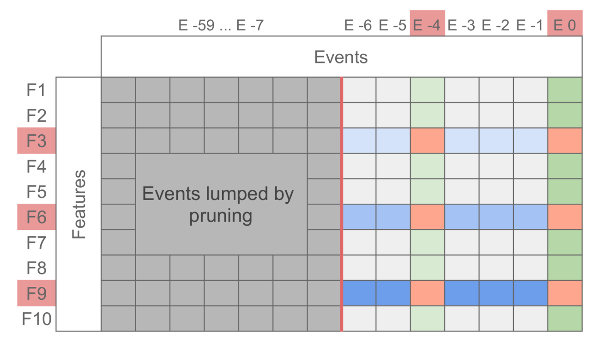

この手順を、実際の（おそらくポルトガルに拠点がある）銀行のトランザクションの
GRUによる（おそらく異常利用の）判別モデルに適用し、どの時刻のどの特徴量が
判別に影響があるかを算出できたといっている。

ADS Track (Industrial Track相当)での発表なので、
実業務への適用実績に力点があり、技術的に新しい何かがある報告ではないが、
比較的シンプルな工夫でうまく効果を出せているように見える。

## Amazon SageMaker Clarify: Machine Learning Bias Detection and Explainability in the Cloud

- [論文](https://dl.acm.org/doi/10.1145/3447548.3467177)
- [Amazon SageMaker Clarify のページ](https://aws.amazon.com/jp/sagemaker/clarify/)

### 概要
Amazon SageMakerにdeployしたモデルと、学習に用いたデータセットを使って、
モデルに含まれる (バイアスがかかりがちな事前指定した特定の属性に対する)
バイアスの定量化と、予測根拠となる説明結果を与える Amazon SageMaker
Clarify というサービスについての紹介。

学習データ自体の偏り(Pre-Training Metrics)と、学習後のモデルが出力する
予測結果が持つ偏り(Post-Training Metrics)を測定、
Pre-Training ではCI/DPL/CDDL, Post-Training では DPPL/DI/DCA/AD/RD/DAR/TE/CDDPI
といった指標が使われるらしい（割と単純な計算式で与えられるものが多い）

予測結果の説明ではKernelSHAPが使われるとのこと。

いずれもこれと言って目新しいものはないが、deployしたモデルの
モニタリング目的で利用できるサービスであるという主張。

## A hyper-surface arrangement model of ranking distributions

- [論文](https://dl.acm.org/doi/10.1145/3447548.3467253)
- [実装](https://github.com/shizuo-kaji/rankLearning) : Chainerを使った実装になっている。

### 概要
九大の鍛冶静雄さんのグループの発表。

アイテムのランキングデータが与えられているときに、このランキングに
最も適合するような多次元空間上の埋め込みを与えるようなアルゴリズムを
考えたという話。Plackett-Luceなどのように1変量にする前提のものは多いが、
ここでは多次元の埋め込みを得られることが利点。

ランキング対象となるアイテム1つが空間上の1点に対応していて、
かつ、空間上の1点がランキング1つに対応しており、その点に近い順に
ランキングが生成されると考える。そのため、アイテムに対応する点で
空間をVoronoi分割すると、Voronoi分割された領域で同一のランキングが
生成される理屈となっている。

神嶌さんの[寿司データセット](https://www.kamishima.net/sushi/)に対して適用した結果が報告されていて、
マグロ系の寿司が概ね同じ地位を占めたり、かっぱ巻きなどが遠くに位置するなど、
概ねデータの全体の傾向を表すような埋め込みベクトルを得ることができるとのこと。

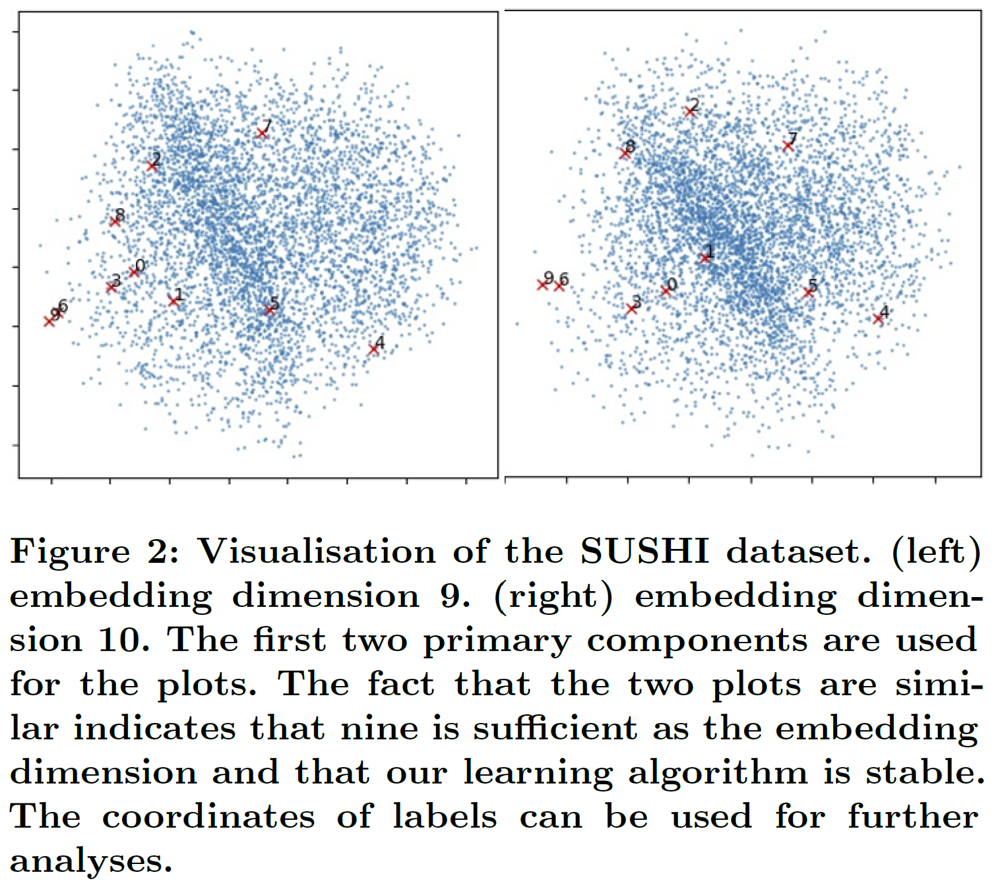

数値検証では、ランキングの上位部分観測から、下位ランキングの推定などが
できるという報告があり、ランキングデータが与えられている場合のレコメンド
などに使えるのではと思った（どういう業種であればランキングデータがあるのかな...）

## Debiasing Learning based Cross-domain Recommendation

- [論文](https://dl.acm.org/doi/10.1145/3447548.3467067)
- 実装はない。

Cross-domain Recommendation といった場合、ユーザが共通する
全く別のデータセットでのレコメンドにおいて、共通ユーザの情報を
互いに使いあうことで精度を高めあうという意味合いが強い。

しかし利用者がオーバーラップするような、2つのネットショッピングサイトで、
まったく同じユーザが、それぞれのサイトで全く別の行動をとることが実際にあり、
これをどのように補正するか？という中国のTaobaoからの報告。

因果グラフにおいて、ドメインに特化した交絡因子(DSC)、共通の交絡因子(GC)
を考える。DSCとして考えられるのが、サイトの性質を表す変数であり、
これによって user embeddings($\boldsymbol{v}_u$) も、購入($y$)も影響を
受けると考えて IPS (傾向スコア逆数スコアリング) でレコメンドの損失に
重みづけをして学習するなどし、バイアス補正の形でドメイン間でのユーザ行動の変化を
吸収したという話。その他いくつかの工夫がある。
評価においては、FM/Wide&Deep/DeepFMに対して提案法を適用し、
従来の Cross-domain Recommendation 手法より精度改善したとのこと。

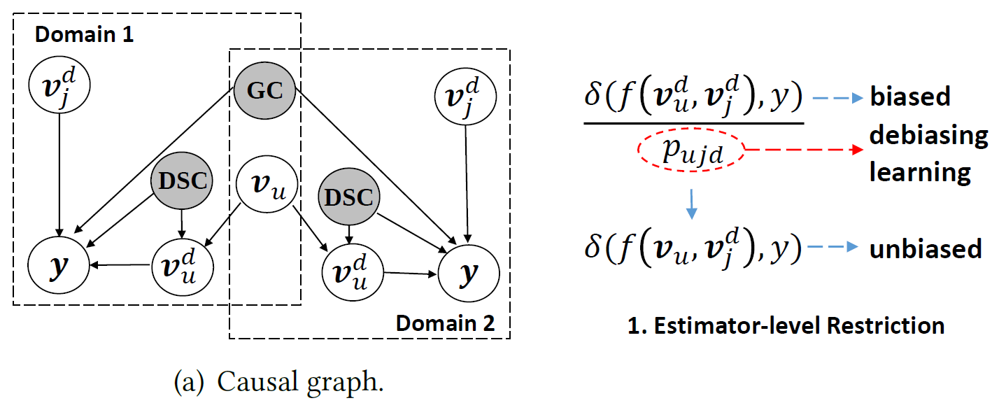

本当にうまくいったのであれば素晴らしいが、
この結果を出すまでに因果を整理できるかが肝なのだろうと思われ、
実践は難しいだろうなという印象を持った。

## Learning to Embed Categorical Features without Embedding Tables for Recommendation
- [論文](https://dl.acm.org/doi/10.1145/3447548.3467304)
- 実装はない。

Recommendationにおいて、User/Itemの数が非常に多い場合、
単純なMatrix FactorizationでもEmbedidngテーブルが巨大になる。
これを回避するための方法としてハッシュ関数を使う方法が近年
多数提案されているが collision 問題が解決されていない。

これを解決するために、Deep Hash Embedding (DHE) という
方法を考えた。これはUser ID/Item ID (巨大な整数を想定)
から1000個くらいのハッシュ化された(小さな範囲の)整数を生成し、
これらを単に実数の範囲に正規化する。この正規化されたベクトルを、
多層Denseを通してEmbeddingを作り、ここからRecommendationモデルを
（Denseの学習も併せて）学習するという流れ。

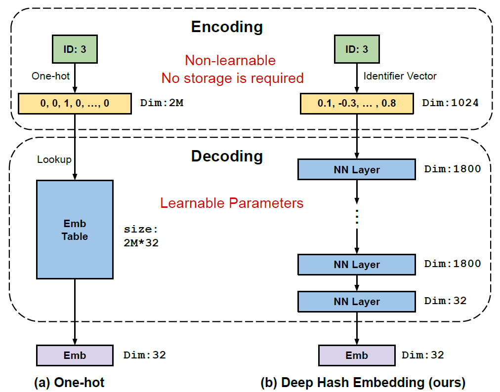

パラメータ数で比較すると、他の手法に比べて精度が高いと言っているのが
本当だとすると、アイデアがシンプルにもかかわらずいい結果を出していて
なかなか素晴らしいのだが、容易に想像できるように計算コストが高く、
素のEmbeddingと比べて10倍以上時間がかかると言っている。
（GPUでboostできると言っているが、この点は苦しいと言わざるを得ない）

というわけで、研究としては生煮え感がぬぐえないが、他のfeature
を混ぜ込むことが容易であるので、このアイデアをベースにした
改良手法がやってくるのではという点で、今後が期待される。

## Discrete Choice Models with Interpretable Context Effects
- [論文](https://dl.acm.org/doi/10.1145/3447548.3467250)
- [実装](https://github.com/tomlinsonk/feature-context-effects)

### 概要
離散選択モデル(Discrete Choice Model)では、最もシンプルには
多項ロジットを使うモデリングが行われるのだが、仮定として
IIA(independence of irrelevant alternatives ; 無関係な選択肢からの独立性)
が成り立つ必要がある([wikipedia](https://en.wikipedia.org/wiki/Independence_of_irrelevant_alternatives))が
一般にはこの仮定は成り立たない。例えば、3つの商品があったときに
常に真ん中ぐらいの商品が選択されやすいとかいう現象が起きたりする。
(compromiseというらしい)

このような、他の選択肢の傾向を context として変数に組み込み
context を考慮したモデルは以前にも提案されてきたが、今回の提案は、
これを Linear で入れたモデル(Linear Context Logit ; LCL)と、
およびそれを線形混合したモデル(Decomposed Linear Context Logit ; CLCL)
とする。基本的にitem featureとcoefficientの線形モデルなのだが、
item featureの平均ベクトルを context として入れ、coefficientに対する
contextの影響を行列として入れるというモデル。

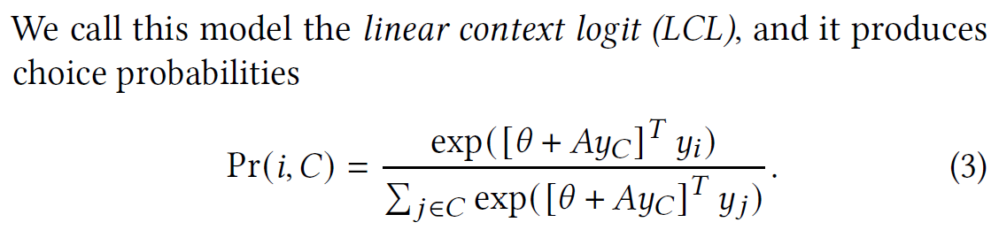

離散選択モデル向けのベンチマークデータセットと、グラフにおける
隣接ノード選択問題（この場合は、エッジを構成した時の三角関係の数とか、
InEdge数とかがfeatureとなる）に適用した精度が従来法よりも高いとの指摘。
実装もある。

離散選択モデルの話は古くからある話題で、このような線形モデルで
Contextを入れるという改良が今までなかったのが不思議なくらいにシンプル
だが、しっかり精度を上げてきている真面目な研究である。

## Data Poisoning Attack against Recommender System Using Incomplete and Perturbed Data
- [論文](https://dl.acm.org/doi/10.1145/3447548.3467233)
- 実装はない。

### 概要
レコメンドモデルで、特定のItemの露出を増やすために、攻撃ユーザ
(Fake User)を何人か使って、他の通常ユーザの接触をそのまま維持して、
攻撃ユーザの接触Itemをどのようにすれば特定のItemの露出が全体で増えるか？
という最適化によって効率的な攻撃を実施するロジック。
必ずしも対象Itemだけではなくて、対象Itemと傾向が近い
アイテムの接触を増やす

対象とするレコメンドモデルは仮定しないが、攻撃のために仮想的な
モデルを使う必要があり、この文献ではWRMFを利用する。

攻撃ユーザーが不自然な接触をすることで、既存のItemの接触にも影響が出て、
通常ユーザーの接触実績とつじつまが合わなくなるため、このつじつま合わせの
パラメータを通常ユーザに入れて、通常ユーザの接触が生成される尤度が
MaxになるようなWRMFのパラメータのもとで、対象ItemがTop-nに現れる
確率が最大になるように攻撃ユーザの接触Itemを決めるというもの。
（以下は通常ユーザの生成モデルの生成過程）

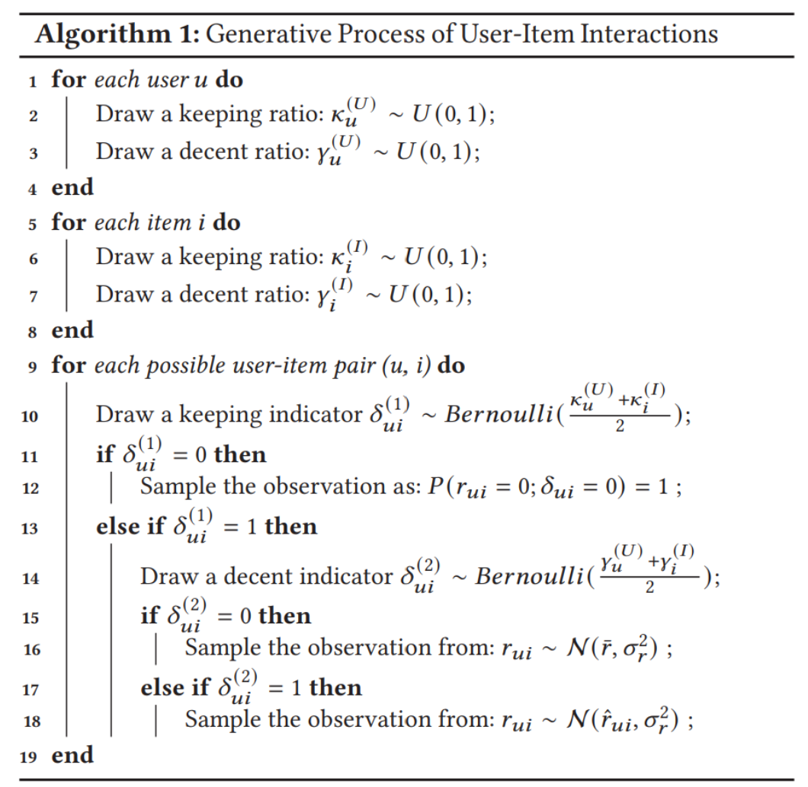

この生成モデルを使う方法(RAPU-G)と、もう少し簡易な方法(RAPU-P)が
提案されていて、ベンチマークではRAPU-Gの性能が良く、5%攻撃ユーザで
対象アイテムのHR@50を20-50%にすることができたと言っている。

もっともらしいモデルと結果なのだが、実装もなく、モデルの記述も
誤記と思われる部分が多いようなので、そこまでうまくいくのかな...
という感じもある。論文には先行手法との比較もあるので、
そのReferenceとしても使えるかもしれない。

## Large-Scale Subspace Clustering via k-Factorization
- [論文](https://dl.acm.org/doi/10.1145/3447548.3467267)
- [実装](https://github.com/jicongfan/K-Factorization-Subspace-Clustering) : MatLabであるが...

### 概要
Subspace Clustering とは、クラスタリング手法の一種で、クラスタに
対応する基底ベクトルが複数本あり、そのクラスタに所属するデータが
その基底ベクトルで張られる空間に属するという形式をとるクラスタリング。

通常は、データ間の類似行列(affinity matrix)を構築してから、
この行列に対してspectral clusteringをする手順をとるのだが
このコストが非常に高いため、データが大きい場合にスケールしない
方法である点がネックだった。

提案法では、これをk-Factorizationというシンプルなモデルにして、
かつ$\ell_{2,1}$正則化という比較的計算しやすい形式に緩和しても
最適解が変わらないことを利用して、Factorizationする2つの行列を
交互に最適化するロジックを提案。

提案法によるクラスタリング結果は、先行手法よりも精度が高いが、
計算時間がややかかるので、これを大規模データに対して簡易にした
ロジックでも精度が落ちずに高速計算が可能であるとの報告。

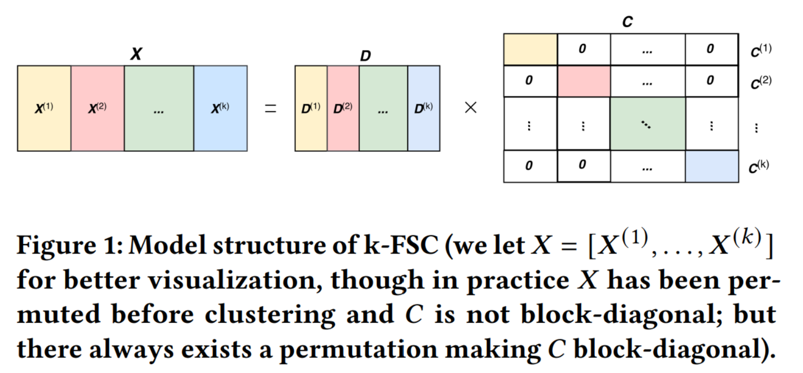

対象データは、MNISTなどの画像や、EEGなどの時空間データ測定値など
denseなものが対象であり、次元については100-150次元で強みがあるらしい。
（画像などもPCAを事前に実施して低次元化して使うことが前提）
レコメンド業界などSparseなものには向かない手法にみえる。

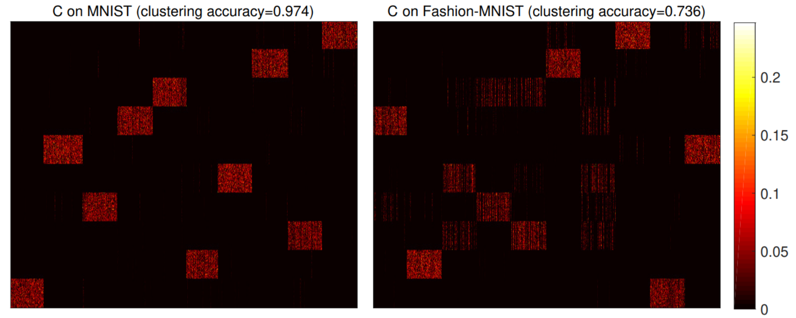

実装は、MatLabしかないのが残念だが、比較的簡易な更新式の繰り返しで
書けるようなので、他の言語に書き直すのも容易そう。

## Scalable Hierarchical Agglomerative Clustering
- [論文](https://dl.acm.org/doi/10.1145/3447548.3467404)
- 実装は公開されていない。

### 概要
Hierarchical Agglomerative Clustering
(日本語では凝集型階層クラスタリングとか訳されるもの) を
大規模データセットにも適用できるように拡張した手法。
著者には、所属が Google, Faceboook となっているメンバーも含まれる。

小難しいことが色々書いてあるのだが、エッセンスとしては、
次のように要約されるらしい。

1. 距離に対する threshold $\tau$ を決めておく
2. 距離が $\tau$ 以内に入るデータ同士を結合
3. 1つもデータが結合されなかったら $\tau$ を少し増やす
4. 繰り返し

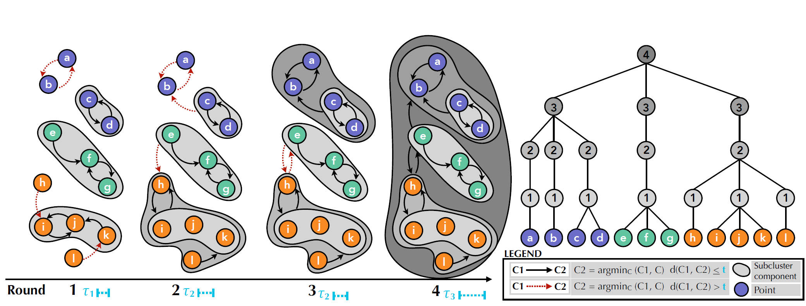

通常のdendrogramと違って、nearest neighbor から結合することを
あきらめているので処理の分散ができ、大規模化・高速化ができる
という理屈らしい。このような考え方は Dirichlet Process を使う
DP-Meansという手法と類似点があり、その考察もある。

報告では、小規模データセットで従来のクラスタリング手法 SOTA達成
という点に加えて、大規模データセット(30 billions!) のクラスタリングを
実施して、ユーザクエリ(いまいち詳細がわからないが、Webサービスの
検索クエリと思われ、featureはユーザの行動などを指標化したもの
らしいが詳細は記載がなく不明。低次元でdenseなfeatureと思われる)の
クラスタリングを実施した結果を記載している。報告にクエリの
クラスタリング結果から階層構造が取り出せているという趣旨の図がある。
Hierarchical Clustering を大規模化するのは、このようにデータから
階層構造を取り出して意味を抽出したいという動機もあるらしい。

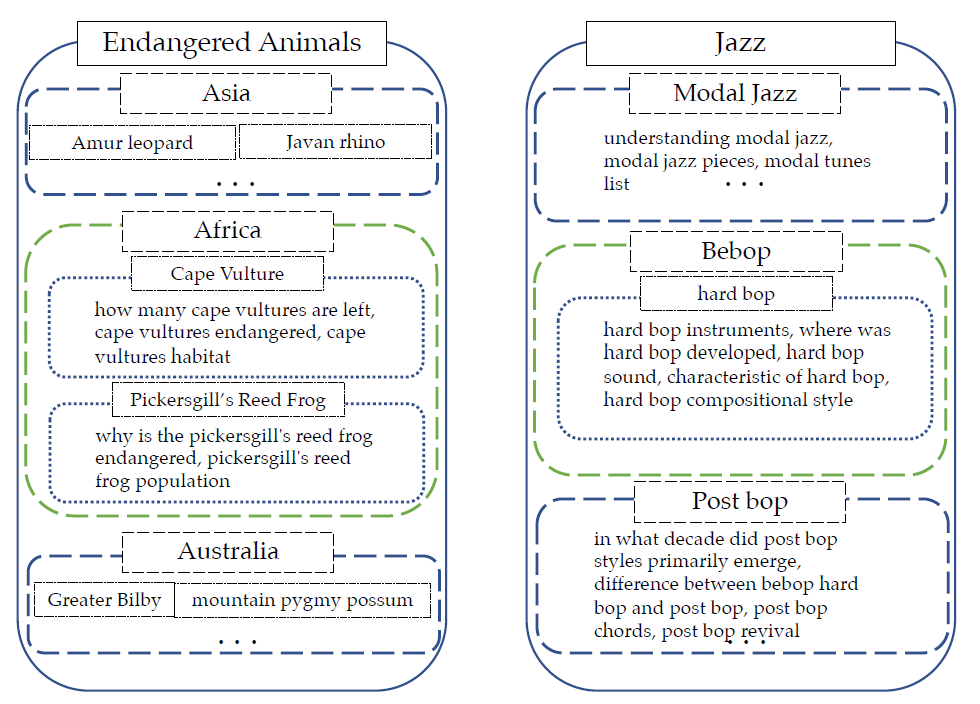

## Why Attentions May Not Be Interpretable?
- [論文]()
- 実装は見つからない

### 概要
RNNやCNNを使ったモデルにAttention機構を利用する場合、
このAttentionの値を利用することで、入力データのどの位置の
データが予測に寄与しているかどうかを、予測の説明に使う
ことができるという趣旨の手法は非常に多い。

一方で、近年、そのようなことはできないという趣旨の批判も
数多くあり、[Attention is not Explanation(Jain+, NAACL 2019)](https://arxiv.org/abs/1902.10186)という論文が出るや、
これに対する反論となる [Attention is not not Explanation(Wiegreffe+, EMNLP 2019)](https://arxiv.org/abs/1908.04626)という論文もあり、結論が出ていない。

このKDDの研究は、特にテキストにAttentionありRNNを用いた場合に、
Attentionで重要とされるtokenとして、頻出する無意味なtokenが
重要視されることから「Attentionは、解釈可能な情報が表現されて
いるわけでなくて、単なる予測に寄与するための情報が埋め込まれる
だけだ」という類推から始めて、AttentionのQueryとして入力する
tokenに、文章とは無関係な頻出tokenを混ぜ込むと、このtokenが
強く効いてしまうということをまず実験で示した。

このように、Attentionが、意味的なところを超えて情報が
埋め込まれる機構を、筆者たちは combinatorial shortcut
という言い方をしている。combinatorial shortcut の存在を
実験で定量的に示した構成図。A,B,C,Dが元の文とは無関係に
挿入された頻出token。

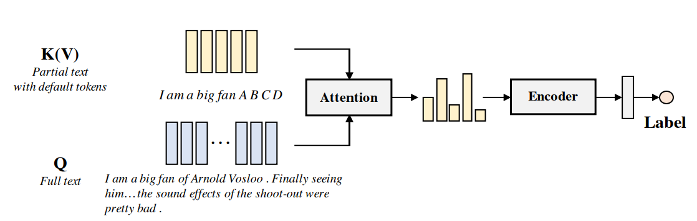

この combinatorial shortcut が入ってしまうのを除外する方法として、
次の2つの方法が提案されている。

1. Random attention pretraining
    まずAttentionをランダムにして、Attentionの値を固定したまま
    downstream task の学習を実施し、そのあとで downstream 部分を
    固定した状態で Attention 部分の更新を実施する。
2. Mask-neural learning with instance weighting
    Attention部分が適切となるように、学習データそれぞれの
    重みを算出して、この重みで学習を実施する（よく理解できない）

この2つの改善を適用すると、Attentionを使ったテキスト判別モデルの
説明手法である [L2X](https://arxiv.org/abs/1802.07814) という手法の説明結果の精度を
大幅に改善できたといっている
（ただし、この改善がない手法では [AIL(Adversarial Infidelity Learning)](https://arxiv.org/abs/2006.05379)という手法のほうが
精度が高い傾向にある、という結果も出ている）

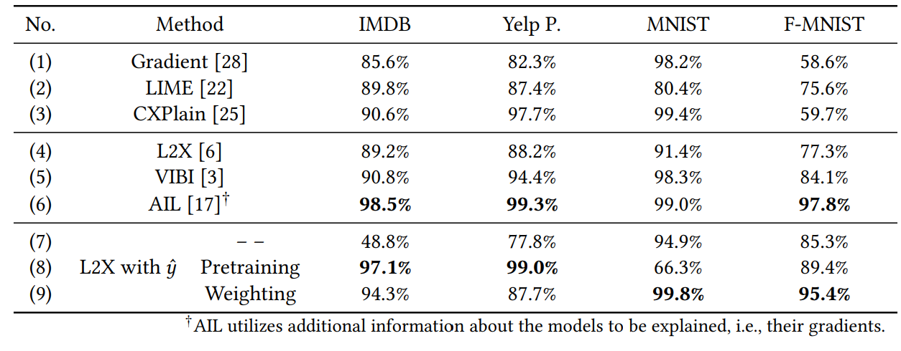

つまり、Attentionを使った理由説明を実施する場合、
筆者が combinatorial shortcut と呼んでいる現象を回避するため
Attention 部分の学習に対して対策を実施する必要がある

## Topology Distillation for Recommender System
- [論文](https://dl.acm.org/doi/10.1145/3447548.3467319)
- [実装](https://github.com/SeongKu-Kang/Topology_Distillation_KDD21)

### 概要
Knowledge Distillation(知識の蒸留) とは、主にNeural Networkの圧縮・高速化を
目的として、元のモデル(teacher model)よりも小さいサイズのパラメータで
動作するモデル(student model)を構築し、元のモデルでの入力・出力を教師として、
この入出力が同一となるように学習をするテクニック。

Recommender System でも同様の手法が多数提案されている。
このうち現時点で一番精度が高いものとして、同じ著者から提案された
[DE](https://arxiv.org/abs/2012.04357)という手法があり、
この手法で使われているテクニックとして次の2つがある。

- 出力が同一となるように学習すること
  (図の *KD by the prediction*)
- 出力の手前の層での（一般にサイズが異なる）representationについて
  同一サイズとなるような変換関数を用意し、変換後のrepresentationの
  差のノルムが最小となるように学習すること。
  (図の *KD by the latent knowledge*で、この手順は
   [hint regression](https://arxiv.org/abs/1412.6550) と呼ばれている)

Recommender System では「出力が同一になること」はあまり本質でなく、
相互の距離関係が保たれれば十分であるため、データ相互の類似度行列が、
teacher/student間で近ければOKであるような学習を実施する。

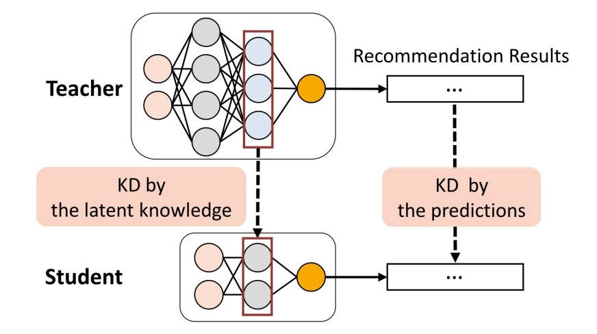

今回提案手法では、DEという手法において、hard clutering
をしていたところ、soft clustering にしてクラスタへの所属確率を計算し、
この重みを使ったクラスタ内類似度行列に関する損失と、
各データ点のhint regressionによる損失の重み付き和が最小となるに
学習する(Hierarchical Topology Distillation ; HTD という名前)

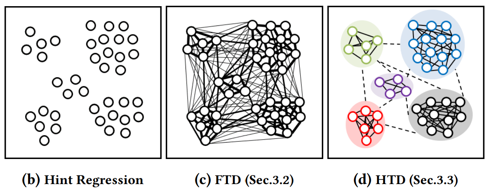

提案法は、ベースラインstudentモデルと比較して、nDCG@20で、20%前後
の改善が見られた、としている。embeddingサイズを1/10に減らした場合
には、さすがにTeacherモデルより劣化するものの、比較的高い精度を
維持したモデルを再構成できている。

## Fast and Memory-Efficient Tucker Decomposition for Answering Diverse Time Range Queries

- [論文](https://dl.acm.org/doi/10.1145/3447548.3467290)
- [実装を公開している著者のページ](https://datalab.snu.ac.kr/zoomtucker/)

### 概要
この論文が、[Best Research Paperを受賞した](http://seoilai.jp/jap/sub/news_view.jsp?idx=448)とのこと
（オンラインでの発表を見逃した。公式発表がどこにもないのだが..）

通常 Tucker 分解という場合、複数の属性が紐づく属性値の観測に
時刻が付与されるケースが多く、時刻を含めて3-4次元の変量にがあり、
これを分解することが多い。この Tucker 分解を改良した新しい手法である
ZOOM-Tuckerを提案。

観測データに時刻が加わると、計算量が多くかかってしまう。
そのため、計算量を落とす工夫として、事前に固定の時間長でデータを
分割しておき、この分割されたブロックごとにあらかじめ Tucker 分解しておく。
事後で、分析したい時間範囲が決まったら、このブロックをつなぎ合わせて、
粗い計算結果を精緻化するための iteration を回して最終結果を得る。
（この精緻化のiterationの計算過程がややこしくて、私には追えない...）

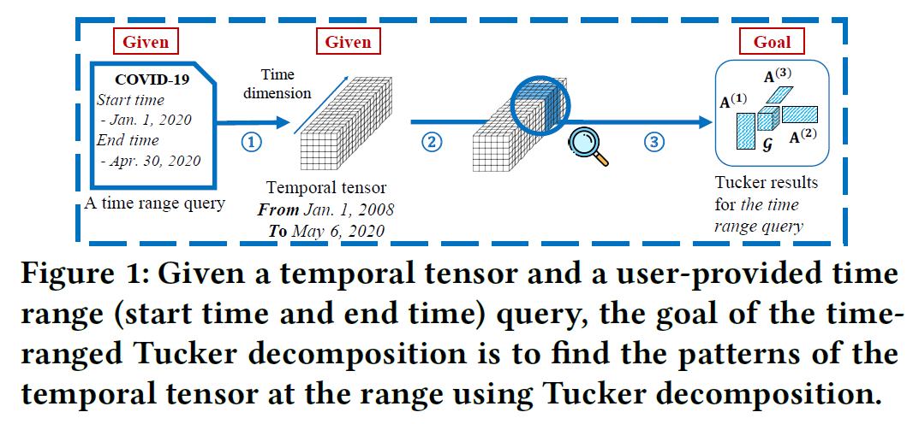

この2段階による計算で、従来法による計算よりも10-100倍程度計算を
高速化できたと言っている。ただし提案法の意味合いからして、これは
全時間領域の計算を一度にやることを諦めた（あとまわしにした）ことによる
短縮が大きいとみるべきであろう。

具体的な応用として、短時間での分解結果と長時間での分解結果から、
それぞれ元のデータを再構成したときの誤差を比較することで得られる
外れ値指標を使った外れ値検出や、株価時系列が特定期間において変動が同期する傾向
がある類似銘柄を見つける分析などが挙げられている。

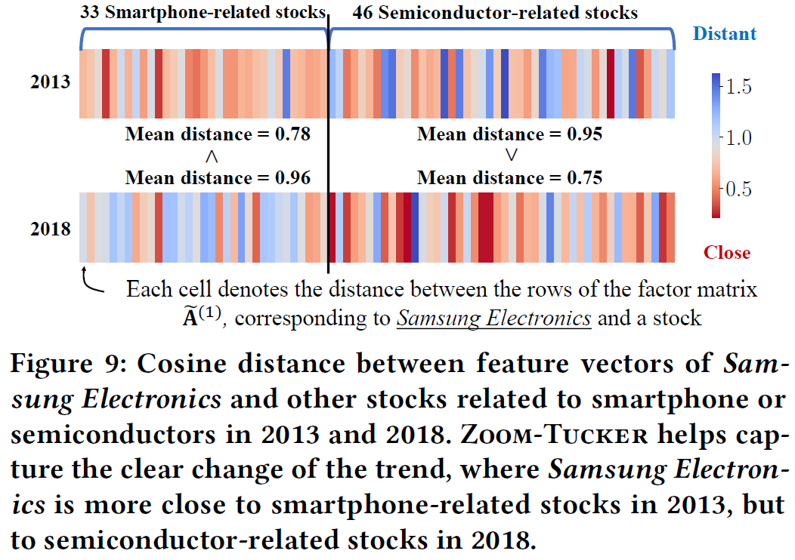

## Attentive Heterogeneous Graph Embedding for Job Mobility Prediction

- [論文](https://dl.acm.org/doi/10.1145/3447548.3467388)
- 実装はなさそう

### 概要
端的に言うと、転職履歴から次の会社とポジションを当てるモデルを実装する話。
データとしてLinkedInのデータを利用。
事前分析として集計した結果のサマリが書いてあり、これが興味深い。

1. 業務ポジション名につくfunction word (software engineer であれば
   software が fuction word)について、会社ごとに、その会社が持つ
   すべてのfunction word についての binary vectorを構築すると
   転職前後での会社のbinary vectorの相関は平均で 0.6376 となり高い。
2. 転職で違う会社に行く場合でも、ポジションに共通の語が入る
   ケースが全体の60%
3. 転職先の会社は、転職前の会社のポジションと同じポジションを
   もっている会社に転職する割合が全体の85%を超える。
   同様に転職先でのポジションは、転職前の会社が持っている
   ポジションである割合が85%を超える。

つまり、転職前後での会社・ポジションは、相互に似た関係がある場合が多い。
これらの事前分析の結果から、当該研究者は、

- 会社から会社への転職ネットワーク
- ポジションからポジションへの転職ネットワーク
- ある人が同時に所属する会社・ポジションのネットワーク

から Graph 上を情報伝播させることで Node Embedding を算出することで、
会社・ポジションの意味を表す Embedding を算出し、その Embedding を
入力とした RNN(GRU) で転職時系列をモデル化して、次の転職先での
会社・ポジションを予測することがふさわしいと考えた。

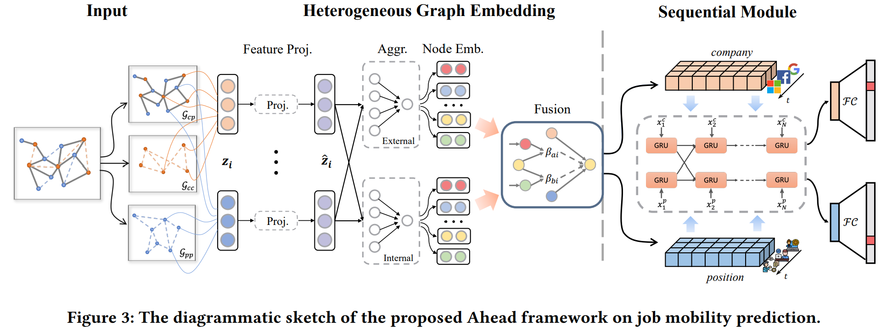

このタスクを単純回帰モデル、Graph Embeddingを用いないRNNモデル、
少し発展させたモデル、などと比較し、提案法(Ahead)が最も精度が
高い結果が出たと言っている。
（ただし精度評価結果を見ると、GRUだけでもかなりの精度があるようにみえる）

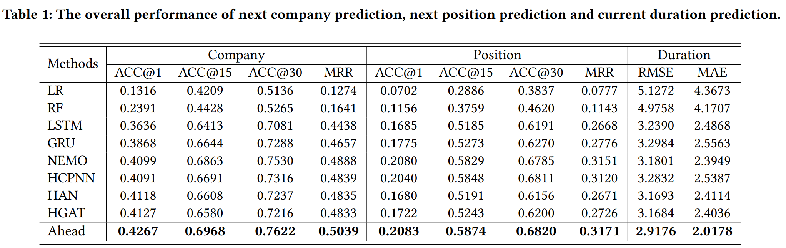

話の流れは非常にきれいであり、実運用に回ったのであれば素晴らしいが、
実装がみつからないので、この点なんとも判断が難しい。

## Network Experimentation at Scale

- [論文](https://dl.acm.org/doi/10.1145/3447548.3467091)
- 事例紹介であり、実装はない。

### 概要
Facebookの分析部隊が実施した、ネットワーク上のユーザの
相互影響を加味した大規模A/Bテストの分析報告について。

A/Bテストが正しく機能するためには、対象ユーザ以外の割り当て
によって対象ユーザの行動が左右されないことが必要である。
これはSUTVA(stable unit treatment value assumption)という
仮定であるが、Facebookではサービスの性質上、他のユーザから
相互影響が出てしまうため、何も考えないA/BテストはSUVTAの仮定
が成立しないことが多い。これを実験における干渉(interference)
もしくはネットワーク効果(network effect)と呼ばれる。

本論文では、このような干渉を受けない実験計画の方法と、
その前提で実施された計画でも残ってしまう相互影響を除外する
補正方法の提案が含まれている。

干渉影響をなくすA/B割り付けとして、次の2つの方法が提案されている。

1. クラスタリングの結果得られるクラスタごとの割り付け
2. 相互干渉が弱まる属性ごとの割り付け

ネットワーククラスタリングの方法として、BP([Kabiljo+ 2017](https://arxiv.org/abs/1707.06665))という方法と、
Louvain([Blondel+ 2008](https://arxiv.org/abs/0803.0476))という方法が提案されているが、
補正の際に、クラスタサイズが均等になるのが望ましいことから、
BPを使ったほうがよいとされている（ただしFacebookの実例ではLouvainとなっているが...）

また、問題によっては、地域で分けるのも一案とされている。
これはFacebookでは、Facebook上での職探しサービス(Job on Facebook)での
施策評価では、地域外でのマッチングが生じにくいことから、
居住地・勤務地単位での割り付けを実施したとしている。

このように割り付けたあとでも、SUTVAの仮定をクリアしているかを
チェックしているかを確認し補正することが必要であるとしている。

ここで Trigger Logging([Ya Xu+, KDD2015](https://content.linkedin.com/content/dam/engineering/site-assets/pdfs/ABTestingSocialNetwork_share.pdf)) と呼ばれる考え方を使い、A/Bテスト割り付け可能な
状況が発生した瞬間(これをTriggerと呼ぶ)で、割り付けを実施し、
Triggerが発生した事実とその割り当て結果を記録しておく。

クラスタごと割り当てによるA/Bテストが正しく機能するためには、
SUVTAが成り立たなくても、少なくとも次の点が必須であるとされている。

1. Triggerが発生するかどうかは、他のユーザのA/B割り付けに依存しない。
2. Triggerが発生しなかったユーザの outcome は、他のユーザのA/B割り付けに依存しない。

この条件が成立する場合に、クラスタごとでのoutcomeの合計の全クラスタ平均を、
クラスタ内のサンプル数の全クラスタ平均で割ったものを使って、クラスタごと
割り当てA/Bテストの結果を使える、といっている。

さらに評価誤差を小さくできる regression adjustment という方法もある。

具体例として、次の評価を Facebook で実施した事例を紹介している。

- FacebookでのUI変更テスト(Louvainによって構築したクラスタごとの割り当てを利用)
- Job on Facebookで、まだ求職者から応募がないJobを上位に出す施策の効果検証
  (地域別でのA/Bテスト)
  - 特にこの場合では、単純なA/Bでは施策がoverestimateだったとしており、
    クラスタごとのA/B評価により、それを補正できたとしている(以下の表)

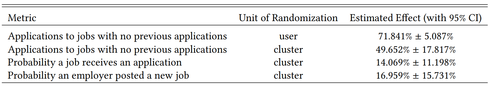

## Preference Amplification in Recommender Systems

- [論文](https://dl.acm.org/doi/10.1145/3447548.3467298)
- 実装は見つからない。

### 概要
レコメンドがユーザの好みを助長することで、ネットワーク内のユーザに
極端に好みが偏った集団ができてしまう現象が、最近 Filter bubble であったり、
Echo Chamber であったりというような用語で報告されている。

本研究は、一人のユーザに対して継続的にレコメンドを繰り返す
実験を実施した場合に、そのユーザのレコメンド結果がどのように変化するか
という点について報告した研究。Facebookの研究者も名を連ねていて、
実際にFacebookでの実験報告もある。

モデルとしては、User/Item embedding が存在し、inner productをスコアと考え、
スコアのsoftmaxを確率にしてランダムにアイテムを選択するrecommenderを使い、
クリックする場合には、モデル側がもつuser embeddingを SGD で update する。
ユーザ側の好みも、少しずつレコメンドされるアイテムが好きになるようなdrift
を持つメカニズムを考え、その後どうなるか？を見た。

この場合に、Userのembeddingは、徐々に大きくなっていき、ユーザが特に好きな
アイテムをよりrecommenderが出力するようになり、ユーザはさらにそのアイテムを
好きになるというecho chamber的な傾向を出すことができた。

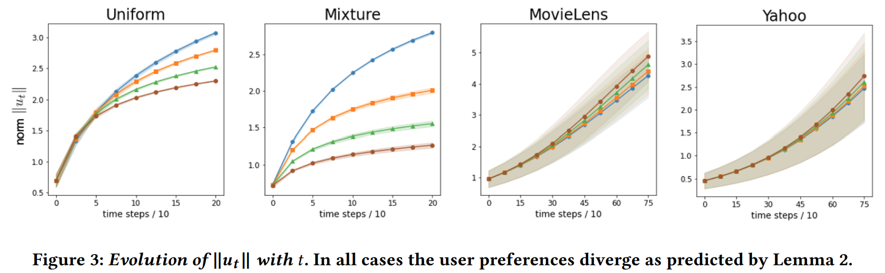

この実験で、特にecho chamber的な挙動をするユーザはuser embeddingのノルムが
どんどん大きくなる傾向にある、という傾向も見出すことができ、対策として、
echo chamber的な挙動がひどいと考えれられるユーザについて、embeddingの
方向を維持したままノルムを小さくする対応が考えられる。

実際に、Facebookで問題になるギリギリの画像（ただし削除対象ではないもの）
へのアクセスが非常に多いユーザに対して、レコメンドモデルの user embedding の
ノルムを 1/10 倍にする対応に効果があるか？を検証するA/Bテストを実施すると、
対象画像へのアクセスが、処置群において有意に減少したとのこと。
（個人的には、この検証結果を載せているのが、すごいと考える）

Discussion において、echo chamber化しているかどうかをノルムから判断する
ための閾値を定量的に出せないかが将来課題であるという点に言及している。

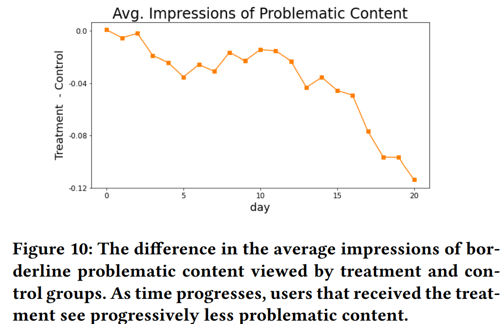