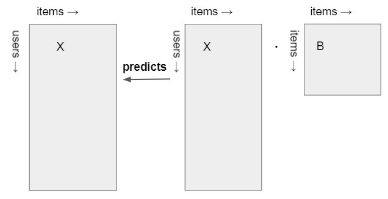
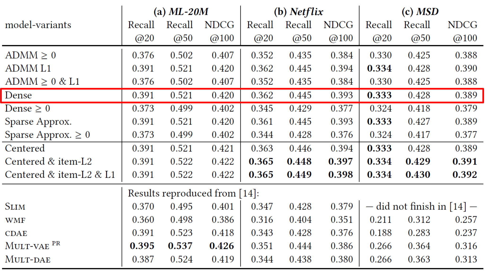
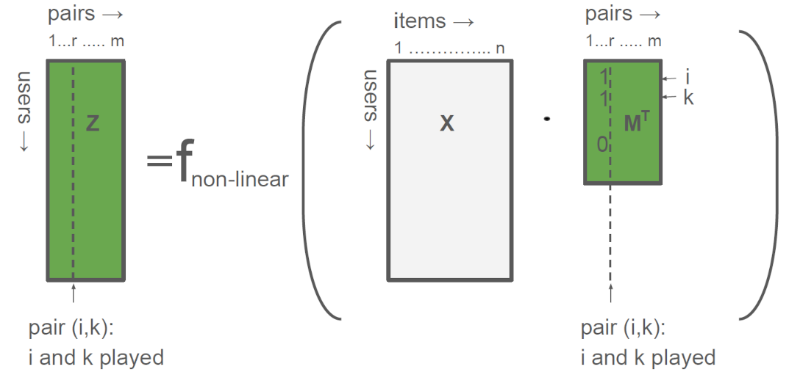
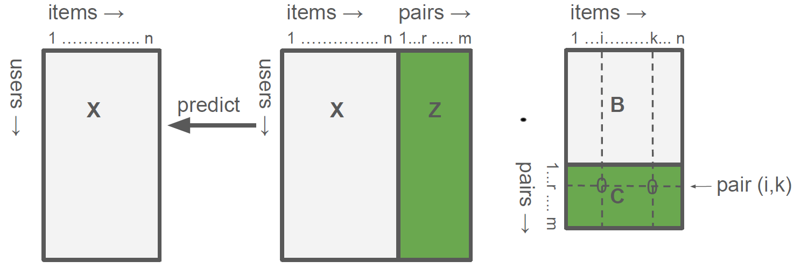
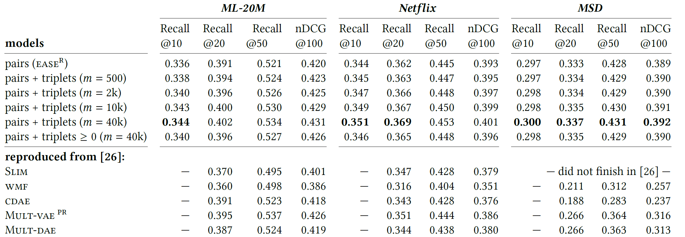
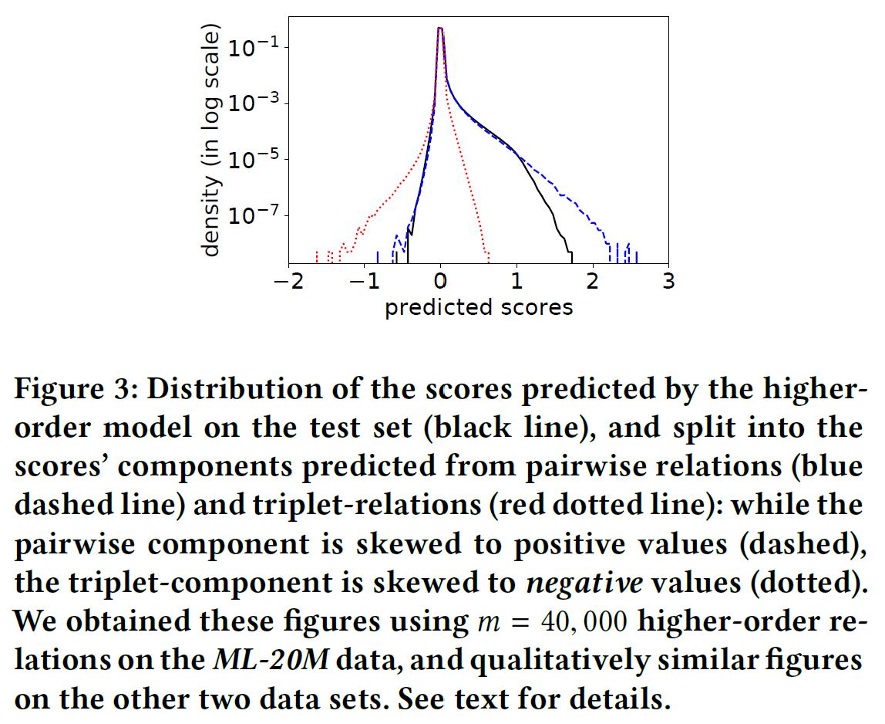
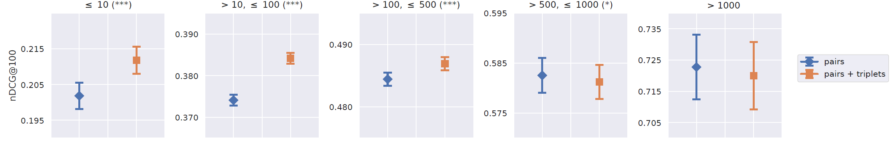
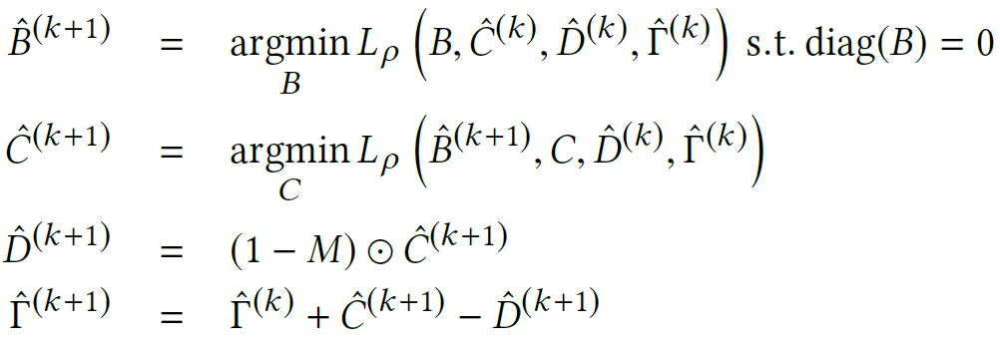
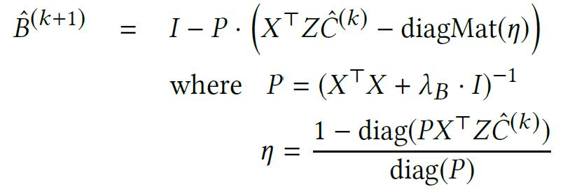
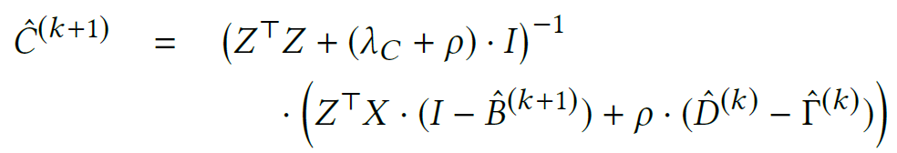

# な組 Tech MTG
## Negative Interactions for <br> Improved Collaborative Filtering (RecSys2021)

---

## Today's paper
- Title
  - Negative Interactions for Improved Collaborative Filtering  
    Don't go Deeper, go Higher
    - [PDF can be freely downloaded from ACM Digital library](https://dl.acm.org/doi/10.1145/3460231.3474273)!
- Authors
  - Harald Steck (Netflix)
    - [EASE](https://arxiv.org/abs/1905.03375) (WWW2019)
    - [ADMM SLIM](https://dl.acm.org/doi/10.1145/3336191.3371774) (WSDM2020)
    - [EDLAE](https://proceedings.neurips.cc/paper/2020/hash/e33d974aae13e4d877477d51d8bafdc4-Abstract.html) (NIPS2020)
  - Dawen Liang (Netflix)
    - [Mult-VAE](https://arxiv.org/abs/1802.05814) (WWW2018)

---

## RecSys2019での批判
- [Dacrema MF](https://mauriziofd.github.io/)+,  
  **Are We Really Making Much Progress?**  
  **A Worrying Analysis of Recent Neural Recommendation Approaches**
  - Best Paper in RecSys2019 ([arxiv](https://arxiv.org/abs/1907.06902), [github](https://github.com/MaurizioFD/RecSys2019_DeepLearning_Evaluation))
  - [Revised in 2021](https://arxiv.org/abs/1911.07698)
- Summary:
  - Collaborative Filtering で Deep を使った論文が、単純な手法に負ける
  - 負ける理由
    - 既存手法のチューニングが不十分
    - 恣意的なデータ分割・検証データの抽出
- 有効であるとされた単純な手法
  - Random Walk ($P^3 \alpha$, $RP^3 \beta$)
  - SLIM
  - MultVAE (by Liang)
  - EASE (by Steck) in revised paper

---

## SLIM
- Xia Ning and George Karypis,  
  [SLIM: Sparse Linear Methods for Top-N Recommender Systems](http://glaros.dtc.umn.edu/gkhome/node/774) (ICDM2011)
- $X$ : interaction matrix (user x item)
- item interaction を別の item intraction から予測する
$$
\begin{eqnarray}
\underset{B}{\textrm{Minimize}} &\quad&
\Vert X - XB \Vert _{F}^{2} +
\lambda_2 \Vert B \Vert _{F}^{2} +
\lambda_1 \Vert B \Vert _{F} \\\\
\textrm{s.t.} &\quad& \textrm{diag}(B) = 0,
\quad B _{ij} \ge 0
\end{eqnarray}
$$



---

## EASE : Simplified model of SLIM by H.Steck
- Harald Steck (NetFlix)  
  [Embarrassingly Shallow Autoencoders for Sparse Data](https://arxiv.org/abs/1905.03375) (WWW2019)
- Summary:
  - Simple modifications for SLIM doesn't change performance, but  
    improve calculation cost drastically (exists closed-form solution)
    - L1-regularization should be dropped
    - Non-negativity should be dropped

$$
\begin{eqnarray}
\underset{B}{\textrm{Minimize}} &\quad&
\Vert X - XB \Vert _{F}^{2} +
\lambda_B \Vert B \Vert _{F}^{2} \\\\
\textrm{s.t.} &\quad& \textrm{diag}(B) = 0
\end{eqnarray}
$$

---

## Performance comparison
- from [ADMM SLIM](https://dl.acm.org/doi/10.1145/3336191.3371774) (WSDM2020) by H.Steck



---

## Higher-order interaction
- SLIM only considers single item-to-item interaction
- **How to consider higher-order interaction?**
  - When the user interacted item A and B, how about next item?
  - Triplet relation $(A, B) \to C$ should be considered
    - Steck/Liang paper in RecSys2021!

---

## Prerequisite
- $X$ : interaction matrix (user x item)
- $M$ : 2-items pair definition matrix (pair x item)
  - すべての pair ではなくて、主要なものだけを抽出
  - この論文では、f = identity function (単なる行列の掛け算)
- $Z$ : interaction matrix of pair (user x pair)



---

## Model
$$
\begin{eqnarray}
\underset{B}{\textrm{Minimize}} &\quad&
\Vert X - XB - ZC \Vert _{F}^{2} +
\lambda_B \Vert B \Vert _{F}^{2} +
\lambda_C \Vert C \Vert _{F}^{2}
\\\\
\textrm{s.t.} &\quad& \textrm{diag}(B) = 0, \quad C \odot M = 0
\end{eqnarray}
$$

$\odot$ ... element-wise product of matrix



---

## Performance comparison
- triplets improve EASE performance
- Sufficient to use 40k pairs



---

## Distribution of predicted score



---

## Performance comparison grouped by user activity
- Performance improvement is significant for low-activity users.



---

## Details of algorithm
### EASE

$$
\begin{eqnarray}
\underset{B}{\textrm{Minimize}} &\quad&
\Vert X - XB \Vert _{F}^{2} +
\lambda_B \Vert B \Vert _{F}^{2} \\\\
\textrm{s.t.} &\quad& \textrm{diag}(B) = 0
\end{eqnarray}
$$


---

## Bの解き方
- まず Lagrange multiplier $\boldsymbol{\eta}$ を使って
  元の最適化問題を書き直す $$
\underset{B, \boldsymbol{\eta}}{\textrm{Minimize}} \quad
\mathcal{L}(B, \boldsymbol{\eta}) =  \Vert X - XB \Vert _{F}^{2} +
\lambda_B \Vert B \Vert _{F}^{2} -
\boldsymbol{\eta} \textrm{diag}(B) $$
- $\mathcal{L}$ の最小値をとる $B$ では、
  $\displaystyle{\frac{\partial \mathcal{L}}{\partial B}}=0$ となるので、  
  diagMat を 対角成分に vector を持つ行列として、 $$
\frac{\partial \mathcal{L}}{\partial B}
 =  -
  2 X^T (X - XB) + 2 \lambda_B B - \textrm{diagMat} (\boldsymbol{\eta}) = 0 $$
- 整理すると $$
\begin{eqnarray}
(X^T X + \lambda_B I) B &=& X^T X + \frac12 \textrm{diagMat}(\boldsymbol{\eta}) \\\\
\therefore \quad B &=& (X^T X + \lambda_B I)^{-1} [X^T X + \frac12 \textrm{diagMat}(\boldsymbol{\eta})]
\end{eqnarray} $$
---

## etaを消そう
- もう一度書くと $$
B = (X^T X + \lambda_B I)^{-1} [X^T X + \frac12 \textrm{diagMat}(\boldsymbol{\eta})]
$$
- $\textrm{diag}(B) = 0$ だったので、$[...]$ の中の diagonal はゼロになる。$$
\therefore \frac12 \boldsymbol{\eta} = - \textrm{diag} (X^T X) $$
- 整理して $$
\begin{eqnarray}
B
 &=& (X^T X + \lambda_B I)^{-1} [X^T X - \textrm{diag} (X^T X)] \\\\
 &=& (X^T X + \lambda_B I)^{-1} [(X^T X + \lambda_B I) - \textrm{diag} (X^T X + \lambda_B I)] &
\end{eqnarray} $$
- $P = (X^T X + \lambda_B I)^{-1}$ と置くと、$\oslash$ を成分ごとの割り算として $$
\begin{eqnarray}
B
 &=& P [P^{-1} - \textrm{diag} (P^{-1})] \\\\
 &=& I - P {} \textrm{diag}(1 \oslash \textrm{diagMat} (P))
\end{eqnarray}
$$

---

## irspack code
`irspack/recommenders/dense_slim.py` ([github](https://github.com/tohtsky/irspack/blob/main/irspack/recommenders/dense_slim.py))

``` python
def _learn(self) -> None:
    X_train_all_f32 = self.X_train_all.astype(np.float32)
    P = X_train_all_f32.T.dot(X_train_all_f32)
    P_dense: np.ndarray = P.todense()
    del P
    P_dense[np.arange(self.n_items), np.arange(self.n_items)] += self.reg
    gc.collect()
    P_dense = linalg.inv(P_dense, overwrite_a=True)

    gc.collect()
    diag_P_inv = 1 / np.diag(P_dense)
    P_dense *= -diag_P_inv[np.newaxis, :]
    range_ = np.arange(self.n_items)
    P_dense[range_, range_] = 0
    self.W_ = P_dense
```

---

## EASEの特徴
- 繰り返し処理がない。
- $P = (X^T X + \lambda_B I)^{-1}$ を計算する必要がある。
  - item数の3乗の計算オーダー
  - item数が多すぎる場合には厳しい。

---


## Details of algorithm
### Triplet EASE

$$
\begin{eqnarray}
\underset{B}{\textrm{Minimize}} &\quad&
\Vert X - XB - ZC \Vert _{F}^{2} +
\lambda_B \Vert B \Vert _{F}^{2} +
\lambda_C \Vert C \Vert _{F}^{2} \\\\
\textrm{s.t.} &\quad& \textrm{diag}(B) = 0, \quad C \odot M = 0
\end{eqnarray}
$$

$\odot$ ... element-wise product of matrix

---

## ADMM
- $C \odot M = 0$ があるので、lagrange multiplier をそのまま使うのは難しいが、  
  このようなときは ADMM(*Alternative Directional Multiplier Method*) というものが使える。

- $D$ という別の行列を持ってきて、式を書き換える
  - $C$ は制約式 $C \odot M = 0$を満たすことをあきらめて  
    別の変数 $D$ がこの条件を満たし、$C$ を $D$ に近づけることを考える。
$$
\begin{eqnarray}
\underset{B}{\textrm{Minimize}} &\quad&
\Vert X - XB - ZC \Vert _{F}^{2} +
\lambda_B \Vert B \Vert _{F}^{2} +
\lambda_C \Vert C \Vert _{F}^{2} \\\\
\textrm{s.t.}
&\quad& \textrm{diag}(B) = 0 \\\\
&\quad& D \odot M = 0 \\\\
&\quad& D = C
\end{eqnarray}
$$

---

## ADMM
- $C, D$ の制約式を、損失関数に入れる
  - $\Gamma$は制約式を満たすために入れる multiplier
  - $\rho$は、ADMMのhyperparameter ($\lambda$みたいなもの)
$$
\begin{eqnarray}
\mathcal{L}_{\rho}(B, C, D, \Gamma)
&=& \Vert X - XB - ZC \Vert _{F}^{2} +
  \lambda_B \Vert B \Vert _{F}^{2} +
  \lambda_C \Vert C \Vert _{F}^{2} \\\\
&\quad& + 2 \cdot \rho \cdot
  \langle \Gamma, C - D \rangle _F + \rho \Vert C- D \Vert_F^2\\\\
\textrm{s.t.}
&\quad& \textrm{diag}(B) = 0
\end{eqnarray}
$$

- この $\mathcal{L}_{\rho}$ を次の順番で最適化
  1. $C, D, \Gamma$ を Fix して $\mathcal{L}_{\rho}$ を $B$ について最小化
  2. $B, D, \Gamma$ を Fix して $\mathcal{L}_{\rho}$ を $C$ について最小化
  3. $B, C, \Gamma$ を Fix して $\mathcal{L}_{\rho}$ を $D$ について最小化
  4. $B, C, D$ を Fix して $\mathcal{L}_{\rho}$ を $\Gamma$ について最小化
  5. 1.に戻る (収束していたら終了)

--- 

## 更新式



---

### update B


### update C

