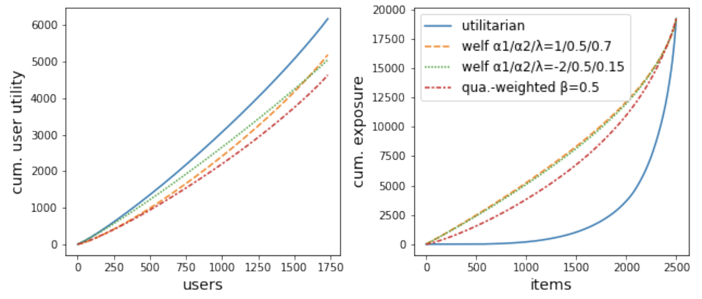
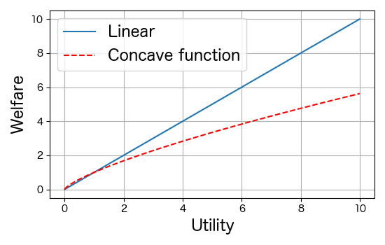
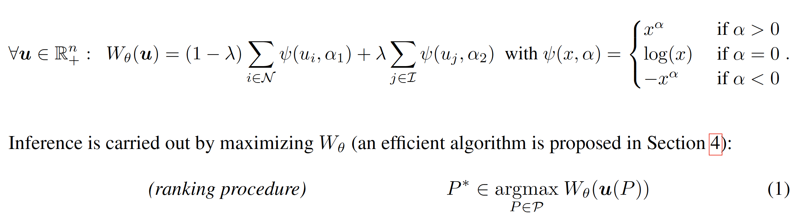
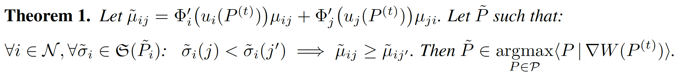
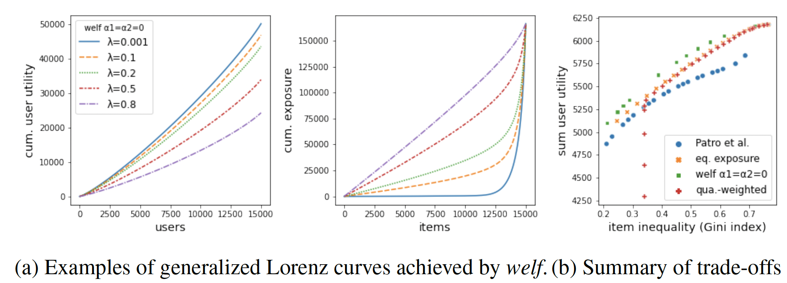

# な組 Tech MTG : 2021-12-07
- Two-sided fairness in rankings via Lorenz dominance (NeurIPS 2021)

---
<!-- paginate: true -->
<!-- footer: な組 Tech MTG : 2021-12-07 -->

## NeurIPS 2021
- 現在開催中 (12/06-12/12)
  - [Official Website](https://nips.cc/Conferences/2021)
  - 全てオンラインで、費用を払えばオンラインで
    すべての講演を見ることができる (やや迷い中...)
- 論文リスト
  - [Accepted Paper List](https://nips.cc/Conferences/2021/Schedule?type=Poster)
  - [PDF化された全論文サマリ](https://www.paperdigest.org/wp-content/uploads/2021/11/NIPS-2021-Paper-Digests.pdf) (2,334本)

---

## 今回紹介する論文
- [Two-sided fairness in rankings via Lorenz dominance](https://papers.nips.cc/paper/2021/hash/48259990138bc03361556fb3f94c5d45-Abstract.html)
  - レコメンドでuser/item双方の公平な配分の問題定義と、手法提案
    - ざっくり読んだので今回紹介します。
- [Topic Modeling Revisited: A Document Graph-based Neural Network Perspective](https://papers.nips.cc/paper/2021/hash/7b6982e584636e6a1cda934f1410299c-Abstract.html)
  - トピックモデルを直前の単語も含めたモデルに拡張し、
    LDAを特殊なケースとして含むようにして精度向上したとのこと。
    - 読みたいが、時間取れず挫折...

---

## 何をやった論文か？
- [Two-sided fairness in rankings via Lorenz dominance](https://papers.nips.cc/paper/2021/hash/48259990138bc03361556fb3f94c5d45-Abstract.html)
  - レコメンドで、user/item 双方にとって公平になる状態として
    Lorenz曲線に基づいた公平性を算出する関数(welfare ; 厚生)を定義
  - この関数を効率的に最適化する手法を提案
    - based on [Frank-Wolfe algorithm](https://ja.wikipedia.org/wiki/%E3%83%95%E3%83%A9%E3%83%B3%E3%82%AF%E3%83%BB%E3%82%A6%E3%83%AB%E3%83%95%E3%81%AE%E3%82%A2%E3%83%AB%E3%82%B4%E3%83%AA%E3%82%BA%E3%83%A0)

---

## 公平性を考えないレコメンドから始めよう
- 最も単純には、userに対してレコメンドされたアイテムが
  user にとって「好み」の総和をmaxにすれば良さそう(greedy)
  - 後で説明するがこれは utilitarian(ism) (ja=zh:功利主義) と呼ばれる
- このようにすると、userにとっては満足度が高いが、
  一部のitemのレコメンド回数(exposure)が偏る。
  - 不公平はどのように確認できるだろう？ $\to$ Lorenz plot

---

## Lorenz plot
- user は「好み」(レコメンドスコア)の合計の「低い人」から並べる
- item は「レコメンド回数」(exposure) が少ない方から並べる
- X軸 : userの人数 or itemの個数
- Y軸 : そこまでの「好み」or「レコメンド回数」の累積和
- 青い線が greedy (utilitarian)

---

## Lorenz plot に基づく公平性
- **Lorenz dominant**
  - Lorenz曲線をもうこれ以上、上に持ち上げられない状態。
- どちらのLorenz曲線も上に持ち上げたい。
  - userだけが満足している状態(Lorenz dominant)は良くない(unfair)
  - でも普通は、user/item のどちらか良くしたら、どちらかは悪くなる。
  - **どちらの曲線も、これ以上同時に改善できない状態** を実現したい。
    - このような状態を **Lorenz Efficient** と呼ぶ
- cf: **Pareto dominant**
  - どのuser/itemもこれ以上良くできない状態のこと
    - Lorenz Dominant はそれより弱い条件

--- 

## Lorenz efficient を実現する方法
- どのようにすれば Lorenz efficient を実現できるか？
  - user の満足(=utility)の単純な合計を取るのが良くない。
- ある程度満足した人はそれ以上満足しないようにしないと...
  - 満足の増加に対して penalty がかかるようにすれば？

---

## 厚生経済学
- **welfare economics** (ja:厚生経済学, zh:福利经济学)
  - user/item はそれぞれ増やしたいものがある
    - これを **utility** (ja:効用, zh:效用) とよぶ
  - 社会にとって増やすべき値を **welfare** (ja:厚生, zh:福利) と呼ぶ
- utilitarian(ism) (ja=zh:功利主義)
  - welfare = $\sum \textrm{utility}$ (単純線形和)
    - 通常は不公平な分配となる。
- [social welfare function](https://ja.wikipedia.org/wiki/%E7%A4%BE%E4%BC%9A%E7%9A%84%E5%8E%9A%E7%94%9F%E9%96%A2%E6%95%B0) (ja:社会的厚生関数, zh:社会福利函数)
  - welfare = $\sum f(\textrm{utility})$
    - $f(...)$ は concave (monotonic increasing) function

---

## レコメンドの文脈で utility は？
- user $i$ に item $j$ をレコメンド (position-based model)
  - $\mu_{ij}$ : user $i$ にとっての item $j$ の価値 (value)
  - $\sigma_i(j)$ : user $i$ に item $j$ をレコメンドする位置
  - $v_k$ : item を $k$ 番目に表示した場合の露出度 (exposure weight)
- utility
  - user side : $u_i = \sum_{j} \mu_{ij} v_{\sigma_i(j)}$
  - item side : $u_j = \sum_{i} v_{\sigma_i(j)}$
    - 全userで足し算しなければいけない！

---

## 確率モデル 
- deterministic ではなく probabilistic にレコメンドする前提を置く。
  - user $i$ に item $j$ を 位置 $k$ に確率 $P_{ijk}$ でレコメンド
    - $\sum_j P_{ijk} = \sum_k P_{ijk} = 1$ を満たす (double stochastic)
  - $v_k$ : item を $k$ 番目に表示した場合の露出度 (exposure weight)
- この場合の utility
  - user side : $u_i(P) = \sum_{j} \mu_{ij} P_{ij} v$
  - item side : $u_j(P) = \sum_{i} P_{ij} v$

---

# welfare
- user/item utility $u_i, u_j$ に非線型関数 $\psi$ 適用し welfareを定義
  - $\alpha < 1$ が小さいほど、linearから遠い
  - $\lambda$は user/item の weight を調整
- welfare $W_{\theta}(\boldsymbol{u})$ が最大となるようなレコメンド $P_{ijk}$ をしたい！

---

# welfareの最適化
- welfare は非線型関数を含み最適化が難しい。
  - 論文では [Frank-Wolfe algorithm](https://en.wikipedia.org/wiki/Frank%E2%80%93Wolfe_algorithm) を使う
- 前提 : vector spaceにおける制約のある非線型最適化
$$
\textrm{Minimize } f(x) \quad \textrm{subject to} \quad  \boldsymbol{x} \in D
$$
- 手順 : 次の繰り返し
  - Step 1: $\boldsymbol{x}'_{t} = \textrm{argmin} _{\boldsymbol{x}} [\boldsymbol{x}^T \nabla f(\boldsymbol{x}_{t-1})] \quad \textrm{ subject to} \quad \boldsymbol{x} \in D$
  - Step 2 : $\gamma^{(t)} = \frac{2}{t + 2}$
  - Step 3 : $\boldsymbol{x}_{t} = (1 - \gamma^{(t)}) \boldsymbol{x}_{t-1} + \gamma^{(t)} \boldsymbol{x}'_{t}$
    - $\boldsymbol{x}_{t} \in D$ because $D$ is vector space.

---

## 実際の操作
- 次の繰り返し (初期状態は greedy から始める)
  - Step1 : gradient $\tilde{\mu}_{ij}$を計算
  - Step2 : $\tilde{\mu}_{ij}$が大きい順にレコメンドする場合の確率を $\tilde{P}_t$ とする
  - Step3 : $P_{t} = (1 - \gamma^{(t)}) P_{t-1} + \gamma^{(t)} \tilde{P}_{t}$
    - Step2 では、不公平が最も解消される方向を見つけることに相当

---

## 結果例

