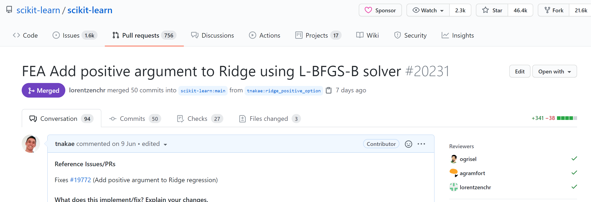
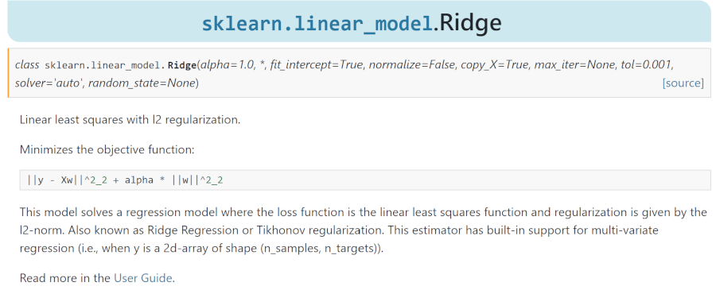

# な組 Tech MTG
## sklearn PR for Ridge positive argument

---

## Summary
- sklearnのPRがmain branchにマージされました!
- この経緯をお話しします。



---

## Table of contents
- Preliminaries
  - About linear regression
  - `linear_model` in sklearn
- Implementation
  - Motivation (動機)
  - First step
  - Comments from reviews
- Details in benchmark
- Final Step
- Conclusion

---

## About linear regression
- 線形回帰 (linear regression)
  - For training data set, $\\{ \boldsymbol{x}_i, y_i \\}$ $(i=1,...,N)$
    - $\boldsymbol{x}_i \in \mathbb{R}^d$ : feature variable(説明変数)
    - $y_i \in \mathbb{R}$ : target variable(目的変数)
  - find **coefficients(回帰係数)**  $\boldsymbol{w} \in \mathbb{R}^d$ to minimize "sum of square error"
$$
L_\boldsymbol{w} = \frac12 \sum_i (\boldsymbol{w} \cdot \boldsymbol{x}_i - y_i)^2
$$
    - Omitted intercept in this presentation for simplicity.

- Matrix form:
$$
A =
\begin{pmatrix}
\boldsymbol{x}_1^T \\\\ \vdots \\\\ \boldsymbol{x}_N^T
\end{pmatrix}, \quad
\boldsymbol{y} =
\begin{pmatrix} y_1 \\\\ \vdots \\\\ y_n
\end{pmatrix}, \quad
L_\boldsymbol{w} = \frac12 \Vert A \boldsymbol{w} - \boldsymbol{y} \Vert^2_2
$$

---

## Linear regression with regularization term

- 正則化項付きの線形回帰 (linear regression with regularization term)
  - Lasso (L1-regularized) : often generate sparse solution.
  $$
  L_\boldsymbol{w} =
    \frac12 \Vert A \boldsymbol{w} - \boldsymbol{y} \Vert^2_2 +
    \alpha \Vert \boldsymbol{w} \Vert _ 1
  $$

  - Ridge (L2-regularized) : generate non-sparse solution
  $$
  L_\boldsymbol{w} =
    \frac12 \Vert A \boldsymbol{w} - \boldsymbol{y} \Vert^2_2 +
    \frac{\alpha}{2} \Vert \boldsymbol{w} \Vert_2^2
  $$

  - ElasticNet (L1+L2) : generate baranced solution between L1/L2
  $$
  L_\boldsymbol{w} =
    \frac12 \Vert A \boldsymbol{w} - \boldsymbol{y} \Vert^2_2 +
    \alpha \left[
      r \Vert \boldsymbol{w} \Vert_1 +
      \frac{1-r}2 \Vert \boldsymbol{w} \Vert_2^2
    \right]
  $$

- Why regularization? : To avoid overfitting to training data
- Why sparse solution? : To drop meaningless features (variable selection)

---

## Implementation in sklearn 
- [`sklearn.linear_model`](https://scikit-learn.org/stable/modules/classes.html#module-sklearn.linear_model)
  - [LinearRegression](https://scikit-learn.org/stable/modules/generated/sklearn.linear_model.LinearRegression.html#sklearn.linear_model.LinearRegression)
  - [Lasso](https://scikit-learn.org/stable/modules/generated/sklearn.linear_model.Lasso.html#sklearn.linear_model.Lasso)
  - [Ridge](https://scikit-learn.org/stable/modules/generated/sklearn.linear_model.Ridge.html#sklearn.linear_model.Ridge)
  - [ElasticNet](https://scikit-learn.org/stable/modules/generated/sklearn.linear_model.ElasticNet.html#sklearn.linear_model.ElasticNet)
- Example : Ridge
  - 

---

## Motivation : な組のタスク
- 王さんとの業務
  - (金額に関係する)target variableを user featureから線形回帰で予測したい
  - user featureの経済価値を出すために coefficientを正(non-negative)にしたい
  - overfitting を避けるために regularization term を入れたい
  - でも解釈できなくなるので 0 になるのは困る (Lassoはいやだ)
- Let's use sklearn!
  - There is `positive` argument in LinearRegression, Lasso, ElasticNet
  - Lassoはいやだ、Ridge を使おう
  - Oh no... There is not positive argument in Ridge...
``` python
class sklearn.linear_model.Ridge(
    alpha=1.0, fit_intercept=True, normalize=False, copy_X=True,
    max_iter=None, tol=0.001, solver='auto', random_state=None)
```
- How about ElasticNet? (and l1_ratio set to almost 0)
  - low reliability (from note in user manual)

---

## Motivation : Issue in github
- There is [Issue #19772](https://github.com/scikit-learn/scikit-learn/issues/19772) about ridge positive argument
  - example in physical science
    - ...to model a classic mechanical (based on Newton's second law)  
      problem where weights of the linear model are expected to be positive
  - This is not easy task because
    - 制約条件を今のsolverにそのまま追加することが難しい  
      constraints is not accepted in implemented method in Ridge
    - 新しいsolverを追加する必要がある。  
      needed to add new solver to Ridge
      - Issue では [scipy.optimizer.lsq_linear](https://docs.scipy.org/doc/scipy/reference/generated/scipy.optimize.lsq_linear.html) を使うことが提案されている。
      - これを使って実装してみるか...

---

## First Step in PR
- `lsq_linear` を使って実装
  - この内部では、Trust Region Reflective algorithm を使っているらしい  
    (詳細はよく知らない...)
- 遅いのが気になるね！と言われる。
  - Although they are not solving for the same objective,  
    I would be curious about the performance profile and scalability of this solver.
    - 確かに遅いけど、Approveされた。まあいいかと思っていた。
- その後、ベンチマークしたよ！と言われる。
  - とても素晴らしい benchmark
  - 私が実装したsolverはとても遅くて使い物にならないことが分かった...

---

## Benchmark program
- 送られてきた [Benchmark Program](https://github.com/agramfort/benchmark_ridge_positive)
  - generated from [BenchOpt](https://github.com/benchopt/template_benchmark)
    - Benchmark template for optimization problem
    - Structure
      - define datasets
      - implement solvers
      - run
      - check results (html output)
- solvers
  - Coodinate Descent (CD)
  - Proximal Gradient Descent (PGD)
  - L-BFGS-B (nonlinear optimizer)

---

## Ridge Loss Function
- Loss Function : $
L = \frac12  \Vert A \boldsymbol{w} - \boldsymbol{y} \Vert ^2_2 +
  \frac{\alpha}{2} \Vert \boldsymbol{w} \Vert^2_2
$

- Jacobian (gradient) : $
\nabla _\boldsymbol{w} L = A^T (A \boldsymbol{w} - \boldsymbol{x}) + \alpha \boldsymbol{w}
$

---

## details in benchmark
- solvers
  - `lsq_linear`
  - Coordinate Descent
    - 1featureずつLossを最小化する。
  - Proximal Gradient Descent
    - Gradient Descent で少し動かし、マイナスになったらゼロにする。
      - $w_{t+1} = [w_t - \eta_t \nabla _\boldsymbol{w} L]^{+}$
      - $[...]^{+}$ は ReLU と同じ意味
  - L-BFGS-B
    - 準ニュートン法(quasi-Newton method)の一つ。
    - `scipy.optimize` に constrains を与えられる高速な実装がある。
- results
  - L-BFGS-B > PGD > CD >> lsq_linear
  - Sparse でも Dense でも L-BFGS-B が抜群に速い
- 反省
  - ***Before creating PR, you have to implement benchmark program,  
    compare performances for alternative methods, and pick up best one!***
    - 考えてみれば当然の結論でした。

---

## Final Step to merge

- Changed solver to L-BFGS-B
  - 方針転換を宣言する。
  - 再度実装を修正。
- 度重なる指摘
  - 英語が間違っている。
  - テストが足りない、など。
- PR修正中にmainに大規模な修正が加わる
  - Added black to pre-commit in sklearn
  - Changed source code by black... (やめてくれ...)
- Consensus mismatch between sklearn core reviewers...
