# な組 Tech MTG
## Causal Inference tutorial from KDD2021

---

## KDD2021 Tutorial
- [KDD2021](https://kdd.org/kdd2021/) (8/14-18) の面白かった [Tutorial](https://kdd.org/kdd2021/tutorials)
  - [Causal Inference and Machine Learning in Practice with EconML and CausalML](https://causal-machine-learning.github.io/kdd2021-tutorial/)
    - 機械学習を用いた因果推論(causal inference)とHands-on
      - 今回紹介します。
  - [Multi-Objective Recommendation](https://moorecsys.github.io/)
    - 多目的最適化(Multi-Objective Optimization)をRecommendationに適用する実例  
      weighted summartion と GAなどの huristics を使う方法がある。
  - [Mixed Method Development of Evaluation Metrics](https://kdd2021-mixedmethods.github.io/)
    - サーチエンジンやレコメンドにおいて、定量的な評価結果と  
      定性的な仮説検証/施策実行を組み合わせる Mixed Method の適用事例

---

## 因果推論(Causal Inference)の前提
- ある結果変数(outcome)がある
  - (例)ユーザがある商品を購入する, ある病気が回復する
- outcomeが改善する処置(treatment)を実施する。
  - (例)特定のWeb広告を見せる/見せない
- treatmentによりoutcomeは改善するかを知りたい！

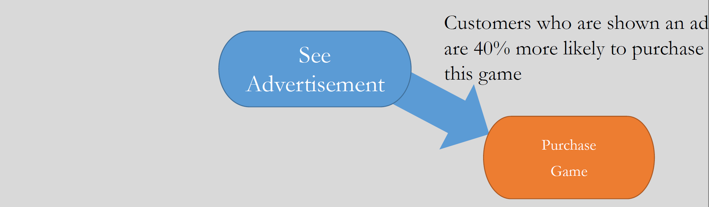

---

## 交絡因子(confounders)の存在
- 例えば、あるWeb広告を見た人は見ていない人に比べて  
  あるWebサービスへ登録率が高いとする。Web広告は登録率を上げた？
    - 正しいこともあるが、一般的には正しくない。
    - Correlation is not equal to causality.
- outcome, treatment 両方に影響を与える**交絡因子(confounders)**に注意。
  - 事前の engagement が高ければ広告も見やすいし  
    新しいサービスも使う傾向が強い（広告はなくてもよいかも？）

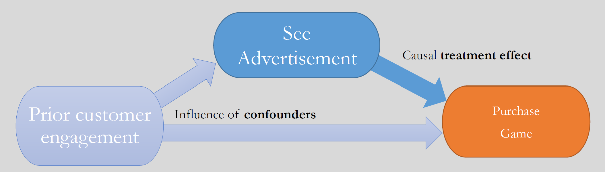

---

## 処置効果(Treatment Effect)
- 広告(treatment)が不要なケースがある
  - 広告がなくても商品を買う人がいる(Always-taker)
  - 広告があっても商品を買わない人がいる(Never-taker)
- 本当に広告が必要なユーザとは  **広告がないと商品を買わないが、**  
  **広告があると買う場合。**(Persuadable)
- 処置(treatment)があることで  結果変数(outcome)の期待値が上昇するか知りたい
  - この変化を**処置効果(Treatment Effect)**または**アップリフト(Uplift)**という

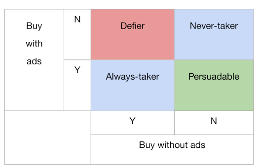

---

## ランダム化比較実験 (RCT ; Randomized Controlled Trial)
- 処置への割り付けがランダムなら、交絡因子を無視できる
  - ランダム割り当てのA/Bテストがうまくいく理由

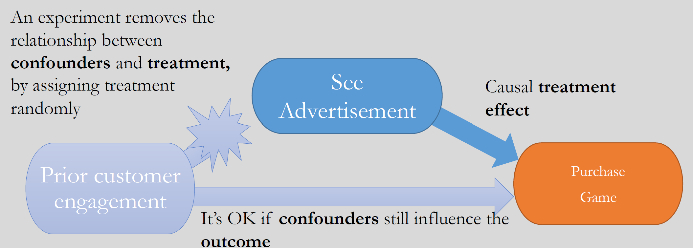

---

## ランダム実験ができない場合(1) : Unconfoundedness
- ランダム割り当てができなくても、交絡因子(Confounders)を  
  **すべて観測できていれば**、補正する方法がいくつかある
  - Classical Methods
    - 傾向スコア(propensity score) / IPW(inversed propensity weighting)
  - Machine Learning Methods
    - Meta Learner / Double Machine Learning

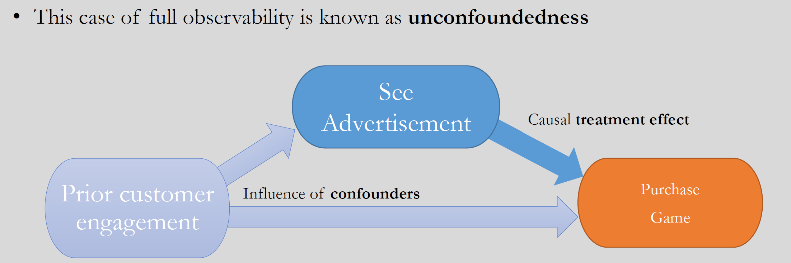

---

## ランダム実験ができない場合(2) : Instrument Variable
- 交絡因子がすべて観測できない場合でも
  操作変数という別の変数を仮定できる場合は、
  その変数を使った別の補正手法を使うことができる。
  - Tutorialでは事例が紹介されているが、ややこしいので今回は説明省略。

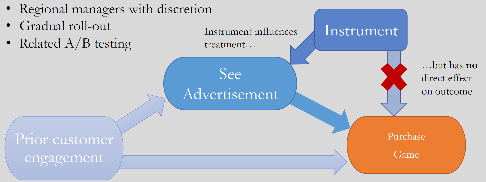

---

## ランダム実験ができないケース
- いつもA/Bテストができればよいが、できない場合も多い
  - 割り付けがランダムにならない。
    - 割り付け通りにユーザが思い通りの行動をとってくれない。
  - 割り付けを考えずに収集されたデータを使って分析する
    - 観察研究(observational study)と呼ばれる

---
## 反実仮想(counterfactual)
- 処置をした人($T=1$)は、処置をした場合の結果($Y_1$)がわかる
- 処置をしなかった人($T=0$)は、処置をしなかった場合($Y_0$)の結果がわかる
- 全員に対する処置の効果は、全員について
  - 処置をした場合の結果がわかる必要がある。
  - 処置をしなかった場合の結果がわかる必要がある。
- 実験していない部分についても、結果がわかる必要がある。
  - 「もし実験していたらどのような結果が得られるだろう？」
    - **反実仮想(counterfactual)**

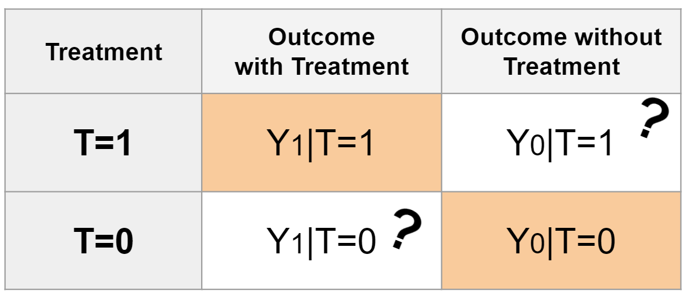

---

## 処置効果(treatment Effect)の計算
- 処置効果(treatment effect)の考え方は、いろいろある。
  - ATE : Average Treatment Effect
  - ITE : Indivisual Treatment Effect
  - CATE : Conditional Average Treatment Effect

---
## ATE (Average Treatment Effect)
- 処置をした結果としなかった結果の差の全員の期待値
  - 傾向スコアを使う方法でわかる。
  - (例) 広告でユーザ全体の購入のUpliftを推定できる
    - 全体で効果があったのかはわかるが、  
      どのような人で効果があったのかはわからない。

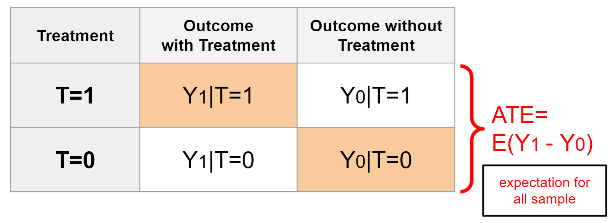

---
## ITE (Indivisual Treatment Effect)
- 個人ごとの $Y_1 - Y_0$ の期待値
  - これは普通はわからない。

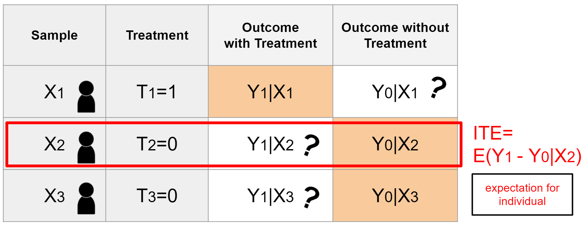

---
## CATE (Conditional Average Treatment Effect)
- ある条件を満たす人の、処置による効果の差の期待値
  - Meta Learner または Double Machine Learning でわかる。
  - (例) 広告でUpliftが高くなるようなユーザ属性を特定できる
      - Upliftが高い属性を持つユーザだけ広告を出すことができる。

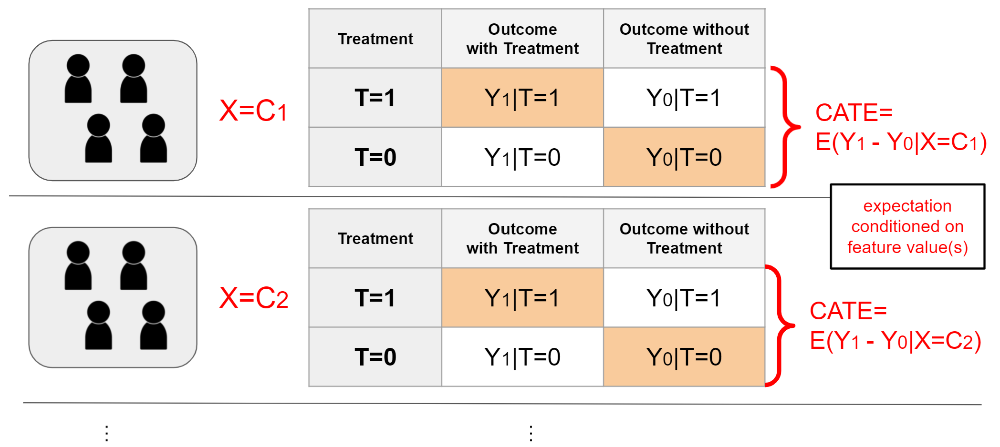

---

## Causal Inferenceの道具
- 古典的手法
  - 傾向スコア法 (Propensity Score)
  - 傾向スコア逆数重みづけ (Inversed Propensity Score Weighing)
- 機械学習手法
  - Meta Learner
    - [CausalML](https://github.com/uber/causalml) (Uber) で  
      Meta Learnerの手法を多数実装している。
  - Double Machine Learning
    - [EconML](https://github.com/microsoft/EconML) (Microsoft) で
      Double Machine Learning の手法を実装している。

---

## 手法を適用するためのシンプルな前提
- outcome $Y$ と treatment $T$ の両方に影響を与える  
  交絡因子(confounders) $X$ がすべて観測できている (Unconfoundedness)  
  場合に、$X$ が観測できた前提での CATE を算出する様々な方法が使える。
- このような前提で集めた（実験した）データを  
  モデルで学習して、CATEを推定する。

---

## Meta-Learner
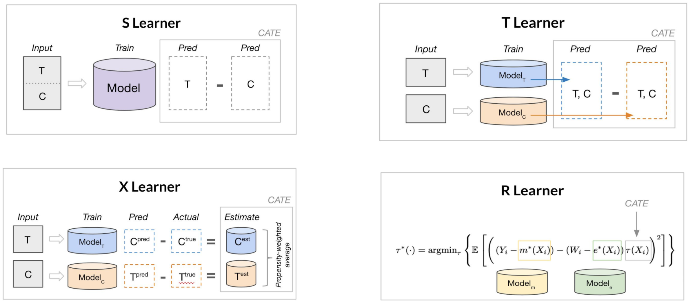

---

## CausalML による CATE 算出
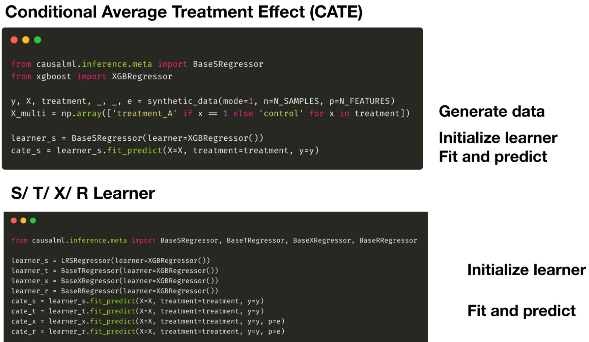

---

## Double Machine Learning
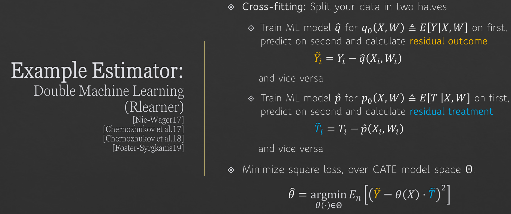

---

## EconML による CATE 算出
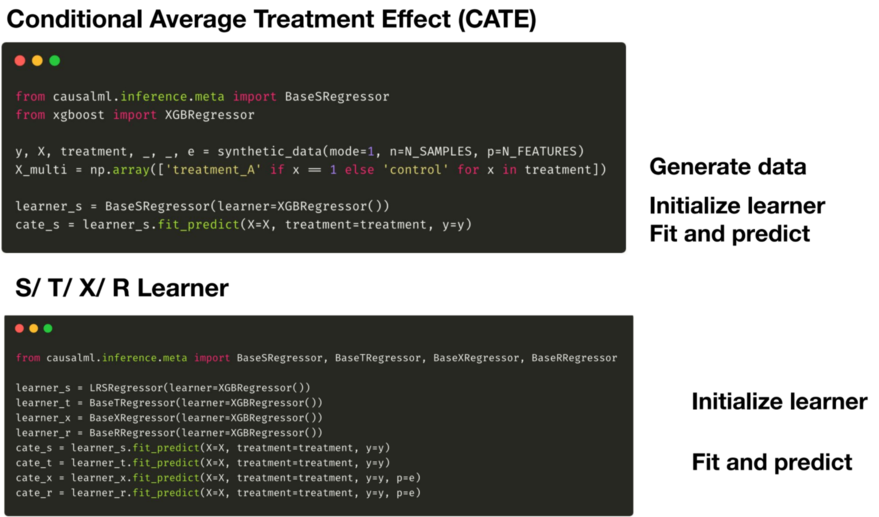

---

## Lift Chart
- サンプルごとのCATEを高い順にソートすれば、  
  Upliftが高いほうから処置した時の全体でのUpliftがわかる。
  - これを図示したものが Lift Chart

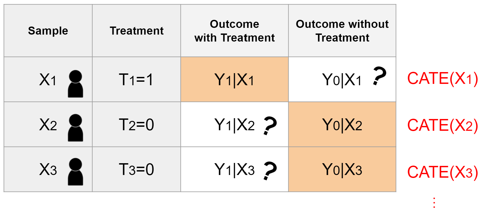

---

## Lift Chart
- CATEの総和を縦軸にして、CATEの高いほうからプロットしたグラフ
- このカーブの下側面積が AUUC (Area Under Uplift Curve)
- このカーブとランダムの場合のカーブと間の面積が Qini Coefficient

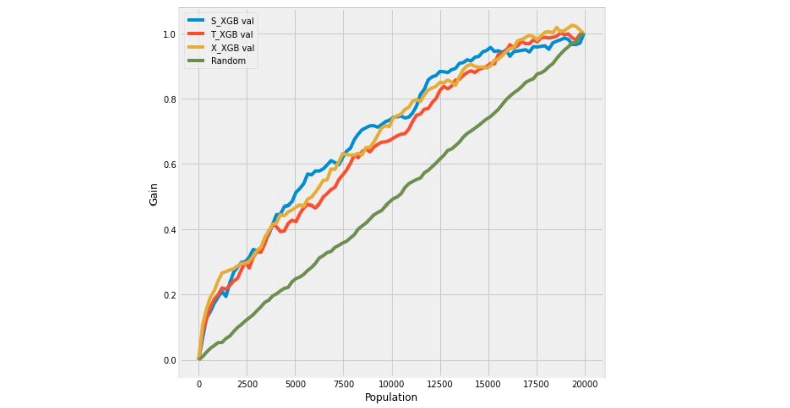

---

## Uplift Tree
- Upliftの高い/低い人を分ける属性を見つける
  - Classification Treeと違って、Upliftをtargetにしている。
- 図は、CausalMLのUplift Tree
  - EconMLでも同様のTreeの機能がある。

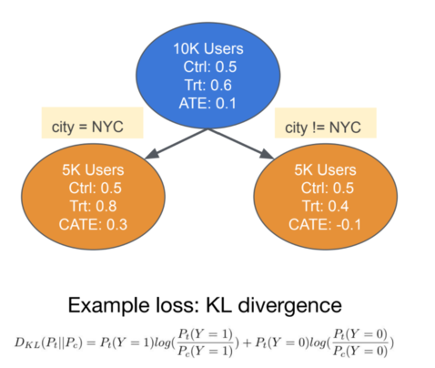

---

## Tutorialで説明されている例
- Web広告の出稿
  - Uberの利用者に対してUber Eatsの広告を見せて、
    Uber Eatsの利用率が上がるかどうか
  - Uber利用者に対して、さらに広告を出すことで、
    Uberの利用がさらに増加するか？
- 会員登録
  - TripAdvisorへ登録させることで、
    TripAdvisorの利用率が上がるか？
      - 非常にコントロールが難しい実験であり、
        Sign Upを簡単にする操作(Instrument)を使っている。

---
## Web広告における適用結果
- Uberの広告Upliftで、CATEが高い60%に対して広告を出すことで、
  ROAS(獲得合計/コスト合計)は 6.46 -> 12.5 に改善したといっている。

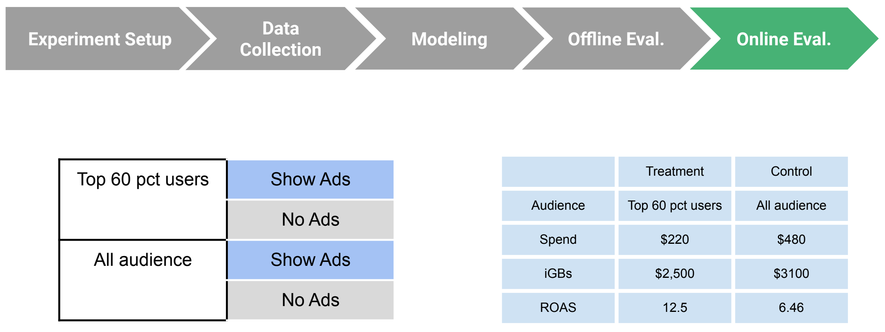

---

## 印象
- CATEの算出手法により、Upliftの高い対象だけを狙い撃ちした  
  施策を出すことが可能になると考えらえる。
  - (例) 特定ユーザ向け優遇サービスを出す対象を絞る
  - (例) Web広告の出稿対象者を絞る
- ただし実際の適用は注意を要する
  - Unconfoundednessを満たすように、outcomeとtreatmentに対して
    親として影響を与える交絡因子(confounders)を可能な限り  
    すべて洗い出す  必要がある。
  - 手法・因果グラフの正しい理解が適用に必須
