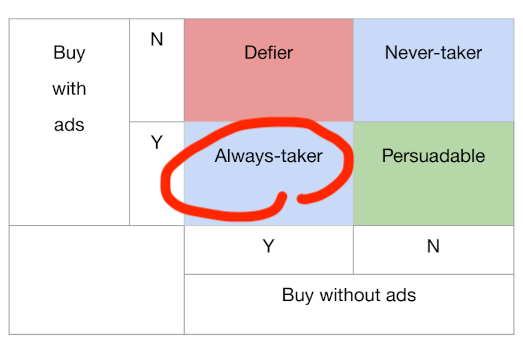
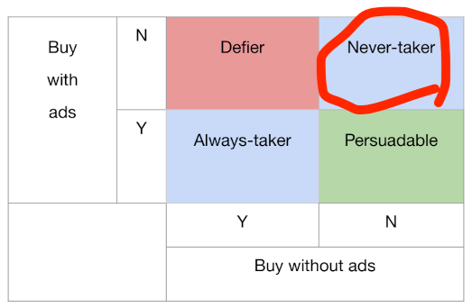
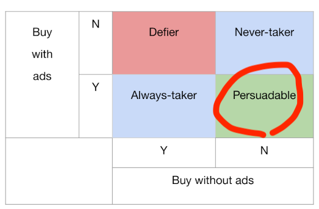
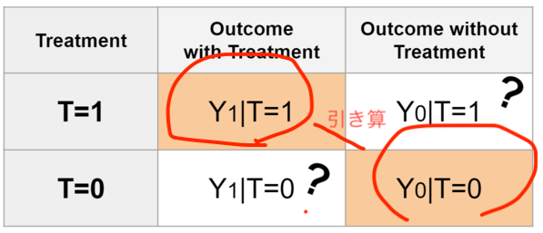
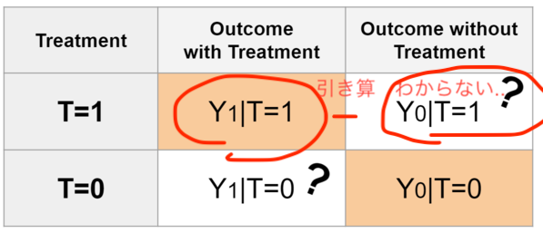
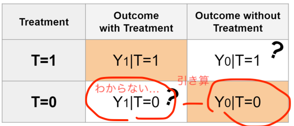
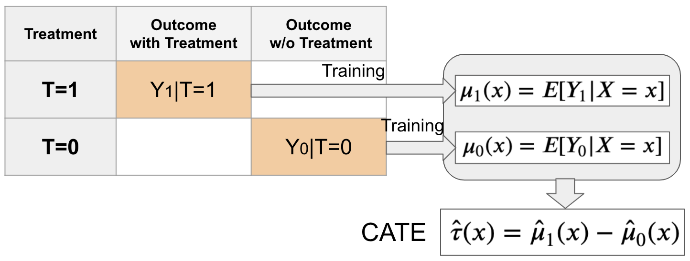
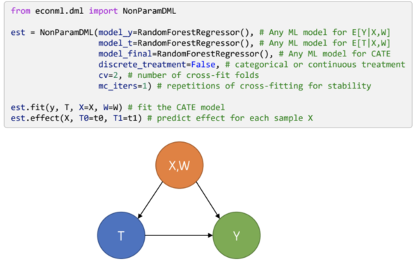

# な組 Tech MTG
## Causal Inference tutorial from KDD2021

---

## KDD2021 Tutorial
- [KDD2021](https://kdd.org/kdd2021/) (8/14-18) の面白かった [Tutorial](https://kdd.org/kdd2021/tutorials)
  - [Causal Inference and Machine Learning in Practice with EconML and CausalML](https://causal-machine-learning.github.io/kdd2021-tutorial/)
    - 機械学習を用いた因果推論(causal inference)と分析事例の紹介
    - 今回紹介します。
  - [Multi-Objective Recommendation](https://moorecsys.github.io/)
    - 多目的最適化(Multi-Objective Optimization)をRecommendationに適用する実例  
      weighted summartion と GAなどの huristics を使う方法がある。
  - [Mixed Method Development of Evaluation Metrics](https://kdd2021-mixedmethods.github.io/)
    - サーチエンジンやレコメンドにおいて、定量的な評価結果と  
      定性的な仮説検証/施策実行を組み合わせる Mixed Method の適用事例

---

## 因果推論(Causal Inference)の前提
- ある結果変数(outcome)がある
  - (例)ユーザがある商品を購入する, ある病気が回復する
- outcomeが改善する処置(treatment)を実施する。
  - (例)特定のWeb広告を見せる/見せない
- treatmentによりoutcomeは改善するかを知りたい！

---

## 交絡因子(confounders)の存在
- 例えば、あるWeb広告を見た人は見ていない人に比べて  
  あるWebサービスへ登録率が高いとする。Web広告は登録率を上げた？
    - 正しいこともあるが、一般的には正しくない。
    - Correlation is not equal to causality.
- outcome, treatment 両方に影響を与える**交絡因子(confounders)**に注意。
  - 事前の engagement が高ければ広告も見やすいし  
    新しいサービスも使う傾向が強い（広告はなくてもよいかも？）
- よく言われる（古い）例 : 親が新聞を読むと、子供の成績は良くなる
  - 親の年収が交絡因子となる。

---

## さて誰に広告を出せば良いでしょうか？

---

- この人は広告を出さなくても買ってくれる
- 広告を出すのは無駄

---

- この人は広告を出しても出さなくても買ってくれない。
- やっぱり広告を出すのは無駄

---

## 処置効果(Treatment effect)
- 本当に広告が必要なユーザとは  **広告がないと商品を買わないが、**  
  **広告があると買う場合。**(Persuadable)
- 処置(treatment)で、どれだけ結果変数(outcome)が変化するか？
  - この変化を**処置効果(Treatment Effect)**または**アップリフト(Uplift)**という
  - この変化が Positive で、値が高い人を狙いたい。

---

## ランダム化比較実験 (RCT ; Randomized Controlled Trial)
- 処置への割り付けがランダムなら、交絡因子を無視できる
  - ランダム割り当てのA/Bテストがうまくいく理由

---

## ランダム実験ができない場合(1) : Unconfoundedness
- ランダム割り当てができなくても、交絡因子(Confounders)を  
  **すべて観測できていれば**、補正する方法がいくつかある

---

## ランダム実験ができない場合(2) : Instrument Variable
- 交絡因子がすべて観測できない場合でも
  操作変数という別の変数を仮定できる場合は、
  その変数を使った別の補正手法を使うことができる。
  - Tutorialでは事例が紹介されているが、ややこしいので今回は説明省略。

---

## ランダム実験ができないケース
- いつもA/Bテストができればよいが、できない場合も多い
  - 割り付けがランダムにならない。
    - 割り付け通りにユーザが思い通りの行動をとってくれない。
  - 割り付けを考えずに収集されたデータを使って分析する
    - 観察研究(observational study)と呼ばれる

---

## 効果を見るには？
- 処置をした人($T=1$)は、処置をした場合の結果($Y_1$)がわかる
- 処置をしなかった人($T=0$)は、処置をしなかった場合($Y_0$)の結果がわかる
  - だったら、2つの平均の引き算をすればいいよね？
  - **ランダム実験でない場合はやってはいけない！**
    - 処置した人・しない人が偏っている。
    - 「新聞を読む」が treatment の場合、  
      親の年収分布が$T=0,1$で異なっている

---

- 処置した人に、処置しない実験もしてみよう！
  - そんなことは普通できない。
  - 広告を見せた後に、広告見せない実験できますか？(もうみちゃった)

---

- 処置しなかった人に、処置した実験もしてみよう！
  - そんなことは普通できない。
  - 広告を見せないで商品を買ってしまっていたらどうする？

---

## 反実仮想(Counterfactual)

- 正しい処置効果を見るには実験していない結果もわかる必要がある。
  - 「もし実験していたらどのような結果が得られるだろう？」
    - **反実仮想(counterfactual)**
- 因果推論をざっくりいうと...
  - 「実験していない結果がもしわかったら」という  
    前提の処置効果を出せる。

---

## 処置効果(treatment Effect)の計算
- 処置効果(treatment effect)の考え方は、いろいろある。
  - ATE : Average Treatment Effect
  - ITE : Indivisual Treatment Effect
  - CATE : Conditional Average Treatment Effect

---
## ATE (Average Treatment Effect)
- 処置をした結果としなかった結果の差の全員の期待値
  - 傾向スコアを使う方法でわかる。
  - (例) 広告でユーザ全体の購入のUpliftを推定できる
    - 全体で効果があったのかはわかるが、  
      どのような人で効果があったのかはわからない。

---
## ITE (Indivisual Treatment Effect)
- 個人ごとの $Y_1 - Y_0$ の期待値
  - これは普通はわからない。

---
## CATE (Conditional Average Treatment Effect)
- ある条件を満たす人の、処置による効果の差の期待値
  - Meta Learner または Double Machine Learning でわかる。
  - (例) 広告でUpliftが高くなるようなユーザ属性を特定できる
      - Upliftが高い属性を持つユーザだけ広告を出すことができる。

---

## Causal Inferenceの道具
- 古典的手法（とされるが、最も使われる）
  - 傾向スコア法 (Propensity Score)
  - 傾向スコア逆数重みづけ (Inverse Probability Weighting)
    - CATEでなくて、ATEの計算であれば、傾向スコアの方法で十分足りる。
- 機械学習手法（としてTutorialで紹介される手法。他にもある）
  - Meta Learner
    - [CausalML](https://github.com/uber/causalml) (Uber) でMeta Learnerの手法を多数実装している。
  - Double Machine Learning
    - [EconML](https://github.com/microsoft/EconML) (Microsoft) で
      Double Machine Learning の手法を実装している。
- 以下、ざっくり概要説明します
  - 理解が足りていないため、理論的裏付けを説明できません。

---

## 手法を適用するためのシンプルな前提
- outcome $Y$ と treatment $T$ の両方に影響を与える  
  交絡因子(confounders) $X$ がすべて観測できている (Unconfoundedness)  
  場合に、$X$ が観測できた前提での CATE を算出する様々な方法が使える。
- このような前提で集めた（実験した）データを  
  モデルで学習して、CATEを推定する。

---

## Meta-Learner
- 予測モデルを組み合わせて差分などでCATEを算出方法の総称
- [CausalML](https://causalml.readthedocs.io/en/latest/methodology.html#meta-learner-algorithms) にサマリがある。
- 以下の図は、Tutorialのスライドから。

---

## Meta-Learnerの例 : T-Learner
- まず処置群$(T=1)$, 非処置群$(T=0)$ごとに 
  outcome $Y$ の予測モデル $\hat \mu_1(X), \hat \mu_0(X)$ を学習
- CATEは2つのモデルの差として計算
  - 様々な手法が利用できると言われる。
  - CausalML の example では XGBoost になっている。

---

## CausalML による CATE 算出
- CausalMLの解説では、MetaLearnerを用いた説明がおおい。

---

## Double Machine Learning
- R-Learnerと呼ばれる手法に属する。
- データを学習用/残差算出用に2分割して利用してバイアスを避ける工夫がある。
- かなり細かい理論研究がある。[経済セミナーの解説](https://www.web-nippyo.jp/13331/) （追えてない）

---

## EconML による CATE 算出
- EconMLの解説では、Double Machine Learningを用いた説明が多い。
  - Meta Learner をするための関数も一通りある。

---

## Lift Chart
- サンプルごとのCATEを高い順にソートすれば、  
  Upliftが高いほうから処置した時の全体でのUpliftがわかる。
  - これを図示したものが Lift Chart

---

## Lift Chart
- CATEの総和を縦軸にして、CATEの高いほうからプロットしたグラフ
- このカーブの下側面積が AUUC (Area Under Uplift Curve)
- このカーブとランダムの場合のカーブと間の面積が Qini Coefficient

---

## Uplift Tree
- Upliftの高い/低い人を分ける属性を見つける
  - Classification Treeと違って、Upliftをtargetにしている。
- 図は、CausalMLのUplift Tree
  - EconMLでも同様のTreeの機能がある。

---

## Tutorialで説明されている例
- Web広告の出稿
  - Uber利用者に Uber Eatsの広告を見せて、Uber Eatsの利用率が上がるか？
  - Uber利用者にさらに広告を出すことで、Uberの利用が増加するか？
- 会員登録
  - TripAdvisorへの会員登録で、TripAdvisorの利用率が上がるか？
    - 非常にコントロールが難しい実験
    - Sign Upを簡単にする操作(Instrument)を使っている。

---
## Web広告における適用結果
- Uberサンプルデータでの想定運用結果（と思われる）
  - Uberの広告Upliftで、CATEが高い60%に対して広告を出すのが最適
  - ROAS(獲得合計/コスト合計)は 6.46 -> 12.5 に改善できる。

---

## 印象
- CATEの算出手法により、Upliftの高い対象だけを狙い撃ちした  
  施策を出すことが可能になると考えらえる。
  - (例) 特定ユーザ向け優遇サービスを出す対象を絞る
  - (例) Web広告の出稿対象者を絞る
- ただし実際の適用は注意を要する
  - Unconfoundednessを満たすように、交絡因子すべて洗い出す必要あり
    - すべて、$T, Y$に対して親である必要あり。
    - 観測できない要因があれば、間違った推定結果を導く可能性。
  - 手法・因果グラフの正しい理解が適用に必須
