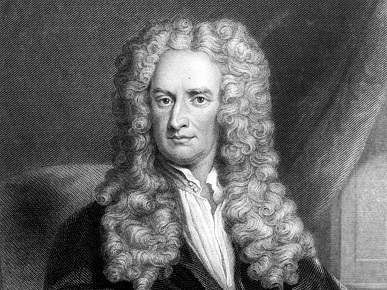
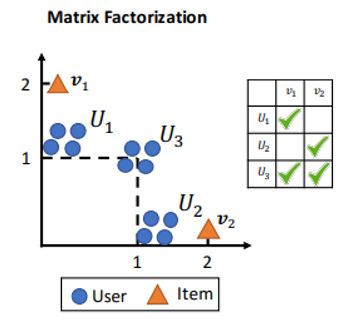
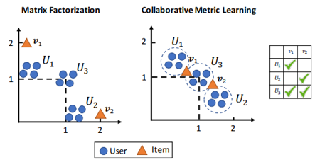
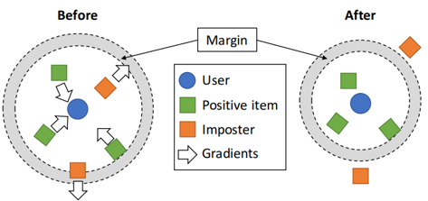
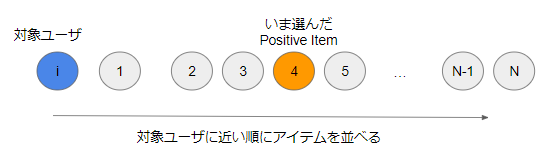

# Newton会
## Collaborative Metric Learning
## 2020-04-15 / AI室 中江 俊博
---
## Newton会の趣旨
- AI室で立ち上げる勉強会の1つ。
- 感染病を避けるために部屋に閉じこもるのであれば、  
  一緒に論文を読み、技術を高めようという趣旨。
- 発表者が興味のあるものであれば、何でも構わない。
  - 特に準備がなくてもよいし、思い付きで話してもよい。
  - 誰かに強制もしないし、ローテーションもしない。

---
## 参考 : wikipediaより
- アイザック・ニュートン
  - ロンドンではペストが大流行しており...、  
    この影響でケンブリッジ大学も閉鎖されることになり、
  - 故郷のウールスソープへと戻り、カレッジですでに得ていた  
    着想について自由に思考する時間を得た。
  - 「ニュートンの三大業績」とされるものは、いずれもペスト禍を逃れて  
    故郷の田舎に戻っていた18か月間の休暇中になしとげたこと

---
## Collaborative Metric Learning
- 本日紹介する文献
  - Cheng-Kang Hsieh+ (WWW2017) Collaborative Metric Learning
  http://www.cs.cornell.edu/~ylongqi/paper/HsiehYCLBE17.pdf
- ざっくりいうと
  - 協調フィルタリング + Metric Learning
  - 単に User に適した Item をレコメンドするだけではなく  
    Item に類似する Item を抽出してこれるUser, Item の  
    特徴ベクトルが得られる方法
- 以下、CMLとも書きます

---
## 協調フィルタリングの問題点
- 通常は Matrix Factorization では、User が好む Item は  
  特徴ベクトルの内積を大きくするように学習する。
- 問題となる例
  - $U_1$ は $v_1$ を好み、$U_2$ は $v_2$ を好むユーザ集合
  - $U_3$ は $v_1, v_2$ の両方を好むユーザ集合
  - $v_1, v_2$ は似た傾向にあるから、近くに置かれそう？
    - 必ずしもそうならない。2つの内積はゼロになる！

---
## Collaborative Metric Learning
- つながりのある User x Item 同士の、(Euclid)距離が  
  近くなるように特徴ベクトルを学習
- 協調フィルタリングとCML
  - $U_1$ は $v_1$ を好み、$U_2$ は $v_2$ を好むユーザ集合
  - $U_3$ は $v_1, v_2$ の両方を好むユーザ集合
  - $v_1, v_2$ は似た傾向にあり、近くに置かれる！

---
## Metric Learning とは
- 対象となる空間での距離関係を、埋め込み空間でも  
  同等になるように埋め込みを学習する方法
  - 一般的な問題設定では、**類似ペアを近く、非類似ペアを遠く配置する。**
- 最もシンプルには？
  - Mahalanovis 距離を最小化するように行列を学習することが行われる  
    - $d_A (x_i, x_j) = \sqrt{(x_i - x_j)^T A (x_i - x_j)}$
  - ただし組み合わせが膨大である。計算量が膨れて大変...

---
## Large Margin Nearest Neighbor (LMNN)
- お互いに近くにある要素だけを調整する手法。計算量が少なくて済む。
- 次の損失 **pull**, **push** を最小化する。
  - **pull** : 類似ペア $i,j$ 同士を近づける
    - $\mathcal{L}_ {\textrm{pull}} = \sum_{j \leadsto i} d(x_i, x_j)^2$
  - **push** : 類似ペア $i,j$ よりも近づいた非類似要素$k$を遠ざける
    - $\mathcal{L}_ {\textrm{push}} = \sum_{i, j \leadsto i} \sum_k (1 - y_ {i,k}) [1 + d(x_i, x_j)^2 - d(x_i, x_k)^2]_ {+}$
      - $y_{i,k}$ は類似ペアで1, 非類似ペアで0
  - 記号 : $j \leadsto i$ : $j$ は $i$ の類似ペアである。

---
## CML の定式化
- Metric Learning の考え方 **「類似ペアを近く、非類似ペアを遠く配置」**  
  を Collaborative Filterning に適用するもの。
- User $i$, Item $j$ の特徴ベクトル $\boldsymbol{u}_i, \boldsymbol{v}_j$ は User が Item を好むほど  
  Euclid 距離 $d(i,j) = | \boldsymbol{u}_i - \boldsymbol{v}_j |$ が近いとする
- 次の損失を最小化する : $S$ は Positive な User, Item の組み合わせ
  - $[\cdot] _{+}$ は負でゼロになる関数(Hinge loss)

$$
\mathcal{L}_ {m} = \sum_ {(i,j) \in S} \sum_ {(i,k) \notin S}
w_{ij} [1 + d(x_i, x_j)^2 - d(x_i, x_k)^2]_ {+}
$$

- これは LMNN に近いだけではなくて、BPR / WARP に似ている！

---
## BPR, WARP のおさらい
- BPR
  - ユーザ $i$ に対して正例 $j$ と負例 $k$ を選ぶ
  - $\sigma(\boldsymbol{u}^T_i \boldsymbol{v}_j - \boldsymbol{u}^T_i \boldsymbol{v}_k)$
    が大きくなるようにパラメータ更新
    - $\sigma(\cdot)$はsigmoid関数
- WARP
  - ユーザ $i$ に対して正例 $j$ と負例 $k$ を選ぶ
  - $[1 - \boldsymbol{u}^T_i \boldsymbol{v}_j + \boldsymbol{u}^T_i \boldsymbol{v}_k] _{+}$ 
    が小さくなるようにパラメータ更新
    - $[\cdot] _{+}$ は負でゼロになる関数(Hinge loss)
- CMLとの違い
  - BPR/WARPでは内積を使うが、CMLではEuclid距離を使う
  - 損失関数の形式は WARP とよく似ている

---
## CMLの定式化を再度見てみる
- User $i$ の Positive Item $j$ よりも内側に入った Negative Item $j$ を  
  Positive Item の外側に遠ざけようとする損失に相当している
  - LMNN と違って pull を考えない
  - $w _{ij}$は、WARPと同様に Positive Item の「順序」を使う

$$
\mathcal{L}_ {m} = \sum_ {(i,j) \in S} \sum_ {(i,k) \notin S}
w_{ij} [1 + d(x_i, x_j)^2 - d(x_i, x_k)^2]_ {+}
$$

---
## WARPで用いる Positive Item の順序
- 基本的なアイデア
  - ユーザ $i$ に対して選んだ Positive Item $j$ が  
    Negative Itemの中で、ユーザから何番目に近いかの順序を使う
  - この順序 $\textrm{rank}(i,j)$ が後ろであるほど**残念なアイテム**なので  
    重みを大きくして更新する (もっとユーザに近づいてもらう)
- サンプリングによる順序の推定
  - 順序の計算は大変なので、サンプリングで順序を推定する
  - Positive Item よりも順序が小さい Negative Item を $U$ 回目で   
    初めて見つけたら、$\textrm{rank}(i,j) = \frac{N}{U}$ と推定する
- 例 : この場合 rank = 4

---
## CMLでの順位の利用
- 手順
  - ユーザ $i$ と Positive Item $j$ を1つ選ぶ
  - Negative Item $k$ を $U$ 個選ぶ(通常20個程度)
  - この $U$ の中で Positive Item $j$ よりもユーザに近いアイテムが  
    $M$ 個あったら、順位は $\textrm{rank}(i,j) = N \times \frac{M}{U}$ とする。
  - 重み $w_{ij} = \log(\textrm{rank}(i,j) + 1)$
- サンプリングしないの？
  - 「GPUで並列化したいのでサンプリングしない」と言っている。

---
## 正則化項の導入
- CMLの損失関数以外に次の正則化項を利用する
- **1. アイテム属性の利用**  
  アイテム属性 $\boldsymbol{x}_j$ からアイテムの特徴ベクトル $\boldsymbol{v}_j$ を  
  回帰するモデル $f(\boldsymbol{x}_j ; \boldsymbol{\theta})$ との残差2乗和を正則化項に入れる
$$\mathcal{L}_f = \sum_j |f(\boldsymbol{x}_j ; \boldsymbol{\theta}) - \boldsymbol{v}_j|^2$$

- **2. 特徴ベクトルの相関の正則化**  
  特徴ベクトルの分散共分散$C$の相関部分の値を  
  抑えるような正則化項を入れる
$$
\begin{equation}
\mathcal{L}_c = \frac1N (|C|_f - |\textit{diag}(C)|_2^2)
\end{equation}
$$

---
## 最終的な手順
- 損失関数
$$\min _{\theta, \boldsymbol{u} _{\*}, \boldsymbol{v} _{\*}} \mathcal{L} + \lambda_f \mathcal{L}_f + \lambda_c \mathcal{L}_c \quad \textrm{s.t.} \quad |u _{\*}|^2 \le 1,  \  |v _{\*}|^2 \le 1$$
- 手順
  - 1. Positive な組を $N$ 個サンプリング
  - 2. それぞれについて Negative Item を $U$ 個サンプリング
    - この Negative を使って Positive の「順位」を計算し $w_{ij}$ とする。
  - 3. Positve Pair ごとに損失が最悪となる Negative Item だけを残す
  - 4. パラメータをSGDなどで更新
  - 5. Norm が1を超えた場合は正規化
  - 6. 1に戻る

---
## 結果・精度評価
論文で説明。

---
## この方法の利点
- User への Item レコメンドだけではなく  
  類似 Item レコメンドにも用いることができる。
  - Euclid距離ベースなので、距離ベースの検索手法を利用可能(LSHなど)
- CFではBPRやWARPよりも精度が上がったと言っている
  - Feature を使うと Factorization Machine よりもいいと言っている(本当か？)