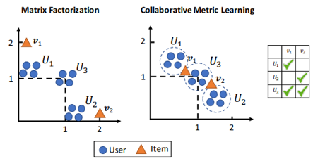

# Newton会
## Collaborative Metric Learning
## 2020-04-15 / AI室 中江 俊博
---
## Newton会の趣旨
- AI室で立ち上げる勉強会の1つ。
- 感染病を避けるために部屋に閉じこもるのであれば、  
  一緒に論文を読み、技術を高めようという趣旨。
- 発表者が興味のあるものであれば、何でも構わない。
  - 特に準備がなくてもよいし、思い付きで話してもよい。
  - 誰かに強制もしないし、ローテーションもしない。

---
## 参考 : wikipediaより
- アイザック・ニュートン
  - ロンドンではペストが大流行しており...、  
    この影響でケンブリッジ大学も閉鎖されることになり、
  - 故郷のウールスソープへと戻り、カレッジですでに得ていた  
    着想について自由に思考する時間を得た。
  - 「ニュートンの三大業績」とされるものは、いずれもペスト禍を逃れて  
    故郷の田舎に戻っていた18か月間の休暇中になしとげたこと

---
## Collaborative Metric Learning
- Cheng-Kang Hsieh+ (WWW2017) Collaborative Metric Learning
http://www.cs.cornell.edu/~ylongqi/paper/HsiehYCLBE17.pdf

---
## 協調フィルタリングの問題点
- 通常は Matrix Factorization では、User が好む Item は  
  特徴ベクトルの内積を大きくするように学習する。
- 何が起きるか？
  - $U_1$ は $v_1$ を好み、$U_2$ は $v_2$ を好むユーザ集合
  - $U_3$ は $v_1, v_2$ の両方を好むユーザ集合
  - $v_1, v_2$ は似た傾向にあるから、近くに置かれそう？
    - 必ずしもそうならない

---
## Collaborative Metric Learning
- つながりのある User x Item 同士の、(Euclid)距離が  
  近くなるように特徴ベクトルを学習
- 図の比較
  - $U_1$ は $v_1$ を好み、$U_2$ は $v_2$ を好むユーザ集合
  - $U_3$ は $v_1, v_2$ の両方を好むユーザ集合
  - $v_1, v_2$ は似た傾向にあり、近くに置かれる！

---
## Metric Learning とは
- 対象となる空間での距離関係を、埋め込み空間でも  
  同等になるように埋め込みを学習する方法
  - $a, b$ が近ければ、射影した空間でも近い
  - $a, b$ が近く、$a, c$ が近ければ $b,c$ も近くなる
- 一般的な問題設定
  - **Positive Items をより近く、Nagative Items をより遠く配置する。**
    - Positive Items : お互いに似ているペアの集合
    - Negative Items : お互いに似ていないペアの集合
- 最もシンプルには？
  - Mahalanovis 距離を最小化するように行列を学習することが行われる  
    - 組み合わせが膨大である。計算量が膨れて大変...

---
## Large Margin Nearest Neighbor
- pull
  - 正例を近づける
- push
  - 正例よりも近づいてしまった負例を遠ざける
    - あるアイテムに対する正例を1つ選ぶ
    - 正例よりも近くに紛れ込んだまがい物(Imposter)を  
      遠ざけることを考える

---
## CML の定式化
- 次の式の通り
- これはどこかで見たことある！

---
## BPR / WARP
- おさらい
- BPR
  - ユーザ i に対して正例 j と負例 k を選ぶ
  - 次の尤度を算出し、SGDする。
- WARP
  - ユーザ i に対して正例 j と負例 k を選ぶ
  - 次の尤度を算出し、SGDする。
  - まさしくこれは WARP
-

---
## CMLの定式化を再度見てみる

---
## 図に戻る
- Positive
- Negative

---
## WARPの時にやったこと
- ユーザi に対してアイテム j を選ぶ際に、近い順に並べて
  正例 j がどれだけ後ろになるかを調べる
  - 後ろになればなるほどかわいそうな正例jということになるので
    損失が大きいと考えて重みを大きくする
  - 順位の増加関数であった。

---
## WARPのアルゴリズム

---
## CMLのロジック
- ユーザ i と Positive Item j を1つ選ぶ
- 負例 k を U 個選ぶ(通常20個程度)
- 損失を計算する
