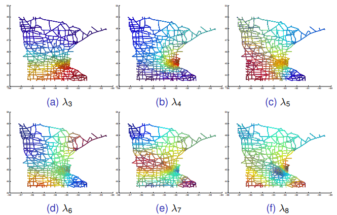

# Newton会
## スカウトデータを用いた Network Embedding
## 2020-11-02 / AI室 中江 俊博

---
## 目次
- 導入
  - 元々の動機
  - network embeddingの実装
- ProNE
  - 事前準備
  - 前提
  - Randomized tSVD
  - Spectral Propagation
    - グラフラプラシアンとその性質
    - グラフラプラシアンの固有値フィルタ
    - チェビシェフ展開による効率的な計算
    - 最終的な伝播式
- スカウトデータに対する適用
  - 対象データ
  - 適用結果と具体例
  - 別の手法との比較

---
## 導入 : 元々の動機
- CRSの求人に対して、関連するクエリを生成したい。
  - 求人に応募しそうな求職者の会社名を出してあげるなど...
- 求人/求職者/会社の関係性のネットワークの性質を使えないだろうか？
  - 求人から求職者にスカウトする
  - 求人/求職者は会社に所属している
- 異種のノード間の関係性があらわされたNetworkを  
  Heterogeneous Information Network という。

---
## 導入 : Network Embedding の各種実装
- ネットワーク上で「近い」ノードに対して類似する  
  (一般的には内積が正に大きい)Embeddingを算出する方法
  - 未知のリンク発見、ノードの属性予測などに活用される。
- 次の2つの実装をつかうことを最初に検討
  - DGL-KE
    - [github](https://github.com/awslabs/dgl-ke)
    - 関係性の種類までを含めた計算が可能だが、  
      チューニングが難しそうな感じで、今回の利用は最終的に諦めた..
  - ProNE
    - [ProNE: Fast and Scalable Network Representation Learning (IJCAI2019)](https://www.ijcai.org/Proceedings/2019/0594.pdf)
    - [Wantedlyの勉強会で紹介された](https://github.com/wantedly/machine-learning-round-table/issues/61#issuecomment-663971444)を見た

---
# ProNE

---
## 事前準備
- $A_{ij}$ : 隣接行列(対象行列, undirected であることが前提)
- $D$ : ノードの次数を表す対角行列 $D_{ii} = \sum_j A_{ij}$
- $p_{i,j} = A_{ij} / D_{ii}$
  - 行側のノード$i$ から列側のノード $j$ をランダムに  
    選択して遷移するランダムウォークの遷移確率に相当する

---
## 具体例
- こんなグラフの場合  
  
- 隣接行列 $A$
  - $i,j$ の間に関係があれば1が立つ

| |1|2|3|4|5|6|
|--|--|--|--|--|--|--|
|1|0|1|1|0|0|0|
|2|1|0|1|0|0|0|
|3|1|1|0|1|0|0|
|4|0|0|1|0|1|1|
|5|0|0|0|1|0|1|
|6|0|0|0|1|1|0|

---
## 具体例
- こんなグラフの場合  
  
- 確率 $p_{i,j}$ の行列 ($j$の和が1になる)

| |1|2|3|4|5|6|
|--|--|--|--|--|--|--|
|1|0|1/2|1/2|0|0|0|
|2|1/2|0|1/2|0|0|0|
|3|1/3|1/3|0|1/3|0|0|
|4|0|0|1/3|0|1/3|1/3|
|5|0|0|0|1/2|0|1/2|
|6|0|0|0|1/2|1/2|0|

---
## ベースとなる確率モデル
- 頂点$i, j$ について、表現 $r_i, c_j$ を考える
- ノード $i$ から連結した次のノード$j$をランダムに選ぶランダムウォークの  
  遷移確率が $\hat{p}_{i,j} = \sigma(r_i^T c_j)$ と予測できるとする。
  - ここで $\sigma(\cdot)$ は sigmoid function
- Loss
  - $l = -\sum_{A_{ij}=1} [p_{i,j} \sigma(r_i^T c_j) + \tau P_{D,j} \ln \sigma(-r_i^T c_j)]$
    - 第2項は negative sampling に相当 ($\tau$はnegative sampling ratio)
    - すべてのランダムウォークで$j$に遷移する確率を使って  
      サンプリング ($\alpha$は 0.75 を採用)
      - $P_{D,j} \propto (\sum_{i: A_{i,j}=1} p_{i,j})^{\alpha}$

---
## 確率モデルの最尤解
- 次のLossの $r_i^T c_j$ についての微分を考える
$$
l = -\sum_{A_{ij}=1}
[p_{i,j} \sigma(r_i^T c_j) + \tau P_{D,j} \ln \sigma(-r_i^T c_j)]
$$
- $f(x) = \ln \sigma(x)$ の微分が $f'(x) = 1 / (1+e^x)$ を使うと  
  Loss の$r_i^T c_j$ についての微分=0は、
$$
\begin{align}
\frac{p_{i,j}}{1 + \exp(r_i^T c_j)} + \frac{\tau P_{D,j}}{1 + \exp(-r_i^T c_j)} = 0 \\\\
 p_{i,j} + \tau P_{D,j} \exp(-r_i^T c_j) = 0 \\\\
 r_i^T c_j = \ln p_{i,j} + \ln (\tau P_{D,j})
\end{align}
$$
- なので、連結要素が $\ln p_{i,j} + \ln (\tau P_{D,j})$ の
  行列$M$を分解すればよい！

---
## ここからの基本的なアイデア
- 1. 行列 $M$ を SVD する。この際に Randomized SVD をする。
- 2. SVDで求めた左特異ベクトルを Spectral Propagation で伝播させる

---
## Randomized Trancated SVD
- SVDの計算量は, $O(\max(mn^2, m^2n))$となって激しい。  
  これを Randomized SVD で計算量を大幅に減らす
- 対象はサイズが $|V| \times |V|$ の行列 $M$
- 手順
  1. 正規分布で乱数を振った行列 $\Omega$ (サイズ$|V| \times d$) を作る
  2. $Y=M \Omega$ を計算し、$Y$ の列を正規直交化して  
     直交基底を列に並べた $Q$ を作る(具体的にはQR分解する)
  3. $H = Q^T M$ (サイズ $d \times |V|$) を作り、これに対して  
     通常の SVD を実施 ... $H = S_d \Sigma_d V_d^T$
  4. $M = (Q S_d) \Sigma_d V_d^T$ となるので、  
     $R_d = Q S_d \Sigma_d^{1/2}$ を各ノードの Embeddings として採用
- Time Complexity $O(|V|d^2)$
- 実は現在の `sklearn.decomposition.TruncatedSVD` の default algorithm
  - 実は公式実装でも [`sklearn` の実装](https://scikit-learn.org/stable/modules/generated/sklearn.utils.extmath.randomized_svd.html)を使っているだけ。

---
## Spectral Propagation による大域的構造の加味
- Randomized tSVD で計算した Embeddings も割といい性能
- でもここからさらに性能を上げるために、ネットワーク上を  
  ある程度伝播させることを考える
  - グラフラプラシアンを用いた伝播 (Spectracl Propagation) 

---
## グラフラプラシアンと固有値
- グラフラプラシアン (Graph Laplacian)
  - $L = D - A$
    - $A_{ij}$ : 隣接行列(対象行列, undirected であることが前提)
    - $D$ : ノードの次数を表す対角行列 $D_{ii} = \sum_j A_{ij}$
- これがラプラシアンとはどう言う意味か？
  - $x^T L x = \frac12 \sum_{A_{i,j}=1} (x_i - x_j)^2$
    - 隣接する2つの点の差の2乗和となっている。
    - 半正定値性そのもの。固有値はすべて0以上の実数。

---
## グラフラプラシアンと固有値 (2)
- 正規化グラフラプラシアン (normalized graph laplacian)
  - $\mathcal{L} = I - D^{-1} A$
  - 正式には正規化 **Random Walk** ラプラシアンという。
  - 例えば ノード $A_{ij}$ は $j$ から $i$ への移動と考えられる。
    - $L$ の左固有値 $\lambda$, 左固有ベクトル $\boldsymbol{x}$ に対して
      - $\boldsymbol{x}^T (I - D^{-1} A)= \lambda \boldsymbol{x}^T$
    - つまり
      - $\boldsymbol{x}^T  D^{-1} A = (1 - \lambda) \boldsymbol{x}^T \sim e^{-\lambda} \boldsymbol{x}$
  - $k$回遷移すると固有ベクトル $\boldsymbol{x}$ は $e^{-\lambda k}$ で減衰
    - 固有値が0に近い = 拡散で残る一様な分布に相当
    - 固有値が大きい = 拡散ですぐ影響が消える短距離の分布に相当
- 右固有ベクトルについては、隣接ノードを平均化する操作に相当  
  (定性的な傾向は左固有ベクトルと同じ)

---
## グラフラプラシアンと固有値 (3)
- 正規化 **Random Walk** グラフラプラシアンの性質
  - ラプラシアン $\mathcal{L}$ は非対称だが、半正定値性があり
    0以上の実固有値を持つ。
- 0 から小さい順にラプラシアンの固有値を並べる
  - $0 = \lambda_1 < \lambda_1 < ... < \lambda_k < ...$
- 固有値0はすべてのノードが同じ値となる自明な固有ベクトル
- $\lambda_k$に対応する固有ベクトル $\boldsymbol{x}$ は、  
  全ノードを k 個のクラスタに分割した構造を  
  あらわしている (cheeger の不等式)

---
## グラフラプラシアンの固有ベクトルの例
- 資料 [Fourier Analysis on Graphs](http://www.norbertwiener.umd.edu/Research/lectures/2014/MBegue_Prelim.pdf)より引用
  - 
- 非ゼロの固有値に対応する固有ベクトルを固有値の小さい方から
  - 固有値が増えるほど、正/負で分かれるクラスタの数が増える
  - つまり固有値が増加するほど近距離の傾向を強く持つ

---
## グラフフーリエ変換
- 正規化ラプラシアン $\mathcal{L} = I - D^{-1} A$ の  
  固有値/固有ベクトルを使えば、$\mathcal{L} = U \Lambda U^{-1}$ と対角化できる
  - $\hat{\boldsymbol{x}} = U^{-1} \boldsymbol{x}$ をグラフフーリエ変換  
    $\boldsymbol{x} = U \hat{\boldsymbol{x}}$ を逆フーリエ変換のようにいうことがある
  - ちょうど固有値が「周波数」に相当している
- 固有値ゼロと、固有値が大きすぎる固有成分はあまり有用でない
  - ゼロは一様すぎる。固有値が大きすぎると局所的な性質が大きすぎる。
- グラフラプラシアンを使った分析では、特定の固有値領域の成分だけを  
  取り出すようなモデリングが一般的

---
## 固有値のフィルタ
- 固有値に対して次のフィルタをかける
  - $g(\lambda) = e^{-\frac12 [(\lambda - \mu)^2 - 1] \theta}$
  - 概ね、Low-pass filter に相当  
    
- この固有値フィルタをした上で、次を計算する
  - $\tilde{\mathcal{L}}=U \textrm{diag} ([g(\lambda_1), ... g(\lambda_n)])  U^{-1}$
  - この計算は固有値計算と逆行列計算を必要として激しい！

---
## チェビシェフ展開
- 固有値フィルタ $g(\lambda)$ を多項式展開して固有値/逆行列計算を避けよう！
- 第一種チェビシェフ多項式 (Chebyshev polynomial of the first kind)
$$
\begin{align}
  T_0(x) &= 0, \quad T_1(x) = x \\\\
  T_{n+1}(x) &= 2x T_n(x) - T_{n-1}(x)
\end{align}
$$
- 定義域 $[-1, 1]$ の直交多項式なので $g(\bar{\lambda}) = e^{-\lambda \theta}$ を途中まで展開
$$
g(\bar{\Lambda}) = \sum_{i=0}^{k-1} c_i(\theta) T_i(\bar{\Lambda})
$$
  - ここで $\bar{\lambda} = \frac12 [(\lambda - \mu)^2 - 1], \bar{\Lambda} = \textrm{diag}([\bar{\lambda}_1, ..., \bar{\lambda}_n])$

---
## チェビシェフ展開の妙技
- チェビシェフ展開をしておけば、次のようにラプラシアンの多項式に帰着
$$
\begin{align}
\tilde{\mathcal{L}} &= U \textrm{diag} ([g(\lambda_1), ... g(\lambda_n)])  U^{-1} \\\\
&= U \left[ \sum_{i=0}^{k-1} c_i(\theta) T_i(\bar{\Lambda}) \right] U^{-1}
= \sum_{i=0}^{k-1} c_i(\theta) \left[ U T_i(\bar{\Lambda}) U^{-1} \right] \\\\
&= \sum_{i=0}^{k-1} c_i(\theta) T_i(\bar { \mathcal{L} } )
\end{align}
$$
- ここで $\bar { \mathcal{L} } = \frac12 [(\mathcal{L} - \mu I)^2 - I]$
- 実際にはチェビシェフ多項式同様、再帰的な計算で求まる。

---
## 最終的な伝播方法
- SVDで計算しておいた Row Embeddings $R_d$ に対して次で変換する
$$
R_d \leftarrow D^{-1} A (I_n - \tilde{\mathcal{L}}) R_d
$$
- 意味 (書いてないが多分こういう意味)
  - $I_n - \tilde{\mathcal{L}}$
    - フィルタを通した後のラプラシアンをもう一度隣接行列に戻して掛け算
    - 長距離のノード間の関係性を入れて伝播させていることに相当
  - $D^{-1} A$
    - 隣接ノードの embeddings の平均を取っているだけ
- ちなみに、ラプラシアンを使う他の文献 (Graph Convolution 系とか)は  
  フィルタ後のラプラシアンを直接何回も掛け算するケースが多い

---
## ProNEの実装
- [公式実装](https://github.com/THUDM/ProNE/blob/master/proNE.py)
  - Randomized tSVD は `sklearn.utils.extmath.randomized_svd`  
    をつかっているだけ。
  - Laplacian Propagation
    - numpy でラプラシアンの行列掛け算をするだけ。
    - 係数部分に scipy の特殊関数 `scipy.special.iv` を利用
- [改良実装](https://github.com/wantedly/machine-learning-round-table/issues/61#issuecomment-663971444)
  - `csr_matrix` の入力を前提として整備 (えらい)

---
# BizReachデータでの実施

---
## 対象データについて
- CRS 2019-07-01 以降 10月末までのスカウト実績を利用
  - 返信有無は問わない
- データ規模
  - 1,375,938 : スカウト数
    - 求職者/求人いずれも10スカウト以上を有効数とする。
  - 61,132 : 求職者数 
    - 61,406 : 求職者の会社所属情報
    - 51,767 : 求職者の卒業大学
  - 22,659 : 求人数 
    - 11,236 : 求人の会社所属情報
- 会社については正規化/揺らぎ統一を実施
  - 非公開・大手xx企業などの伏せ字、なし・ありませんなど除外
  - 株式会社などの屋号はすべて除外して一致性を確認

---
## ProNE適用時の注意点
- スカウト・会社・卒業大学いずれも双方向のリンクとして扱う
- 適用時のパラメータ
  - 次元128 / 繰り返し100
  - 残りはデフォルト
- レコメンドについてはいまいちな感じがある？
  - ちゃんと精度はみた方が良さそう

---
## 別の手法との比較
- スカウトデータから算出したembeddingsを平均する考え方もある
  - ただしこの場合では、マイナーな企業では失敗することが多い
  - 成功するのは、おそらくラプラシアンを使った拡散があるからだと思われる。
- ただしレコメンドよりは性能が劣る感じ
  - globalな表現を求めて local性が失われるからだろうか？
  - Matrix Factorization で user/item embeddings を求めた後に  
    spectral propagation する合わせ技がいいだろうか？
