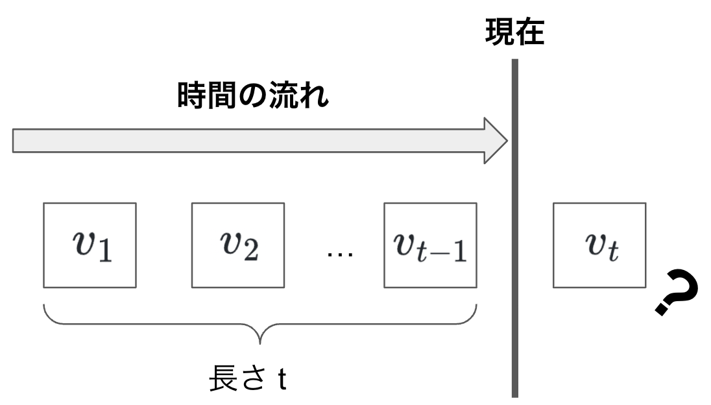
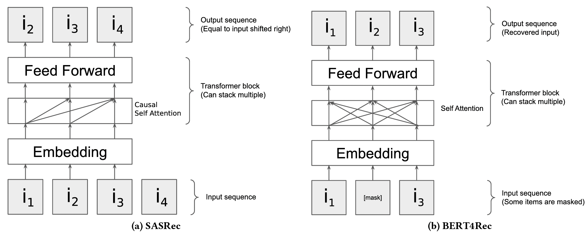
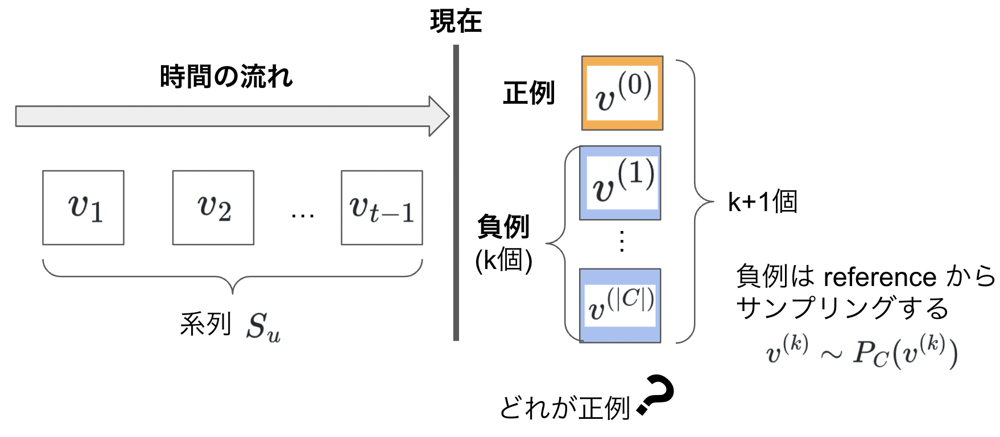
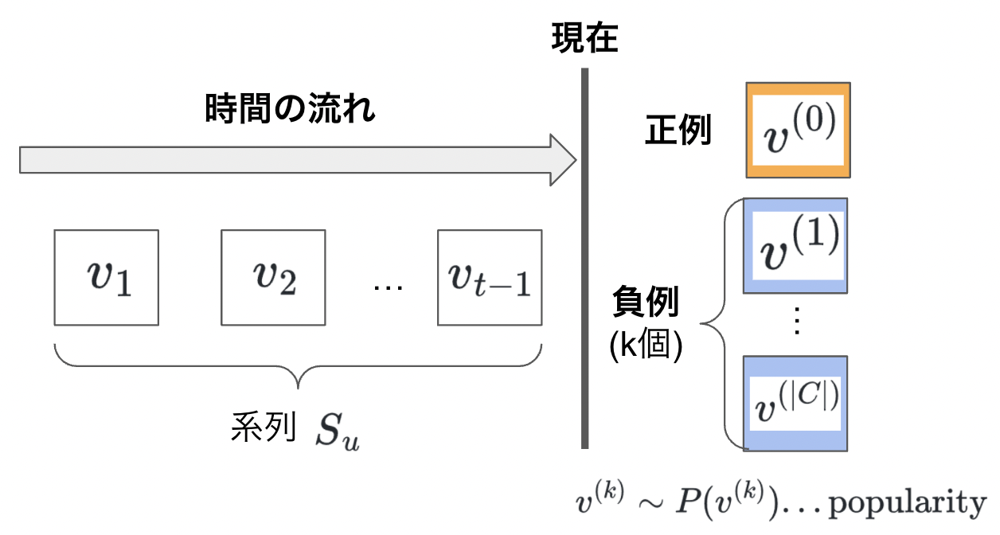

# Research MTG (2022-09-07 / nakae)
- 対象論文
  - Don't recommend the obvious: Estimate probability ratios
  - Pellegrini+ (RecSys2022)

---

## Summary
- Sequential Recommendation における改良の1つ
- 学習の際に、item popularityを使って negative sampling をすると
  PMI (pointwise mutual information) が最大のものを
  レコメンドしていることになる。

---

### Sequential Recommdantion とは
- Item 接触時系列が与えられた時に、次の時刻(以降)で
  接触すると考えられる Item を予測する問題設定

---

### 最近の Sequential Recommendation の傾向
- 提案されている手法
  - GRU4Rec
  - SASRec (based on transformer)
  - BERT4Rec (based on transformer)
    - SOTAと言われているが詳細なbenchmarkに基づく批判がある
      - See: [arxiv/2207.07483](https://arxiv.org/abs/2207.07483)
- SASRec(左) vs BERT4Rec(右) (↑このbenchmark論文から)

---

### 問題意識
- Sequential Recommendation の評価では(後で説明するように)
- レコメンドされるものは、popular item に偏る。
  - 例 : Bob は Toy Story を見る確率が高い
    → Toy Story をレコメンド
    - Toy Story は popular item なので、**Bobがそれほど好きでなくても**見る確率が高い。
    - Bob が見る確率が **他のUserと比べて見る確率が高いかどうか** が大事なのではないだろうか？

---

### 記号

- 基本
  - Users : $U = \{u_1, u_2, ..., u_{|U|} \}$
  - Items : $V = \{v_1, v_2, ..., v_{|V|} \}$
- User $u$ の接触履歴
  - $S_u : \left[ v_1^{u}, v_2^{u}, ..., v_{n_u}^{u}  \right]$

---

### 問題意識を数式で

- 通常のレコメンドの設定
  - 過去の系列 $S_u$ がある時に
    次の Item $v$ の確率 $P(v | S_u)$ が高いものをお勧めする。
- PMIを使うレコメンドの設定
  - Item popularity $P(v)$ と、過去履歴 $S_u$ からの確率 $P(v | S_u)$ から
    計算した確率の比$\displaystyle \frac{P(v | S_u)}{P(v)}$が最も高い Item $v$ をお勧めする。

---

## PMI
- 確率比にlogを取ったものは、Pointwise Mutual Informationと呼ばれる。
$$\log \frac{P(v | S_u)}{P(v)}
 = \log \frac{P(v, S_u)}{P(S_u) P(v)}
$$

- 意味
  - $v, S_u$ が独立であれば、PMI=0
  - $v, S_u$ の関連が強ければ、PMI > 0 で値は大きい。

---

## アイテム予測タスクとPMIの関係

- $k$番目の候補itemが、正例であるかどうかの予測

---

## (Cont.)

$$\begin{aligned}
P(k | \{v^{(i)}\}, S_u)
  &\propto P(v^{(k)} | S_u) \prod_{i \ne k} P(v^{(i)} | S_u) \\
  &= P(v^{(k)} | S_u) \prod_{i \ne k} P_C(v^{(i)}) \\
  &= P(v^{(k)} | S_u) \frac1{P_C(v^{(k)})} \prod_{i} P_C(v^{(i)}) \\
  &\propto \frac{P(v^{(k)} | S_u)}{P_C(v^{(k)})}
\end{aligned}
$$

ここで最後の reference distribution を $P_C(v) = P(v)$ (popularity) とすると
この値のlogは PMI になっている！

---

## 整理すると...
- 1つのpositive と $k$個のnegative (popularity distributionからサンプル)から
  1つのpositiveを予測するモデルについて log-likelihood を maximize すれば、
  PMI最大のアイテムをレコメンドするようになる。
  - sampling は 復元抽出(Sampling With Replacement) でよい。

---

## 似た話 : Sampling Metrics
- Sequential Recommendation モデルは、HIT@kで評価するのが通常。
  - item sequence の最後の item をレコメンドできるかどうかを判断する。
  - User $i$ が最後に接触した item を $v_i$ として、この正解アイテムと
    **残りのすべてのアイテム** $C = [c_1, ..., c_{|C|}]$ のスコアをつけ、
    ソートをして正解アイテムのレコメンド順位 $r(v_i)$ をつける。
- HIT@k の定義
  
$$ \textrm{HIT}@k = \frac1{|U|}
  \sum_{i=1}^{|U|} \mathbb{1}_{r(v_i) \le k}$$

---

## (Cont.)
- すべてのアイテムの評価はとても時間がかかるので、サンプリングする。
- Sampling で評価する HIT@k
  - User $i$ が最後に接触した item を $v_i$ として、この正解アイテムと
    **popularity でサンプリングしたアイテム** $C = [c_1, ..., c_{|C|}]$ の
    スコアでソートをして正解アイテムのレコメンド順位 $r(v_i)$ をつける。

---

## 予測モデル No.1 : Softmax型
- Neural Network などのモデルの最終層で softmax し、
  この値を用いて (cross entropyで) log likelihood maximize する。
$$
P(k | \{v^{(i)}\}, S_u)
  = \frac{\exp (f(v^{(k)}, S_u))}{\sum_{i=0}^{|C|}\exp (f(v^{(k)}, S_u))}
  \propto \exp (f(v^{(k)}, S_u))
$$
- negative sample を popularity で sample して学習すれば、
  最終層の値 $f(v^{(k)}, S_u)$ は $\log(\textrm{PMI})$  となる。
$$\begin{aligned}
f(v^{(k)}, S_u) 
 &= \log P(k | v^{(k)}, S_u) \\
 &= \log \frac{P(v^{(k)} | S_u)}{P_C(v^{(k)})} + \textrm{const.}
\end{aligned}$$

---

## 予測モデル No.2 : Logistic型
- $k$番目のitem $v$ が、positveかどうかの確率を Logistic Regression で fit する。
$$
P(k | v, S_u) = \sigma(f(v, S_u)) = \frac{1}{1 + \exp(- f(v, S_u)))}
$$

- この場合も、1件ずつ0/1判別のモデルの最尤推定すると次のようになる。
$$
f(v, S_u) = \log \frac{P(v^{(k)} | S_u)}{P_C(v^{(k)})} - \log (|C|)
$$

---

## (Cont.) 証明

---

## 

---

$$\begin{aligned}
S_u \\\\

v^{(0)} \\\\

v^{(1)} \\\\

v^{(|C|)} \\\\

v^{(k)} \sim P_C(v^{(k)} ) \\\\

v^{(k)} \sim P(v^{(k)} ) ... \textrm{popularity} \\\\

\end{aligned}$$