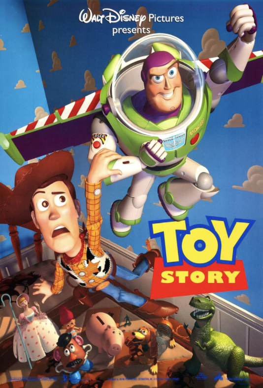
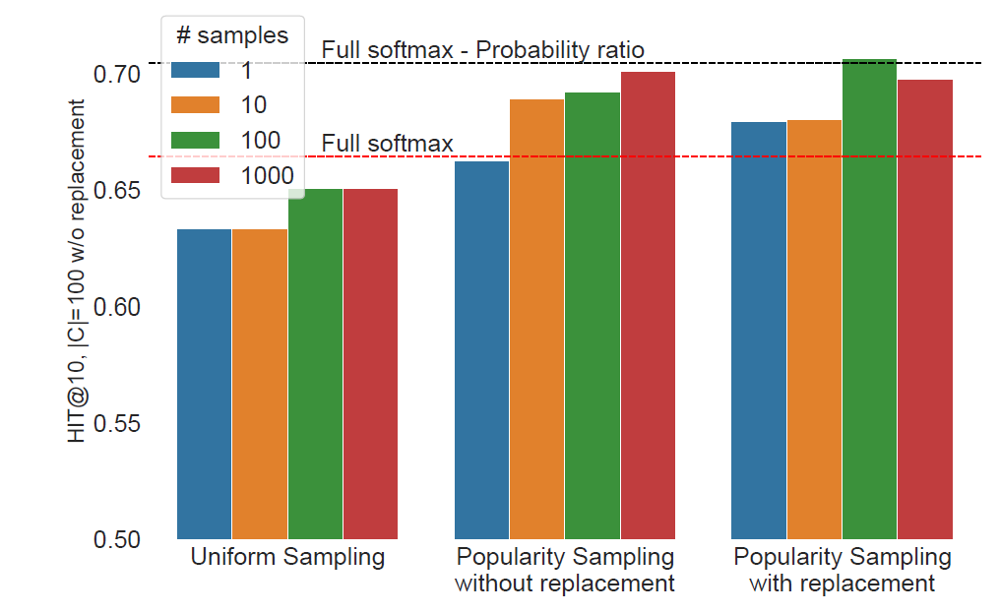
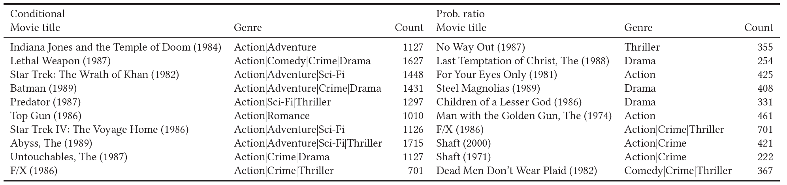

<!-- paginate: true -->
<!-- footer: Research MTG : 2022-09-07 -->

# Research MTG
## 2022-09-07 / nakae
- 今回の対象論文
  - [Don't recommend the obvious: Estimate probability ratios](https://www.amazon.science/publications/dont-recommend-the-obvious-estimate-probability-ratios)
  - Pellegrini+ (RecSys2022)

---

## RecSys?

- RecSys = ACM Conference on **Rec**ommender **Sys**tems
  - Recommenderに関する(最も大きな)国際学会 (毎年9月に実施)
  - ACM Digital Library でまもなく Proceeding が無料公開(1ヶ月程度)

---

## Summary
- Sequential Recommendation における改良の1つ
- 学習の際に、item popularityを使って negative sampling をすると
  **PMI (pointwise mutual information)** でスコアリングできる。
  - PMI は、対象 User がその Item を、
    全体の人気と比較してどの程度選びやすいか？のスコアに相当
  - ***Don't recommend the obvious: Estimate probability ratios***

---

### Sequential Recommdantion とは
- Item 接触時系列が与えられた時に、次の時刻(以降)で
  接触すると考えられる Item を予測する問題設定

---

### 最近の Sequential Recommendation の傾向
- 提案されている手法
  - GRU4Rec(2016)
  - SASRec (2018, based on transformer)
  - BERT4Rec (2019, based on transformer)
    - 精度が高いと言われているが、詳細なbenchmarkに基づく批判がある
      - Petrov, Macdonald (RecSys2022) [arxiv/2207.07483](https://arxiv.org/abs/2207.07483)
      - A Systematic Review and Replicability Study of BERT4Rec for Sequential Recommendation
        - 非常に面白い。おそらく今年のBest Paper

---
### (Cont.)
- SASRec(左) vs BERT4Rec(右) (benchmark論文から)

---

### 問題意識
- Sequential Recommendation の最近の評価では
  popular item をサンプリングして、評価することが多い(後で説明)
- 結局レコメンドされるものは、popular item に偏るから
  これで大丈夫！という理屈でOKになっている。
  - 本当に大丈夫？

---

### 問題意識
- 映画のレコメンドの場合
  - 例 : Bob は Toy Story を見る確率が高い
    → Toy Story をレコメンド
    - Toy Story はみんなが見るので、
      悪くないレコメンドのはず。
    - でも、**Bobが他の人より好きでなくても**
      見る確率が高くなる。
    - Bob が見る確率が **他のUserと比べて**
      **見る確率が高いかどうか** が大事では？

---

### 記号

- 基本
  - Users : $U = \{u_1, u_2, ..., u_{|U|} \}$
  - Items : $V = \{v_1, v_2, ..., v_{|V|} \}$
- User $u$ の接触履歴
  - $S_u : \left[ v_1^{u}, v_2^{u}, ..., v_{n_u}^{u}  \right]$

---

### 問題意識を数式で

- 通常のレコメンドの設定
  - 過去の系列 $S_u$ がある時に
    次の Item $v$ の確率 $P(v | S_u)$ が高いものをお勧めする。
- PMIを使うレコメンドの設定
  - Item popularity $P(v)$ と、過去履歴 $S_u$ からの確率 $P(v | S_u)$ の
    比 $\displaystyle \frac{P(v | S_u)}{P(v)}$が最も高い Item $v$ をお勧めする。
    - Toy Story の $P(v)$ はとても大きい
    - Bob が見る確率 $P(v | S_u)$ が $P(v)$ より大きいかが重要

---

## PMI
- 確率比にlogを取ったものは、
  **PMI(Pointwise Mutual Information)** と呼ばれる。
$$\log \frac{P(v | S_u)}{P(v)}
 = \log \frac{P(v, S_u)}{P(v) P(S_u)}
$$

- 意味
  - $v, S_u$ が独立であれば、PMI=0
  - $v, S_u$ の関連が強ければ、PMI>0 で値は大きい。

---

## アイテム予測タスクとPMIの関係

- $k$番目の候補itemが、正例であるかどうかの予測

---

### (Cont.)
$k$ 番目の item が positive item であるかの確率:
$$\begin{aligned}
P(k | \{v^{(i)}\}, S_u)
  &\propto P(v^{(k)} | S_u) \prod_{i \ne k} P(v^{(i)} | S_u) \\
  &= P(v^{(k)} | S_u) \prod_{i \ne k} P_C(v^{(i)}) \\
  &= P(v^{(k)} | S_u) \frac1{P_C(v^{(k)})} \prod_{i} P_C(v^{(i)}) \\
  &\propto \frac{P(v^{(k)} | S_u)}{P_C(v^{(k)})}
\end{aligned}
$$

$P_C(v) = P(v)$ (popularity) とすると $\exp(\textrm{PMI})$ になっている！

---

## 整理すると...
- 1つのpositive と $k$個のnegative (popularityでサンプリング)から
  1つのpositiveを予測するモデルについて log-likelihood を maximize すれば、
  PMI最大のアイテムをレコメンドするようになる。
  - sampling は 復元抽出(Sampling With Replacement) でよい。

---

## 似た話 : Sampling Metrics
- Sequential Recommendation モデルは、HIT@kで評価するのが通常。
  - item sequence の最後の item をレコメンドできるかどうかを判断する。
  - User $i$ が最後に接触した item を $v_i$ として、この正解アイテムと
    **残りのすべてのアイテム** $C = [c_1, ..., c_{|C|}]$ のスコアをつけ、
    ソートをして正解アイテムのレコメンド順位 $r(v_i)$ をつける。
- HIT@k の定義

$$ \textrm{HIT}@k = \frac1{|U|}
  \sum_{i=1}^{|U|} \mathbb{1}_{r(v_i) \le k}$$

---

## (Cont.)
- すべてのアイテムの評価はとても時間がかかるので、サンプリングする。
- Sampling で評価する HIT@k
  - User $i$ が最後に接触した item を $v_i$ として、この正解アイテムと
    **popularity でサンプリングしたアイテム** $C = [c_1, ..., c_{|C|}]$ の
    スコアでソートをして正解アイテムのレコメンド順位 $r(v_i)$ をつける。
- $|C|$が小さいと、HIT@kは大きくなる。
  - ただし異なる手法の間での性能比較は可能。

---

## 予測モデル No.1 : Softmax型
- Neural Network などのモデルの最終層で softmax し、
  この値を用いて (cross entropyで) log likelihood maximize する。
$$
P(k | \{v^{(i)}\}, S_u)
  = \frac{\exp (f(v^{(k)}, S_u))}{\sum_{i=0}^{|C|}\exp (f(v^{(i)}, S_u))}
  \propto \exp (f(v^{(k)}, S_u))
$$
- negative sample を popularity で sample して学習すれば、
  最終層の値 $f(v^{(k)}, S_u)$ は PMI となる。
$$\begin{aligned}
f(v^{(k)}, S_u) 
 &= \log P(k | v^{(k)}, S_u) \\
 &= \log \frac{P(v^{(k)} | S_u)}{P_C(v^{(k)})} + \textrm{const.}
\end{aligned}$$

---

## 予測モデル No.2 : Logistic型
- $k$番目のitem $v$ が、positiveである$(y=1)$確率を
  Logistic Regression で fit する。
$$
P(y=1 | v, S_u) = \sigma(f(v, S_u)) = \frac{1}{1 + \exp(- f(v, S_u)))}
$$

- この場合も、1件ずつ0/1判別のモデルの最尤推定すると次のようになる。
$$
f(v, S_u) = \log \frac{P(v^{(k)} | S_u)}{P_C(v^{(k)})} - \log (|C|) \quad ... (1)
$$

---

## (1) の証明

正例は $|C|+1$個のサンプルにランダムにあるから、

$$
p(y | v, S_u) \propto
\begin{cases}
 \frac1{|C|+1} P(v|S_u) &\quad (y=1)\\
 \frac{|C|}{|C|+1} P_C(v)   &\quad (y=0)
\end{cases}
$$

なので、比をとると、

$$
\begin{aligned}
\frac{P(y=1 | v, S_u)}{P(y=0 | v, S_u)}
  &= \frac{\frac1{|C|+1} P(v|S_u)}{\frac{|C|}{|C|+1} P_C(v)} \\
  &= \frac1{|C|} \frac{P(v|S_u)}{P_C(v)} \quad ... (2)
\end{aligned}
$$

---

## (1) の証明続き

一方、Logistic Regression を仮定したから、

$$
\begin{aligned}
P(y=1 | v, S_u) &= \frac{1}{1 + \exp(- f(v, S_u)))} \\
P(y=0 | v, S_u) &= \frac{\exp(- f(v, S_u))}{1 + \exp(- f(v, S_u)))} \\\\
\therefore \quad
\frac{P(y=1 | v, S_u)}{P(y=0 | v, S_u)} &= \exp(f(v, S_u)) \quad ... (3)
\end{aligned}
$$

---

## (1) の証明続き

$(2), (3)$ から

$$
\exp(f(v, S_u)) = \frac1{|C|} \frac{P(v|S_u)}{P_C(v)}
$$

logをとって
$$
f(v, S_u) = \log \frac{P(v|S_u)}{P_C(v)} - \log |C| \quad ... (1)
$$
となり $(1)$ が導かれた。

---

### 手法の評価
- 対象データは、ML-1M, ML-20M で評価を実施。
- 手法は SASRec/BERT4Rec で実施。
- ユーザごと、最後の1アイテム接触のレコメンドのHIT@kで評価。

---

### RQ.1 : 確率比(PMI)モデルは、HIT@kを改善するか？
- レコメンド方法 (objective) ... ユーザ接触確率利用 (Conditional)
  - 確率比(PMI)利用 (Prob. Ratio.)
- 損失関数 (Loss)
  - 全アイテムを使ったSoftmax (Full Softmax) ... 今回紹介を省いた
  - 100アイテムをpopularityサンプリングしたSoftmax (Sampled)
- HIT@kの計算も、100アイテムpopularityサンプリングで計算

---

### RQ.2 : サンプリング数を増やせば、HIT@kを改善するか？
- 概ね、100サンプル程度を使えば、十分HIT@kが改善する
  - 図は、BERT4Rec の HIT@10の場合

---

### RQ.4 : PMIは、popularでないitemをレコメンドできるか？
- できる！

---

### まとめ
- popularity を用いて negative sampling をすると、
  PMIをスコアとしたレコメンドモデルを学習できる。
  - 学習したモデルは、従来モデルを
    単に学習するよりも metrics が改善する。
  - レコメンド結果は、popularity よりも
    個人の好みを重視した結果になる
- モデル学習時のサンプリングは、100アイテム程度で十分精度が出る。
