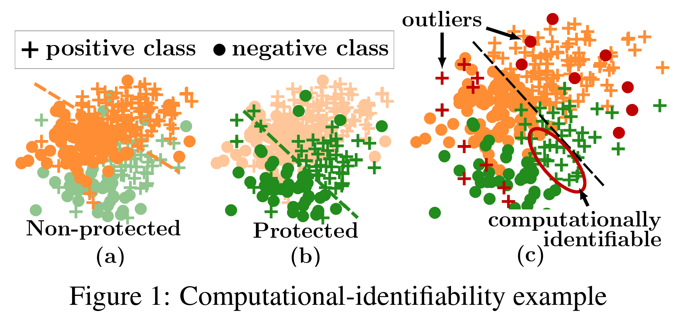

<!-- paginate: true -->
<!-- footer: Research MTG : 2022-10-25 -->

# Research MTG
## 2022-09-07 / nakae
- 今回の対象論文
  - [Adversary or Friend? An adversarial Approach to Improving Recommender Systems](https://dl.acm.org/doi/abs/10.1145/3523227.3546784)
  - Pannaga Shivaswamy, Dario Garcia-Garcia (RecSys '22)

---

## Summary
- 
- 

---

## 元々のモチベーション
- NeurIPS 2020 で
  - Fairness without Demographics through Adversarially Reweighted Learning

---

## Fareness
- 幸福とは、最も不幸な人の幸福度が最大化されること (by ロールズ(Rawls))
  - Max-Min戦略, あるいは Rawlsian fairness (ロールズの公平性)という
- cf) 功利主義 : 最大多数の最大幸福 (by ベンサム)
  - この場合、幸福の合計を最大化するのがもっともよいとされる。

---

## よく出てくる公平でない例
- CEOの検索結果 -> 男性に偏る
  - 学習データが 男性=CEO のデータが非常に多いから
  - 学習データが特定の属性に偏る場合に起こりがちである。

---

## fairnessを考慮した機械学習
- 少数派は保護対象グループ(protected group)として、
  彼らに不利のない学習結果となるようにすべきであるというのが
  fairness を考慮した機械学習の考え方
- でも、公平性を考慮すべき属性は手に入らないことが多い
  - 性別 / 人種 など。
  - 収集に厳しい規制がある地域もある (EUのGDPRなど)

---

## ARL
- ARL (Adversarially Reweighted Learning)
  - 公平性を考慮すべき属性が手に入らない前提で、
    敵対的学習によって、公平性を考慮する学習を実現する。

- 通常の学習

$$
\textrm{Min}_w \frac1n \sum_{i=1}^n l(x_i, y_i; w) + \frac{C}2 \Vert w \Vert^2 
$$

- ARL

$$
\textrm{Min}_w \textrm{Min}_a \frac1n \sum_{i=1}^n l(x_i, y_i; w) + \frac{C}2 \Vert w \Vert^2 + \frac{B}2 \Vert a \Vert^2 
$$

$$
$$

---

## 例

---

## 基本的な考え方

---

## 今回の論文の考え方
- レコメンドは多数派に有利な学習が行われがち
  - 少数グループのUser/Itemには不利なレコメンド結果となっている傾向がある
- これを解決するために ARL を適用しよう！という発想

