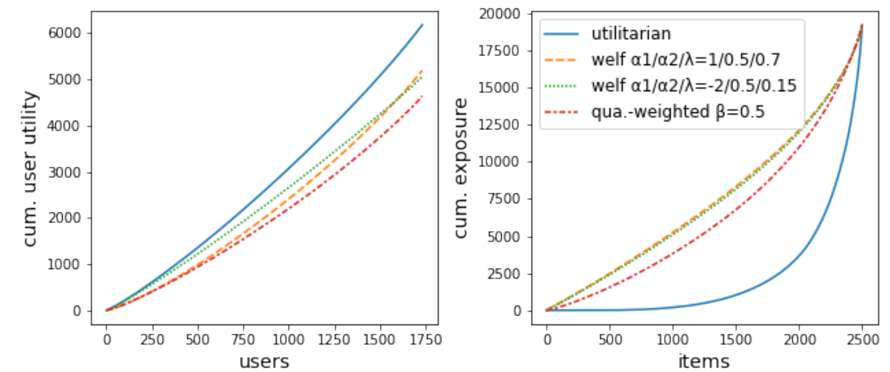

<!--
marp: true
theme: gaia
paginate: true
size: 4:3
-->

<!-- paginate: false -->
<!--_class: top-->
# Optimizing generalized Gini indices for fairness in rankings
## IR Reading 2022 秋 株式会社ビズリーチ 中江 俊博 2022-11-12

---

<!-- paginate: true -->
<!-- footer: IR Reading 2022 秋 / Optimizing generalized Gini indices for fairness in rankings -->
<!--_class: normal-->

## 自己紹介
- 中江 俊博 (なかえ としひろ)
  - ビズリーチ
    - リクルーティングプロダクト本部
      プラットフォーム開発部
      AI1グループ Mgr
- 経歴
  - NTTデータ数理システム(-2018)
    - データ分析コンサルタント
  - トリプルダブリュージャパン(-2019)
    - 排尿予測モデル実装
  - ビズリーチ (現職)
    - 推薦モデルなどの機械学習関連の
      実装の統括担当

---

<!--_class: normal-->

## 今回対象となる論文

- [Optimizing generalized Gini indices for fairness in rankings](https://arxiv.org/abs/2204.06521)
  - Virginie Do, Nicolas Usunier (Meta AI Research)
  - SIGIR 2022
- この論文のベースになる同一著者の論文が NeurIPS2021 で出ている
  - [Two-sided fairness in rankings via Lorenz dominance](https://proceedings.neurips.cc/paper/2021/hash/48259990138bc03361556fb3f94c5d45-Abstract.html)

---

<!--_class: normal-->

## 論文の主張

---

<!--_class: normal-->

## 前提
- User に Item を確率的にレコメンド
  - $\mu_{ij}$ ... User $i$ が Item $j$ にもつ価値
  - $P_{ijk}$ ... User $i$ に対して Item $j$ が $k$ 番目にお薦めされる確率
  - $b_k$ ... User が $k$ 番目にお薦めの Item に接触する確率 (単調減少)

- User $i$ の utility :  $\displaystyle u_i(P) = \sum_{j=1}^m \mu_{ij} P_{ij}^T \boldsymbol{b}$
  - 価値の高いアイテムほど上位に出ていればutility大きい
- Item $j$ の exposure : $\displaystyle v_j(P) = \sum_{i=1}^n P_{ij}^T \boldsymbol{b}$
  - アイテムが上位にレコメンドされる頻度が多いほどexposure大きい

- $\mu_{ij}, b_k$ を Fix した状態で $P_{ijk}$ を動かし、
  utility / exposure を増やすようにする問題と考える。

---

<!--_class: normal-->

## Lorentz efficient
- Generalized Lorentz Curve
  - utility を低いほうから累積和をとってプロットしたもの
    - 下に突き出ているほど不平等である
  - プロット例 (NeurIPS2021から)
    - 青 : user utility の総和 max → itemが不平等
    - 赤 : user/item ともに改善の余地あり
- Lorentz efficient
  - **もう user/item いずれも curve を上側に改善できない状態**

---

<!--_class: normal-->

## Lorentz efficient の見つけ方
- 増加とともに効果が低減するような関数 $\psi(x, \alpha)$ を
  使った線形和が最大になる $P$ では、Lorentz Efficient となる！

$$
  W_{\lambda, \alpha_1, \alpha_2}(\boldsymbol{u}) = 
    (1-\lambda) \sum_{i=1}^n \psi(u_i, \alpha_1) +
    \lambda \sum_{j=1}^m \psi(v_j, \alpha_2)
$$

---

<!--_class: normal-->

## Frank-Wolf 
- $P_{ijk} \in \mathcal{P}$ は確率行列(tensor)なので、微分可能な関数を最適化で、
  **Frank-Wolfアルゴリズム** が使える
  - Step 1: $P'^{(t)} = \textrm{argmax} _{P\in \mathcal{P}} < P | \nabla W(P^{(t-1)}) >$
  - Step 2 : $\gamma^{(t)} = \frac{2}{t + 2}$
  - Step 3 : $P^{(t)} = (1 - \gamma^{(t)})P^{(t-1)} + \gamma^{(t)} P'^{(t)}$
- Step1 の argmax の見つけ方
  - 微分 $\nabla W(P^{(t-1)})$ を計算
    $$\tilde{\mu}_{ij} = (1-\lambda) \psi'(u_i(P^{(t)})) \mu_{ij} + \lambda \psi'(v_j(P^{(t)}))$$

  - $\tilde{\mu}_{ij}$ の User $i$ ごとの降順ソートに対応する
    置換行列 $P$ が argmax を満たしている！
  

---

<!--_class: normal-->

## GGF
- 同じ手続きを Item についての Gini Index 最小化に使えないか？
  - Gini index の計算は、ソート順を伴うため直接微分できない！
- Generalized Gini welfare Functions (GGFs)
  - 非増加の重み列 $w_1 = 1 \ge w_2 \ge ... \ge w_n \ge 0$ 
    をパラメータとする関数 $g_{\boldsymbol{w}} : \mathbb{R}^n \to \mathbb{R}$
  - $n$次元の入力 $x_1, x_2, ..., x_n$ について
    昇順ソート $x_1^{\dagger} \le x_2^{\dagger} \le ... \le x_n^{\dagger}$ を使って次のように定義される。
$$
g_{\boldsymbol{w}}(\boldsymbol{x}) = \sum_{i=1}^n w_i x_i^{\dagger}
$$
- 特に item exposure に対する gini index (のようなもの)
  は次のように定義
$$
g^{\textrm{item}} (\boldsymbol{v}) = \sum_{j=1}^{m} \frac{m-j+1}{m} v_j^{\dagger}
$$

---

<!--_class: normal-->

## 論文のアイデア
- 微分可能な関数で上下で挟む (Moreau envelop)
- 挟んだ関数上での微分を計算
- この微分をつかって Frank-Wolf で $P$ を Update
- 上下で挟む幅を狭めて繰り返し

---

<!--_class: normal-->

## 結果

---

<!--_class: normal-->

## 結論

---

<!--_class: normal-->

## まとめ
