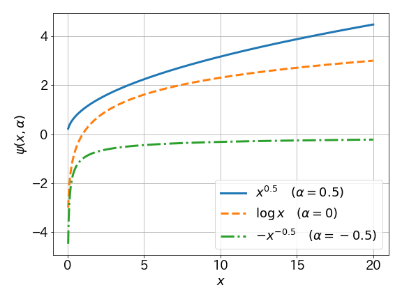

<!--
marp: true
theme: gaia
paginate: true
size: 4:3
-->

<!-- paginate: false -->
<!--_class: top-->
# Optimizing generalized Gini indices for fairness in rankings
## IR Reading 2022 秋 株式会社ビズリーチ 中江 俊博 2022-11-12

---

<!-- paginate: true -->
<!-- footer: IR Reading 2022 秋 / Optimizing generalized Gini indices for fairness in rankings -->
<!--_class: normal-->

## 自己紹介
- 中江 俊博 (なかえ としひろ)
  - 株式会社ビズリーチ
    - リクルーティングプロダクト本部
      プラットフォーム開発部
      AI1グループ Mgr
- 経歴
  - NTTデータ数理システム(-2018)
    - データ分析コンサルタント
  - TripleW(2018-2019)
    - 排尿予測モデル実装
  - ビズリーチ (2019-現職)
    - 推薦モデルなどの機械学習関連の
      実装の統括担当

---

<!--_class: normal-->

## 今回対象となる論文

- [Optimizing generalized Gini indices for fairness in rankings](https://arxiv.org/abs/2204.06521)
  - Virginie Do, Nicolas Usunier (Meta AI Research)
  - SIGIR 2022
- この論文のベースになる同一著者の論文が NeurIPS2021 で出ている
  - [Two-sided fairness in rankings via Lorenz dominance](https://proceedings.neurips.cc/paper/2021/hash/48259990138bc03361556fb3f94c5d45-Abstract.html)
- 要旨
  - レコメンドにおいてItemに対するpreferenceが与えられた状況で、
    User側のutilityの和と、ItemのGini係数(の拡張 ; GGFs)の和が
    最良になる fair なランキングの手法を提案。
  - 前年の論文で、微分可能な関数による手法を提案していた。
    今回の論文で、微分不可能な Gini係数を、微分可能な関数の手法に
    帰着させることで解決を図る、という筋書。

---

<!--_class: normal-->

## 前提
- User に Item を確率的にレコメンド
  - $\mu_{ij}$ ... User $i$ が Item $j$ にもつ価値
  - $P_{ijk}$ ... User $i$ に対して Item $j$ が $k$ 番目にお薦めされる確率
  - $b_k$ ... User が $k$ 番目にお薦めの Item に接触する確率 (単調減少)

- User $i$ の utility :  $\displaystyle u_i(P) = \sum_{j=1}^m \mu_{ij} P_{ij}^T \boldsymbol{b}$
  - 価値の高いアイテムほど上位に出ていればutility大きい
- Item $j$ の exposure : $\displaystyle v_j(P) = \sum_{i=1}^n P_{ij}^T \boldsymbol{b}$
  - アイテムが上位にレコメンドされる頻度が多いほどexposure大きい

- $\mu_{ij}, b_k$ を Fix した状態で $P_{ijk}$ を動かし、
  utility / exposure を増やすようにする問題と考える。

---

<!--_class: normal-->

## Lorentz efficiency
- Generalized Lorentz Curve
  - utility を低いほうから累積和をとったもの(図はNeurIPS2021)
    - 下に突き出ているほど不平等
      - 青 : user utility の総和 max → itemが不平等
      - 赤 : user も item もまだ上に持っていける余地がある。
- Lorentz efficiency
  - **user/item いずれも curve を上側に改善できない状態**
  - 論文著者にとっての fairness の定義

---

<!--_class: normal-->

## Lorentz efficiency を見つける
- 増加とともに効果が低減するような関数 $\psi(x, \alpha)$ の
  次の線形和を最大にする $P$ は、Lorentz efficiency を満たす！
  - $\lambda, \alpha_1, \alpha_2$ は事前に決めたパラメータ

$$
  W_{\lambda, \alpha_1, \alpha_2}(\boldsymbol{u}) = 
    (1-\lambda) \sum_{i=1}^n \psi(u_i(P), \alpha_1) +
    \lambda \sum_{j=1}^m \psi(v_j(P), \alpha_2)
$$

---

<!--_class: normal-->

## Frank-Wolf アルゴリズムの適用
- $P_{ijk} \in \mathcal{P}$ は確率行列(tensor)なので、
  $j, k$ で和をとると1になる制約を満たす必要がある。
- この場合、凸集合での微分可能な関数を最適化する手法である
  **Frank-Wolfアルゴリズム** が使える
  - Step 1: $P'^{(t)} = \textrm{argmax} _{P\in \mathcal{P}} < P | \nabla W(P^{(t-1)}) >$
  - Step 2 : $\gamma^{(t)} = \frac{2}{t + 2}$
  - Step 3 : $P^{(t)} = (1 - \gamma^{(t)})P^{(t-1)} + \gamma^{(t)} P'^{(t)}$
- Step1 の argmax の見つけ方
  - 微分 $\nabla W(P^{(t-1)})$ を計算
    $$\tilde{\mu}_{ij} =
      (1-\lambda) \psi'(u_i(P^{(t)})) \mu_{ij} +
      \lambda \psi'(v_j(P^{(t)}))$$

  - $\tilde{\mu}_{ij}$ の User $i$ ごとの降順ソートに対応する
    置換行列 $P$ が argmax を満たしている！
    - 置換行列が確率行列(tensor)であることに注意。
  

---

<!--_class: normal-->

## GGFs
- 同じ手続きを item exposure の Gini 係数最小化に使えないか？
  - これが SIGIR2022 論文の目標！
- Generalized Gini welfare Functions (GGFs)
  - 非増加の重み列 $w_1 = 1 \ge w_2 \ge ... \ge w_n \ge 0$ 
    をパラメータとする関数 $g_{\boldsymbol{w}} : \mathbb{R}^n \to \mathbb{R}$
  - $n$次元の入力 $x_1, x_2, ..., x_n$ について
    昇順ソート $x_1^{\dagger} \le x_2^{\dagger} \le ... \le x_n^{\dagger}$ を使って次のように定義される。
$$
g_{\boldsymbol{w}}(\boldsymbol{x}) = \sum_{i=1}^n w_i x_i^{\dagger}
$$
- 特に item exposure に対する gini 係数は、
  GGFsを使った次の値を最大化することと(ほぼ)等価
$$
g^{\textrm{item}} (\boldsymbol{v}) = \sum_{j=1}^{m} \frac{m-j+1}{m} v_j^{\dagger}
$$

---

<!--_class: normal-->

## GGFs と Lorentz efficiency
- 例えば次の関数を最大にするレコメンド $P$ は、
  user utility / item gini 係数のバランスをとることができる。
  - GGFs の線形和の形となっている ($\lambda$ はパラメータ)

$$
\begin{aligned}
F(P) &=
  (1 - \lambda) g^{\textrm{user}} (\boldsymbol{u}(P)) +
  \lambda g^{\textrm{item}} (\boldsymbol{v}(P)) \\
g^{\textrm{user}} &= \sum_{i=1}^n \frac1n u_i^{\dagger} \\
g^{\textrm{item}} &= \sum_{j=1}^m \frac{m-j+1}{m} v_j^{\dagger}
\end{aligned}
$$

- 実は GGFs の線形和の形の関数を最大にするレコメンド $P$ は、
  Lorentz efficiency を満たしている
- では、そのような $P$ をさっきと同じように微分で求めよう！
  - **残念！ GGFs は単純に微分できない** (昇順ソートがあるから)

---

<!--_class: normal-->

## GGFsの最適化
- 骨子 : Step1/2 の繰り返し (上下幅を縮めながら)
  - Step1. 微分可能な関数で上下を挟み、挟んだ関数上で微分
  - Step2. 微分をつかって Frank-Wolf で $P$ を Update
- 上下を挟むなめらかな関数 (モーロー包 ; Moreau envelope)
  - 微分不可能な関数 $h(\boldsymbol{z})$ に対して
    次の $h^{\beta}(\boldsymbol{z})$ は比較的簡単な手続きで微分できる。

$$
\begin{aligned}
h^{\beta}(\boldsymbol{z})
  \le h(\boldsymbol{z})
  \le h^{\beta}(\boldsymbol{z}) + \frac{\beta}2
    \Vert \boldsymbol{w} \Vert^2 \\
h^{\beta}(\boldsymbol{z}) =
  \min_{\boldsymbol{z}' \in \mathbb{R}^n} h(\boldsymbol{z}') +
   \frac1{2\beta} \Vert \boldsymbol{z} - \boldsymbol{z}' \Vert^2
\end{aligned}
$$

- 計算できた部分 $y_i^{1}, y_j^{2}$ を使って、GGFsの線形和全体の微分を算出
  - これをソートして、更新して...
$$
\tilde{\mu}_{ij} = (1-\lambda) y_i^{1} \mu_{ij} +  \lambda y_j^{2}
$$

---

<!--_class: normal-->

## 数値実験 : 条件
- 対象データ : Lastfm-2k, MovieLens-20m を対象
- user-item preference $\mu_{ij}$ は行列分解から算出
- ランクごとの接触重みは DCG を利用 $b_k=\frac1{\log_2 (1+k)}$
- 比較手法
  - **FairRec**(*) : Userが順に1つずつとる(先取り)ドラフト会議方式
  - 微分可能な関数による方法
    - **welf** : NeurIPS(2021)で提案された減衰関数 $\psi(x, \alpha)$ を使う。
    - **eq. exposure (stf)** : item exposure の分散を使う (Giniっぽい)
  - **GGF** : 提案法
    - GGFについては、utility が小さい user に重みを付ける
      two-side fairness を考慮した計算も実施。
- (*) Patro+(2020), FairRec: Two-Sided Fairness
  for Personalized Recommendations in Two-Sided Platforms
  (WWW2020, [arxiv/2002.10764](https://arxiv.org/abs/2002.10764))

---

<!--_class: normal-->

## 数値実験結果 : Lastfm-2k
- 左 : user については utility の合計を max にする場合
- 右 : user については utility の小さい 25% に重みを付ける場合
  - いずれも user/item のバランス $\lambda$ を変化させた結果をプロット
- GGF の パレート曲線 がいずれも左上に来ている (最適手法)

---

<!--_class: normal-->

## まとめ
- user/item 両方の Lorentz 曲線が改善できない = fairである
  - これを Lorentz efficiency という
- GGFs を使った user/item の fairness を考慮したランキングを提案
  - GGFs の和を最大にするランキングは Lorentz efficiency を満たす
  - 本来微分不可能な関数である GGFs を、微分可能な関数で近似できる
    近似した関数での微分を使って、Frank-Wolfで最適化できる
- GGFs を使ったランキングは従来手法より、
  user utility /item exposure を改善
