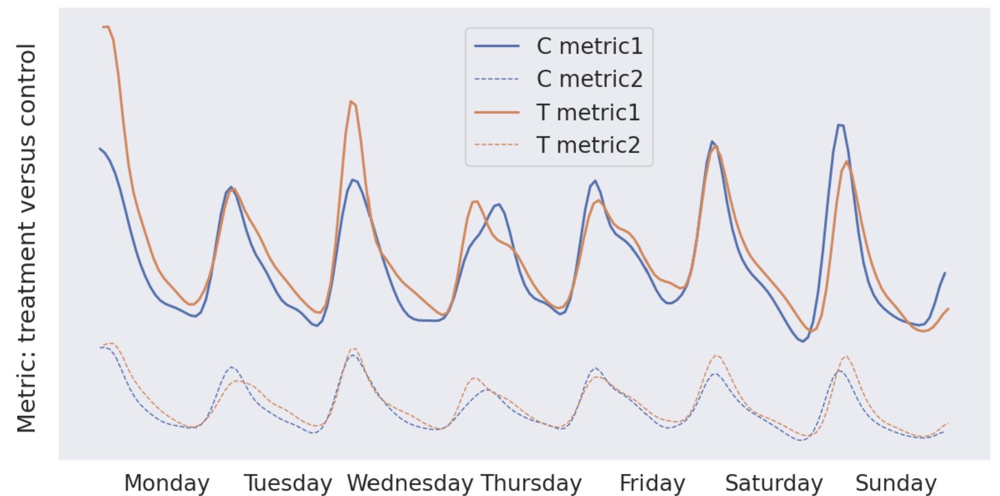
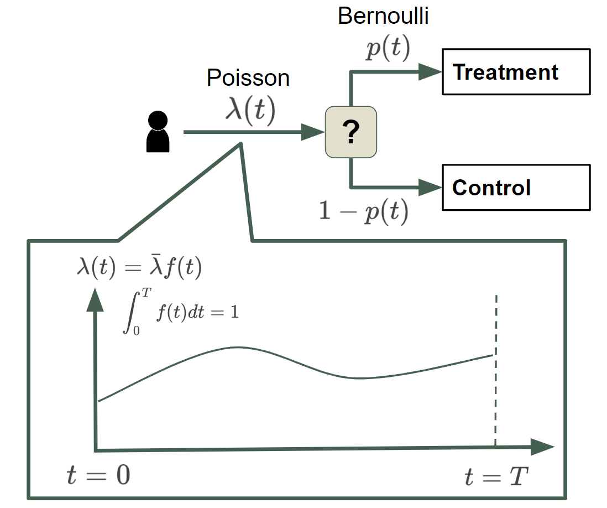
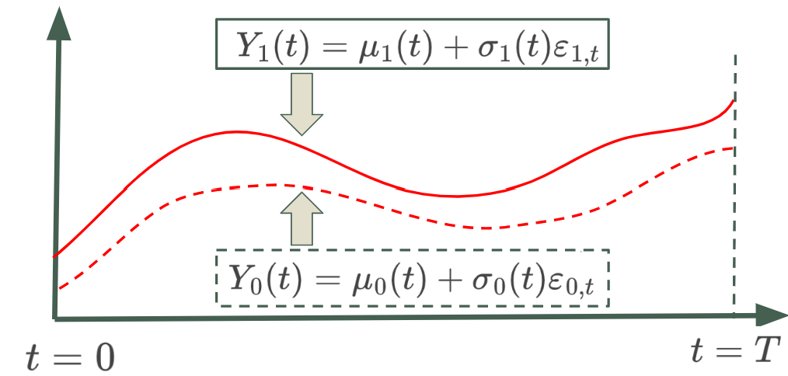
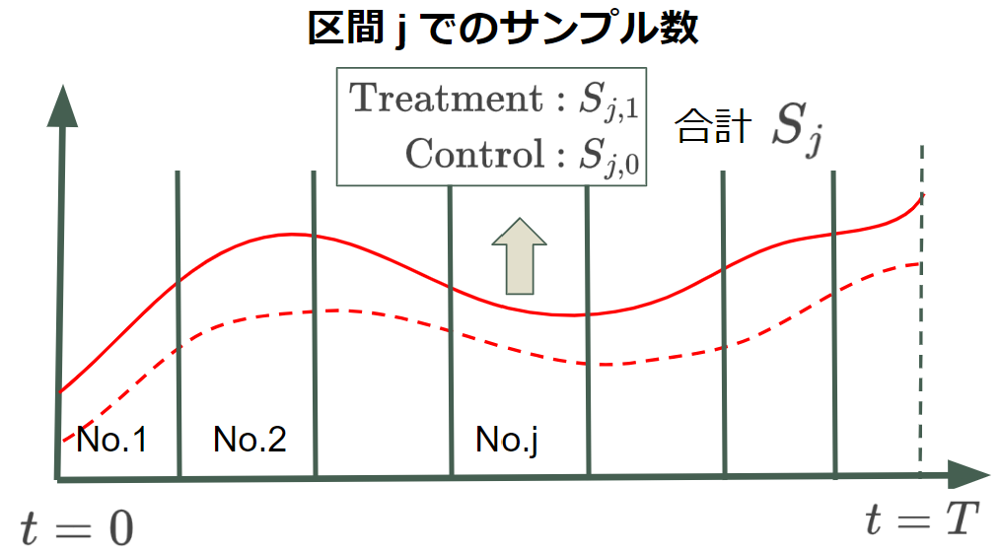

<!--
marp: true
theme: gaia
paginate: true
size: 4:3
-->

<!-- paginate: false -->
<!--_class: top-->
# Non-stationary A/B Tests
## KDD22 関連有志読み会 株式会社ビズリーチ 中江 俊博 2022-11-24

---

<!-- paginate: true -->
<!-- footer: KDD22 関連有志読み会 / Non-stationary A/B Tests -->
<!--_class: normal-->

## 自己紹介
- 中江 俊博 (なかえ としひろ)
  - 株式会社ビズリーチ
    - リクルーティングプロダクト本部
      プラットフォーム開発部
      AI1グループ Mgr
- 経歴
  - NTTデータ数理システム(-2018)  
    - データ分析コンサルタント
  - TripleW(2018-2019)
    - 排尿予測モデル実装
  - ビズリーチ (2019-現職)
    - 推薦モデルなどの機械学習関連の
      実装の統括担当

---

<!--_class: normal-->

## 今回対象となる論文

- [Non-stationary A/B Tests](https://dl.acm.org/doi/10.1145/3534678.3539325) (KDD 2022)
  - Yuhang Wu, Zeyu Zheng+
  - University of California, Berkeley と Amazon の混成チーム
- 要旨
  - A/Bテストの対象となるmetricsが、定常性を満たさない場合に、
    A/Bテストの推定値の分散が大きくなるケースがある。
  - 非定常であるmetricsに対して、A/Bテストの推定値の分散を
    低減させる方法を提案

---

<!--_class: normal-->

## 問題意識
- A/Bテスト対象のメトリクスの時系列変動が非定常である場合
  A/Bごとにメトリクスの平均の差を出すと分散が著しく大きくなる。
  - 図(論文Figure1)のように日内変動、曜日変動をするようなケース
- 変動要素が曜日などに依存することが既知であれば層別化/回帰すればよい
- では、単純な周期性に還元できない非定常の場合どうしたらよい？
  - 時系列を等間隔に分割して層別化すればよい！(今回の提案)

---

<!--_class: normal-->

## 前提(1)
- 対象となるサンプルは 平均 $\lambda(t)$ の Poisson で到着
- Treatment/Control の割り当ては、確率 $p(t)$ の Bernoulli で決める。
  - このようにして集められたサンプルが手元にあると考える。

---

<!--_class: normal-->

## 前提(2)
- Treatment/Control の時刻$t$でのメトリクス $Y_1(t), Y_0(t)$は、
  時刻$t$に依存して平均/分散が変動しているとする。

- A/Bテストにおける推定値

$$
\begin{aligned}
\alpha
 &= \mathbb{E}[Y_1(\tau) -Y_0(\tau)] \\
 &= \int_0^T [\mu_1(t) - \mu_0(t)] f(t) dt
\end{aligned}
$$

---

<!--_class: normal-->

## サンプル事後層別化
- Treatmentへの割り当て確率$p$が、時刻に依存せず固定である前提で、
  サンプルを$n$個集めた後で、均等に $k(n)$ 区間に分割
- そのあとで、層別平均の差の重み付き和をとる
  (Sample-based Post Stratification ; SPS)

$$
\hat{\alpha}_{\textrm{sps}}
 = \sum_{j=1}^{k(n)} \frac{|S_j|}{n}
  (
    \frac{\sum_{i\in S_{j,1}} y_i}{|S_{j,1}|} -
    \frac{\sum_{i\in S_{j,0}} y_i}{|S_{j,0}|}
  )
$$

---

<!--_class: normal-->

## サンプル事後層別化の分散
- Theorem 3.1
  - もし $\displaystyle \lim_{n \to +\infty} k(n) = +\infty$ でかつ $k(n) = o(n^{\frac12})$ なら
$$
\begin{aligned}
\sqrt{\bar{\lambda}}(\hat{\alpha}_{\textrm{sps}} - \alpha) \overset{d} \to
  {\mathcal{N}(0, V_{\textrm{sps}})} \textrm{, as} \hspace{0.5em} \bar{\lambda} \to +{\infty} \\
V_{\textrm{sps}} =
  \textrm{Var}[\mu_1(\tau) - \mu_0(\tau)] +
  \mathbb{E}[
    \frac{\sigma_1^2(\tau)}{p} + \frac{\sigma_0^2(\tau)}{1-p}
  ]
\end{aligned}
$$
- ちなみに、naiveなA/B比較(サンプル平均の差)の分散と比較する
  - SPSは$\mu$の差の分散、naiveは分散の重み付き和になっている。

$$
V_{\textrm{naive}} =
  \frac{\textrm{Var}[\mu_1(\tau)]}{p} +
  \frac{\textrm{Var}[\mu_0(\tau)]}{1-p} +
  \mathbb{E}[
    \frac{\sigma_1^2(\tau)}{p} + \frac{\sigma_0^2(\tau)}{1-p}
  ]
$$

---
<!--_class: normal-->

## 提案1の場合の分散

$$
\begin{aligned}
\textrm{Treatment : } & S_{j,1}  \\
\textrm{Control : } & S_{j,0}  \\

S_j
\end{aligned}
$$

------

<!--_class: normal-->

## 前提 (通常のA/B)

---

<!--_class: normal-->

## 非定常性の前提

---

<!--_class: normal-->

## 定理

---

<!--_class: normal-->

## 分散評価

---

<!--_class: normal-->

## 具体例

---

<!--_class: normal-->

## まとめ
