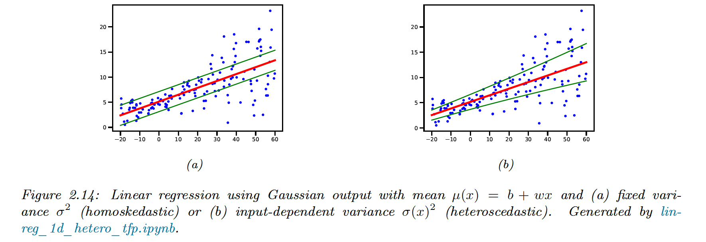

# pml-book1
## 2 : Probability: Univariate Models

---

### 2.2 Random Variables

- Basic
  - $X \in \mathcal{X}$ ... **random variable** (rv)
  - $\mathcal{X}$ ... **sample space** / **state space**
- Discrete / Continuous
  - $X$ is **discrete rv** $\Longleftrightarrow$ $\mathcal{X}$ is finite/countably infinite
    - **Probability mass fuction** (pmf) : $p(x) := \mathrm{Pr}(X=x)$
  - $X$ is **continuoius rv** $\Longleftrightarrow$ $\mathcal{X} = \mathbb{R}$
    - **Cumulative distribution fuction** (cdf) : $P(x) := \mathrm{Pr}(X \le x)$
    - **Probability densitry function** (pdf) : $p(x) := \frac{d}{dx}P(x)$

---

### 2.2.2.3 Quantile / Quartiles

- **Quantile** : inverse cdf / percent point function (ppf)
  - q's quantile $:= P^{-1}(q)$
- **Quartiles**
  - $P^{-1}(0.25)$ and $P^{-1}(0.75)$ are the lower / upper **quartiles**
  - 日本語では、四分位点(しぶんいてん)という。
- Example
  - $\Phi$ ... cdf of Gaussian distribution $\mathcal{N}(0,1)$
    - $(\Phi^{-1}(0.025), \Phi^{-1}(0.975))=(-1.96, 1.96)$ \
      is 95% interval.

---

### 2.2.3 joint distribution / 2.2.4 independence etc

- **Joint distribution**
  $$p(x,y) := p(X=x, Y=y)$$
- **Conditional distribution**
  $$p(Y=y|X=x) := \frac{p(X=x, Y=y)}{p(X=x)}$$
- product rule :
  $$p(x,y) = p(x)p(y|x)$$
- **(unconditionally) independence** / marginally independence
  $$X \perp Y \Longleftrightarrow p(X,Y)=p(X)p(Y)$$
- **conditionally independence** (CI)
  $$X \perp Y | Z \Longleftrightarrow p(X,Y|Z)=p(X|Z)p(Y|Z)$$

---

### 2.2.5 Moments of a distribution

- **mean** / **expected value**
  - for discrete rv : $\displaystyle \mathbb{E}[X] := \sum_{x \in \mathcal{X}} x p(x) dx$
  - for continuous rv : $\displaystyle \mathbb{E}[X] := \int_{\mathcal{X}} x p(x) dx$
- **variance** (often denoted by $\sigma^2$)
  - $\mathbb{V}[X] := \mathbb{E}[(X - \mu)^2]$
  - **standard deviation** : $\mathrm{std}[X] := \sqrt{\mathbb{V}[X]} = \sigma$
- The variance of product of $n$ independent rv:
  $$\mathbb{V}[\prod_{i=1}^{n} X_i]
    = \prod_i (\sigma_i^2 + \mu_i^2) - \prod_i \mu_i^2$$

---

### 2.2.5.4 Conditional moments

- **law of iterated expectations** / **law of total expectation**
  $$\mathbb{E}[X] = \mathbb{E}_Y [\mathbb{E}[X|Y]]$$
- derivation
$$\begin{aligned}
\mathbb{E}_Y [\mathbb{E}[X|Y]]
 &= \mathbb{E}_Y \left[\sum_x x  p(X=x | Y) \right] \\
 &= \sum_y \left[ \sum_x x  p(X=x | Y=y) \right] p(Y=y) \\
 &= \sum_{x,y} x p(X=x , Y=y) = \mathbb{E}[X]
\end{aligned}
$$
- Example : Lightbulb
  - Factory 1 supplies 60% bulbs, lifetime $X = 5000$ (hr)
  - Factory 2 supplies 40% bulbs, lifetime $X = 4000$ (hr)

---

### 2.2.6 Limitation of Summary Statistics

---

### 2.3 Bayes' rule

- Bayes' rule
  - For unknown (**hidden**) quantity $H$
  - Given some observed data $Y=y$
$$p(H=h|Y=y)
 = \frac{p(H=h) p(Y=y|H=h)}{p(Y=y)}
$$
- Details
  - $p(H=h)$ ... **Prior Distribution**
  - $p(Y=y|H=h)$ ... **Likelihood**
  - $p(H=h|Y=y)$ ... **Posterior Distribution**
- **Posterior** $\propto$ **Prior** $\times$ **Likelihood** 

---

### Example 1 : Testing for COVID-19
- Notation
  - $H$ : infection event (1=infected, 0=uninfected)
  - $y$ : diagnosis test result (1=positive, 0=negative)
- Aim
  - calc $p(H=1|y=1)$ : infected probability when test positive
  - calc $p(H=1|y=0)$ : infected probability when test negative
- Assumption (based on NYC situation in Spring 2020)
  - Likelihood
    - **Sensitivity** $p(y=1|H=1) = 0.875$
    - **Specificity** $p(y=0|H=0) = 0.975$
  - Prior (of infection) : $p(H=1) = 0.1$
---
(Cont.)
- calc $p(H=1|y=1)$ : infected probability when test positive
$$\begin{aligned}
p(H=1|y=1)
 &= \frac{p(y=1|H=1)p(H=1)}
  {p(y=1|H=0)p(H=0) + p(y=1|H=0)p(H=0)}  \\
 &= \frac{0.875 \times 0.1}
  {0.875 \times 0.1 + 0.125 \times 0.9} = 0.795
\end{aligned}$$

- calc $p(H=1|y=0)$ : infected probability when test negative
$$\begin{aligned}
p(H=1|y=0)
 &= \frac{p(y=0|H=1)p(H=1)}
  {p(y=0|H=1)p(H=1) + p(y=0|H=0)p(H=0)}  \\
 &= \frac{0.125 \times 0.1}
  {0.125 \times 0.1 + 0.975 \times 0.9} = 0.014
\end{aligned}$$

---

### Example 2 : The Monty Hall problem
- Game flow
  - There 3 doors : No.1, No.2, No.3
    - A single prize has been hidden behind one of theme.
  - At first, you choose a door (suppose door 1)
  - Gameshow host opens one of the other two doors (suppose door 3)
    - no prize behind it
  - You can change your choice (door 1 or door 2)
- Problem : Should you
  - (a) choose door 1 ?
  - (b) choose door 2 ?
  - (c) or no difference
---
(Cont.)
- Notation
  - $H_i$ : hypothesis that the prize is hidden behind door No $i \in \{1,2,3\}$
  - $Y=2(,3)$ : Gameshow host opens door 2(,3)
- Assumption
  - Prior : $P(H_1)=P(H_2)=P(H_3)=\frac13$
  - Likelihood
$$\begin{matrix}
P(Y=2|H_1) = \frac12 & P(Y=2|H_2) = 0 & P(Y=2|H_3) = 1 \\
P(Y=3|H_1) = \frac12 & P(Y=3|H_2) = 1 & P(Y=3|H_3) = 0
\end{matrix}$$

---
(Cont.)
- After observed $Y=3$, apply Bayes' rule
$$\begin{aligned}
P(H_1|Y=3) &\propto P(Y=3|H_1) P(H_1) = \frac12 \times \frac13 = \frac16 \\
P(H_2|Y=3) &\propto P(Y=3|H_2) P(H_1) = 1 \times \frac13 = \frac13 \\
P(H_3|Y=3) &\propto P(Y=3|H_3) P(H_1) = 0 \times \frac13 = 0 \\
P(Y=3) &= \frac16 + \frac13 = \frac12
\end{aligned}$$

---
(Cont.)

- Finally:
$$\begin{aligned}
P(H_1|Y=3) = P(Y=3|H_1) P(H_1) / P(Y=3) &= \frac16 / \frac12 = \frac13\\
P(H_2|Y=3) = P(Y=3|H_2) P(H_1) / P(Y=3) &= \frac13 / \frac12 = \frac23\\
P(H_3|Y=3) = P(Y=3|H_3) P(H_1) / P(Y=3) &= 0 \\
\end{aligned}$$
- You sholud change your choice to door 2!

---
### 2.4 Bernoulli / Binomial distribution

- **Bernoulli** : $Y \sim \textrm{Ber}(\theta)$
  - $Y \in \{0, 1\}$  (ex) coin toss (1=head / 0=tail)
  - $0 \le \theta \le 1$ (ex) probability of head
$$\begin{aligned}
\textrm{Ber} (y|\theta)
&=
  \begin{cases}
    1 - \theta & \textrm{if} &  y = 0 \\
    \theta & \textrm{if} &  y = 1
  \end{cases} \\
&= \theta^y (1 - \theta)^{1-y}
\end{aligned}
$$      
- **Binomial** : $Y \sim \textrm{Bin}(s|N, \theta)$
  - $s \in \{0, 1, ..., N\}$ (ex) num of heads in $N$-times coin toss

---

### 2.4.2 Sigmoid function

- **Sigmoid function** : $\displaystyle \sigma(a) = \frac1{1 + e^{-a}}$
- Sigmoid function + Bernoulli
  - predict probability given some input $\boldsymbol{x} \in \mathcal{X}$
  $$p(y | \boldsymbol{x}, \boldsymbol{\theta}) = 
    \textrm{Ber}(y|\sigma(f(\boldsymbol{x} ; \boldsymbol{\theta})))$$

---

---
### Logistic regression
- using linear predictor : $f(\boldsymbol{x} ; \boldsymbol{\theta}) = 
    \boldsymbol{w}^{T} \boldsymbol{x} + b$
  $$p(y | \boldsymbol{x}; \boldsymbol{\theta}) = 
    \textrm{Ber}(y|\sigma(\boldsymbol{w}^{T} \boldsymbol{x} + b))$$
  $$p(y=1| \boldsymbol{x}; \boldsymbol{\theta}) )
    = \sigma(\boldsymbol{\theta}^{T} \boldsymbol{w} + b)
    = \frac{1}{1 + e^{-(\boldsymbol{w}^{T} \boldsymbol{x} + b)}}
  $$

---

### 2.5 Categorical / Multinomial

- Categorical : $\displaystyle
    \textrm{Cat}(y | \boldsymbol{\theta})
    = \prod_{c=1}^{C} \theta_c^{\mathbb{I}(y=c)}$
  - $y \in \{1, 2, 3, ..., C\}$, where $C$ is num of categories
  - $\sum_c \theta_c = 1, \quad 0 \le \theta_c \le 1$
  - In other word : $p(y=c) = \theta_c$

- Multinomial : $\displaystyle
    \textrm{Mul}(\boldsymbol{y} | \boldsymbol{\theta})
    = \left( \begin{matrix}
        N \\
        y_1 ... y_C
      \end{matrix} \right)
    \prod_{c=1}^{C} \theta_c^{y_c}$
  - $y_c (c \in \{1, 2, 3, ..., C\})$ is the number of occurreces of category $c$
  - $\sum_c y_c = N$
  - $\sum_c \theta_c = 1, \quad 0 \le \theta_c \le 1$

---

### Softmax / Multiclass Logistic

- **Softmax** (or **multinomial logit**)
  $$\textrm{softmax}(\boldsymbol{a})
    := \left[
        \frac{e^{a_1}}{\sum_{c'=1}^{C} e^{a_{c'}}}
        ,...,
        \frac{e^{a_C}}{\sum_{c'=1}^{C} e^{a_{c'}}}
    \right]
  $$

- **Multiclass Logistic regression**
  $$p(y|\boldsymbol{x} ; \boldsymbol{\theta}) =
    \textrm{Cat}(y | \textrm{softmax}
      (\boldsymbol{W} \boldsymbol{x} + \boldsymbol{b}))
  $$
  - Using $\boldsymbol{a} = \boldsymbol{W} \boldsymbol{x} + \boldsymbol{b}$
  $$p(y=c|\boldsymbol{x} ; \boldsymbol{\theta}) =
    \frac{e^{a_c}}{\sum_{c'=1}^{C} e^{a_{c'}}}
  $$

---

### 2.5.4 : Log-Sum-Exp trick
- Softmax : $\displaystyle p_c = \frac{e^{a_c}}{\sum_{c'=1}^{C} e^{a_{c'}}}$
  - **"exp" value overflows on a computer when $a$ is big!**
- **Log-Sum-Exp trick** : Use $m = \max_c a_c$
$$\log \sum_{c=1}^{C} \exp(a_c)
 = m + \log \sum_{c=1}^{C} \exp(a_c - m)
$$
- **lse function**
$$
\textrm{lse}(\boldsymbol{a}) := \log \sum_{c=1}^{C} \exp (a_c)
$$
---

### 2.6 Univariate Gaussian (normal)

- Recall : cumulative distribution dunction ; cdf $P(y) := \textrm{Pr}(Y \le y)$
- Gaussian distribution (cdf)
$$\begin{aligned}
\Phi(y ; \mu, \sigma^2)
  := \int_{-\infty}^{y} \mathcal{N} (z | \mu, \sigma^2) dz \\
  \textrm{where} \quad
  \mathcal{N} (z | \mu, \sigma^2)
  := \frac{1}{\sqrt{2 \pi \sigma^2}}
        e^{-\frac{1}{2\sigma^2}(z - \mu)^2}
\end{aligned}$$
- using $\displaystyle
  \textrm{erf}(u) = \frac{2}{\sqrt{\pi}}
  \int_0^{u} e^{-t^2} dt$
$$\Phi(y ; \mu, \sigma^2) = \frac12
  \left[
    1 + \textrm{erf}(\frac{z}{\sqrt{2}})
  \right]
\quad \textrm{where} \quad
  z = \frac{y-\mu}{\sigma}
$$

---

### (Cont.)
- Recall : probability density dunction ; pdf $\displaystyle p(y) := \frac{d}{dy}P(y)$
- pdf of Gaussian
$$\mathcal{N} (y | \mu, \sigma^2)
  := \frac{1}{\sqrt{2 \pi \sigma^2}}
        e^{-\frac{1}{2\sigma^2}(y - \mu)^2}$$
- moments
  - mean : $\mathbb{E}[Y] = \mu$
  - variance : $\mathbb{V}[Y] = \sigma^2$

---

### 2.6.3 : Regression

- Normal distirbution conditioned on input variables $\boldsymbol{x}$:
$$p(y | \boldsymbol{x} ; \boldsymbol{\theta}) =
 \mathcal{N} (y |
  f_{\mu}(\boldsymbol{x} ; \boldsymbol{\theta}),
  f_{\sigma}(\boldsymbol{x} ; \boldsymbol{\theta})^2)
$$
- **Homoscedastic regression** (**Linear regression**)
$$p(y | \boldsymbol{x} ; \boldsymbol{\theta}) =
 \mathcal{N} (y |
  \boldsymbol{w}^{T} \boldsymbol{x} + b,
  \sigma^2)
$$
- **Heteroskedastic regression**
$$\begin{aligned}
p(y | \boldsymbol{x} ; \boldsymbol{\theta}) =
 \mathcal{N} (y |
  \boldsymbol{w}_{\mu}^{T} \boldsymbol{x} + b,
  \sigma_{+}(\boldsymbol{w}_{\sigma}^{T} \boldsymbol{x})) \\
\textrm{where} \quad
\sigma_{+}(a) = \log (1 + e^a) \quad \textrm{(softplus)}
\end{aligned}$$

---

