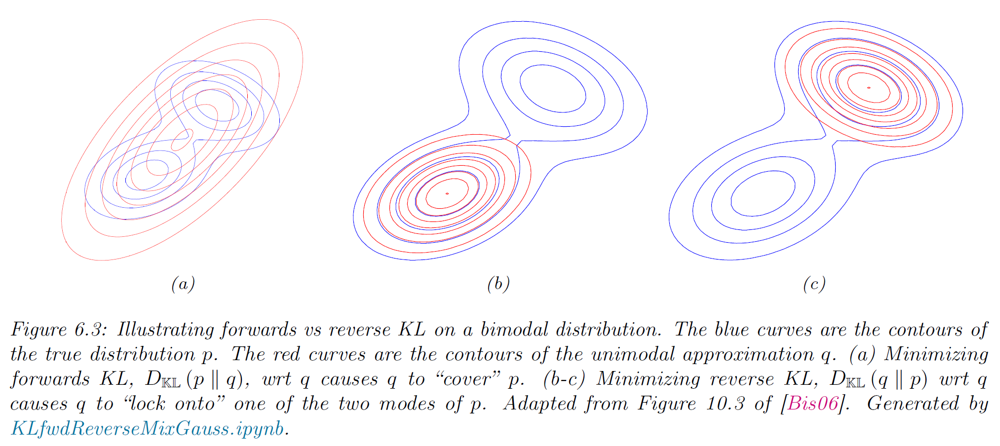
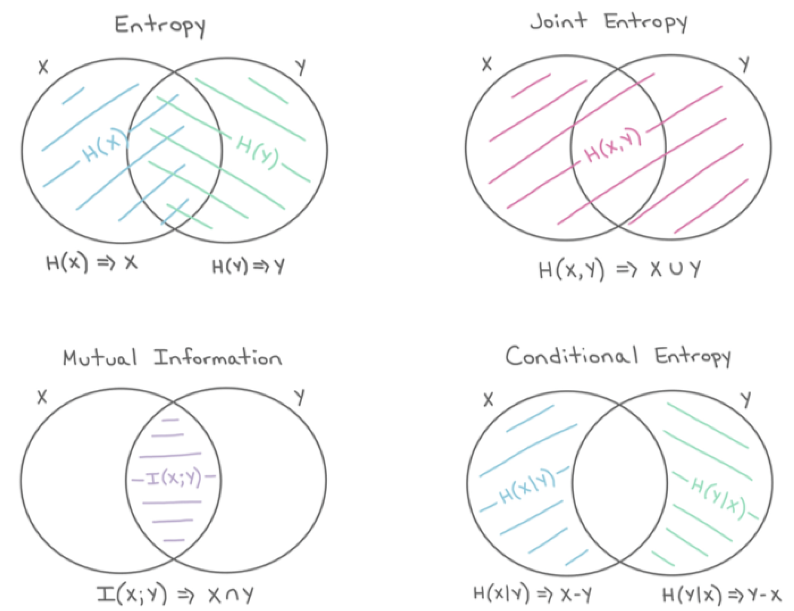

<!-- paginate: true -->

# pml-book1
## 6 : Information Theory

---

### Table of Contents (6.1)
- 6.1 Entropy
  - 6.1.1. Entropy (for discrete variable)
  - 6.1.2. Cross Entropy
  - 6.1.3. Joint Entropy
  - 6.1.4. Conditional Entropy
  - 6.1.5. Perplexity
  - 6.1.6. Entropy (for continuous variable)

---

### Table of Contents (6.2)
- 6.2. Relative Entropy (KL Divergence) *
  - 6.2.1. Definition
  - 6.2.2. Interpretation
  - 6.2.3. Example (two gaussian)
  - 6.2.4. Non-negativity
  - 6.2.5. KL divergence and MLE
  - 6.2.6. Forward KL / Backward KL

---

### Table of Contents (6.3)
- 6.3. Mutual Information *
  - 6.3.1. Definition
  - 6.3.2. Interpretation
  - 6.3.3. Example
  - 6.3.4. Conditional Mutual Information
  - 6.3.5. MI as a "generalized correlation coefficient"
  - 6.3.6. Normalized mutual Information
  - 6.3.7. Maximal information coefficient
  - 6.3.8. Data Processing inequality
  - 6.3.9. Sufficient Statistics
  - 6.3.10. Fano's inequality

---

### 6.1.1. Entropy (for discrete variable)
- Definition
  - for discrete variable $X$ with distribution $p$ over $K$ states:

$$
\begin{aligned}
\mathbb{H}(X)
  \triangleq & - \sum_{k=1}^K p(X=k) \log p(X=k) = -\mathbb{E}_X [\log p(X)]
\end{aligned}
$$

- The entropy is maximized if $p(x=k) = 1/K$
  - 理由は後で分かる (KL-divergenceで簡単に示せる)
$$
\begin{aligned}
\mathbb{H}(X)
  = & - \sum_{k=1}^K \frac1K \log \frac1K = \log K
\end{aligned}
$$

---

### (Cont. 6.1.1.)
- Binary distribution : $p(X=1)=\theta, \textrm{  } p(X=0)=1-\theta$

$$
\begin{aligned}
\mathbb{H}(X)
  &= - \left[p(X=1) \log p(X=1) + p(X=0) \log p(X=0) \right] \\
  &= - \left[\theta \log \theta + (1-\theta) \log (1-\theta) \right]
\end{aligned}
$$

- Example : DNA sequence

---

### 6.1.2. Cross Entropy
- **Cross entropy** between distirbution $p$ and $q$ :

$$
\mathbb{H}(p, q) \triangleq - \sum_{k=1}^K p_k \log q_k
$$

- Interpretation : the expected bits needed to compress
  - samples draw from $p$
  - using a code $q$
- 性質
  - $p = q$ の時、最小 (**Shannon's source coding theorem**)

$$
\mathbb{H}(p, p) = \mathbb{H}(p) 
$$

---

### 6.1.3. Joint Entropy
- **Joint entropy** of varibles $X, Y$

$$
\mathbb{H}(X, Y) \triangleq
  - \sum_{x, y} p(x, y) \log p(x, y)
$$

- 性質
  - 上限 : $\mathbb{H}(X, Y) \le \mathbb{H}(X) + \mathbb{H}(Y)$
    - 等しいのは、$X, Y$が独立の時
  - 下限 : $\mathbb{H}(X, Y) \ge \max \{\mathbb{H}(X), \mathbb{H}(Y)\} \ge 0$
    - 等しいのは、$X$ が $Y$ の関数の時 (または逆)

---

### 6.1.4. Conditional Entropy
- **Conditional Entropy** of $Y$ given $X$

$$
\begin{aligned}
\mathbb{H}(Y|X)
  & \triangleq \mathbb{E}_{p(X)} \left[ \mathbb{H}(p(Y|X)) \right] \\
  & = \sum_x p(x)  \sum_y p(y|x) \log p(y|x) \\
  & = \sum_{x,y} p(x,y)  \log p(y|x) \\
  & = \sum_{x,y} p(x,y)  \log [p(x,y)/p(x)] \\
  & = \sum_{x,y} p(x,y)  \log p(x,y) - \sum_{x} p(x)  \log p(x) \\
  & = \mathbb{H}(X, Y) - \mathbb{H}(X)
\end{aligned}
$$

---

### (Cont. 6.1.4.)
- 性質
  - 上限 : $\mathbb{H}(X, Y) \le \mathbb{H}(X) + \mathbb{H}(Y)$ だったので $\mathbb{H}(Y|X) \le \mathbb{H}(Y)$
    - 等しいのは、$X, Y$が独立の時
  - 下限 : $\mathbb{H}(X, Y) \ge \mathbb{H}(X)$ だったので $\mathbb{H}(Y|X) \ge 0$
    - 等号は、$Y$が$X$の関数である場合。
- **Chain rule for entropy**
  - $\mathbb{H}(Y|X) = \mathbb{H}(X, Y) - \mathbb{H}(X)$ から
    $\mathbb{H}(X_1, X_2) = \mathbb{H}(X_1) + \mathbb{H}(X_2|X_1)$
  - つなげてつなげて...

$$
\mathbb{H}(X_1, X_2, ..., X_n) = \sum_{i=1}^{n} \mathbb{H}(X_i | X_{i-1}, ..., X_1)
$$

---

### 6.1.5. Perplexity

---

### 6.1.6. Entropy (for continuous variable)
- Differential entropy for continuous variable $X$ with pdf $p(x)$ 

$$
h(X) \triangleq - \int_{\mathcal{X}} p(x) \log p(x) dx
$$

- For $X \sim U(0,a)$

$$
h(X) = - \int_0^a \frac1a \log \frac1a = \log a
$$

- 仮に $a = 1/8$ とすると、$h(X) = - \log_2 8 = -3$ (minus value!)
  - discrete variable の entropy は負にはならないことに注意する。
  - 実数(float) を $n$ bits で表現したとすると、
    この一様乱数は $n - 3$ bits で表せると解釈する。

---

### Example : Entropy of a Gaussian

$$
h(\mathcal{N}(\boldsymbol{\mu}, \boldsymbol{\Sigma}))
 = \frac{d}2 [1 + \ln 2\pi] + \frac12 \ln |\boldsymbol{\Sigma}| 
$$

---

### 6.2. Relative Entropy (KL Divergence) *

- Definition
  - for discrete

$$
D_{\textrm{KL}}(p \Vert q) \triangleq \sum_{k=1}^{K} p_k \log \frac{p_k}{q_k}
$$

  - for continuous

$$
D_{\textrm{KL}}(p \Vert q) \triangleq \int dx \textrm{ } p(x) \log \frac{p(x)}{q(x)}
$$

---

### 6.2.2. Interpretation

$$
\begin{aligned}
D_{\textrm{KL}}(p \Vert q) 
 &= \sum_{k=1}^{K} p_k \log \frac{p_k}{q_k} \\
 &= \sum_{k=1}^{K} p_k \log p_k - \sum_{k=1}^{K} p_k \log q_k  \\
 &= -\mathbb{H}(p) + \mathbb{H}(p, q)
\end{aligned}
$$

- 解釈
  - $\mathbb{H}(p, q)$ : 情報源$p$ を $q$のコードで圧縮するのに必要なbit数
  - $\mathbb{H}(p)$ : 情報源$p$を表すのに必要な最小bit数
    - $D_{\textrm{KL}}(p \Vert q)$ : $q$を使うことで、余計に必要となったbit数

---

### 6.2.3. Example (two gaussian)
$$
\begin{aligned}
& D_{\textrm{KL}}(
  \mathcal{N}(\boldsymbol{x} | \boldsymbol{\mu}_1, \boldsymbol{\Sigma}_1), 
  \mathcal{N}(\boldsymbol{x} | \boldsymbol{\mu}_2, \boldsymbol{\Sigma}_2)
) \\
&= \frac12 \left[
  \textrm{tr} (\boldsymbol{\Sigma}_2^{-1} \boldsymbol{\Sigma}_1) +
  (\boldsymbol{\mu}_2 - \boldsymbol{\mu}_1)^T
    \boldsymbol{\Sigma}_2^{-1}
  (\boldsymbol{\mu}_2 - \boldsymbol{\mu}_1) - D +
\frac{\det{\boldsymbol{\Sigma}_2}}{\det{\boldsymbol{\Sigma}_1}}

\right]
\end{aligned}
$$

- 計算は地味に長い（はず）
  - 両方の分布が等しい時に 0 になることに注意しよう。

---

### 6.2.4. Non negativity
- 事前準備 : **Jensen's inequality** for convex function $f(x)$

$$
f\left(\sum_{i=1}^n \lambda_i \boldsymbol{x}_i \right)
 \le \sum_{i=1}^n \lambda_i f(\boldsymbol{x}_i) \quad
\textrm{where } \lambda_i \ge 0 \textrm{ and } \sum_{i=1}^{n} \lambda_i = 1
$$

- $f(x) = -\log(x)$ を使って
  - $\log (\mathbb{E}_x g(x)) \ge \mathbb{E}_x \log(g(x))$
    - 等号成立は $g(x) = c$ の時 ($c$ は定数)

---

### (Cont.)
- **Theorem 6.2.1.** (*Information inequality*)
  - $D_{\textrm{KL}} (p \Vert q) \ge 0$ *with equality iff* $p = q$
- *Proof.*
  - Let $\mathcal{A} = \{x : p(x) > 0\}$
$$ \begin{aligned}
- D_{\textrm{KL}}
 &= - \sum_{x \in \mathcal{A}} p(x) \log \frac{p(x)}{q(x)} = \sum_{x \in \mathcal{A}} p(x) \log \frac{q(x)}{p(x)} \\
 & \le \log \sum_{x \in \mathcal{A}} p(x) \frac{q(x)}{p(x)} = \log \sum_{x \in \mathcal{A}} q(x) \\
 & \le \log \sum_{x \in \mathcal{X}} q(x) = \log 1 = 0
\end{aligned}
$$
  - 等号は、$p(x) = c q(x)$ の時。これは結局 $p(x) = q(x)$ を意味する。$\quad \square$

---

### (Cont.)
- **Corollary 6.2.1.** $\quad \mathbb{H}(X) \le \log |\mathcal{X}|$
  - ここで $\mathcal{X}$ は離散空間、$|\mathcal{X}|$ は状態数。
  - つまり、離散空間で一様分布がエントロピー最大

- *Proof.*  Let $u(x) = 1 / |\mathcal{X}|$
$$
0 \le D_{\textrm{KL}}(p \Vert u)
  = \sum_x p(x) \log \frac{p(x)}{u(x)}
  = \log |\mathcal{X}| - \mathbb{H}(X)
  \quad \square
$$

---

### 6.2.5. KL divergence and MLE

- KL divergence から MLE を導くことができるという話

$$
\begin{aligned}
q^*
  &= \textrm{argmin}_{q} D_{\textrm{KL}}(p \Vert q) \\
  &= \textrm{argmin}_{q} \left[
    \int p(x) \log p(x) dx - \int p(x) \log q(x) dx \right]
\end{aligned}
$$

- 目標分布 $p$ を経験分布にしてみよう

$$
p_D(x) = \frac1{N_D} \sum_{n=1}^{N_D} \delta(x - x_n)
$$

---

### (Cont.)

$$
\begin{aligned}
D_{\textrm{KL}}(p \Vert q)
  &= - \int p_D(x) \log q(x) dx + C \\
  &= - \int \left[
    \frac1{N_D} \sum_n \delta(x - x_n) \right]\
    \log q(x) dx  + C \\
  &= - \frac1{N_D} \sum_n \log q(x_n) + C
\end{aligned}
$$
- つまり MLEは、観測データが経験分布 (delta function)
  とした場合の KL divergence を最小化するような分布
  - delta function はちょっと極端な仮定

---

### 6.2.6. Forward KL / Backward KL
- **Forward KL** (通常のKL)
  - 最小化する $q$ は、**M-projection** / **moment projection**
  - $p(x) > 0$ となる点では $q(x) = 0$ となってはいけない！
$$
D_{\textrm{KL}}(p \Vert q) = \int p(x) \log \frac{p(x)}{q(x)} dx
$$

- **Backward KL**
  - 最小化する $q$ は、**I-projection** / **information projection**
$$
D_{\textrm{KL}}(q \Vert p) = \int q(x) \log \frac{q(x)}{p(x)} dx
$$

---

---

### 6.3. Mutual Information *
- Definition

$$
\begin{aligned}
\mathbb{I}(X ; Y)
  &\triangleq D_{\textrm{KL}} (p(x,y) \Vert p(x)p(y)) \\
  &= \sum_{y \in Y} \sum_{x \in X}
    p(x, y) \log \frac{p(x, y)}{p(x) p(y)}
\end{aligned}
$$

- 性質
  - $\mathbb{I}(X ; Y) = D_{\textrm{KL}} (p(x,y) \Vert p(x)p(y)) \ge 0$
    - 等号成立は $p(x,y) = p(x) p(y)$
  - $\mathbb{I}(X ; Y) = \mathbb{H}(X) - \mathbb{H}(X|Y) = \mathbb{H}(Y) - \mathbb{H}(Y|X)$
  - $\mathbb{I}(X ; Y) = \mathbb{H}(X) + \mathbb{H}(Y) - \mathbb{H}(X,Y)$

---

---

### 6.3.4. Conditional Mutual Information
- Definition

$$
\begin{aligned}
\mathbb{I}(X;Y|Z)
  &\triangleq \mathbb{E}_{p(Z)} [\mathbb{I}(X;Y)|Z] \\
  &= \mathbb{E}_{p(x,y,z)} \left[
    \log \frac{p(x,y|z)}{p(x|z)p(y|z)} \right] \\
  &= \mathbb{H}(X|Z) + \mathbb{H}(Y|Z) - \mathbb{H}(X, Y| Z) \\
  &= \mathbb{H}(X,Z) + \mathbb{H}(Y,Z) - \mathbb{H}(Z) - \mathbb{H}(X, Y, Z) \\
  &= \mathbb{I}(Y ; X,Z) - \mathbb{I}(Y;Z)
\end{aligned}
$$

---

### 6.3.5. MI as a "generalized correlation coefficient"

---

### 6.3.6. Normalized mutual Information

---

### 6.3.7. Maximal information coefficient

---

### 6.3.8. Data Processing inequality

---

### 6.3.9. Sufficient Statistics

---

### 6.3.10. Fano's inequality
